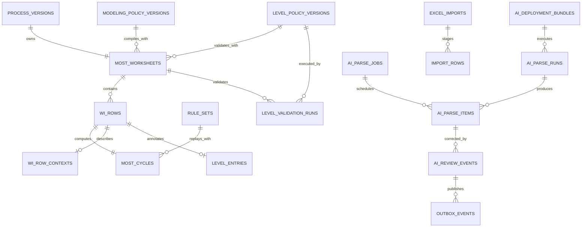
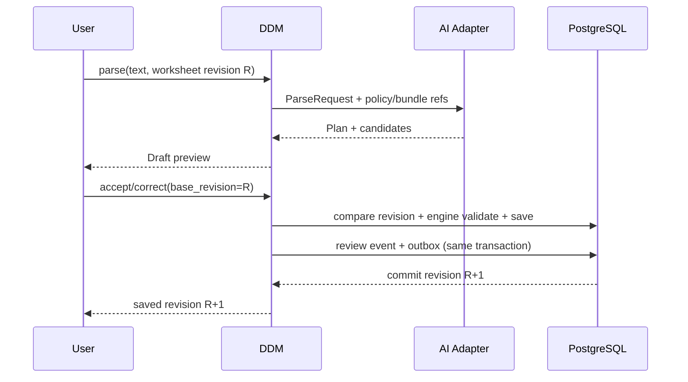

# Domain Evolution 與 AI Readiness 資料架構規格

**文件類型：** v2 資料架構與領域演進規格（canonical proposal）
**版本：** 0.1 — 設計草案
**建立日期：** 2026-07-31
**適用範圍：** MOST 工作台、Level System、互動式 AI 建模、CSV/Excel 批次建模
**既有決策：** [ADR-011](../decisions/ADR-011-schema-evolution-and-contract-stability.md)、[ADR-013](../decisions/ADR-013-excel-import-architecture.md)、[ADR-014](../decisions/ADR-014-v3-dictionary-as-value-authority.md)、[ADR-023](../decisions/ADR-023-dictionary-governance-unification.md)、[ADR-025](../decisions/ADR-025-import-template-matching-p2.md)
**架構提案：** [ADR-026](../decisions/ADR-026-wi-ai-parser-pipeline-boundary.md)、[ADR-027](../decisions/ADR-027-domain-evolution-versioning-and-ai-readiness.md)、[WI AI Parser 系統規格](wi-ai-parser-system-spec.md)
**核心權威：** [MiniMOST Sequence Model](../core-logic/minimost-sequence-model-core-logic-spec.md)、[Level System](../core-logic/level-system-core-logic-spec.md)

> 本文件定義「在核心業務仍會演進時，資料庫與服務邊界現在應預備什麼」。它不修改
> MiniMOST 或 Level 規則，也不授權直接建立 migration。所有 proposed schema 需依交付階段
> 另立實作工單，並遵循 ADR-011 的加法演進政策。

---

## 1. 問題與目標

目前 ddm-v2 是第一版可運作系統。MOST 工作台與 Level System 完成後，預期仍會增加：

- 工序的品質、安全、工具、機台、圖示與 SOP reference；
- quantity、工具持有、歸位、SIMO、檢查等建模 policy；
- Level System 的額外限制、巢狀規則、資源與 LB output contract；
- 互動式 AI 建模與數十至數百列的批次建模；
- 人工修正、評測、模型與門檻 promotion。

若直接讓 AI 對現行資料表寫入，或把未定業務資訊全部塞進 `slot_inputs`，會產生三種漂移：

1. AI prompt 內隱含一套業務規則，DDM service 又有另一套。
2. Level 規則改版後，歷史 worksheet 無法重現當時為何合法。
3. 批次結果回來時，使用者已修改 draft，舊結果仍覆蓋新內容。

本規格的目標是建立版本、契約與 ownership 防火牆，使未來可以：

- 新增正式工序資訊而不破壞 `CycleIn`；
- 更換建模 policy 而不必重新呼叫 LLM；
- 更換模型而不改 MOST/Level domain；
- 回放某份 worksheet 當時使用的 rule-set、Level policy 與建模 policy；
- 對互動與批次結果做 optimistic locking、retry、部分採用與完整稽核。

---

## 2. 文件責任與權威順序

| 文件分類 | 回答的問題 | 本文件的關係 |
|----------|------------|--------------|
| `core-logic/` | MOST/Level 規則本身是什麼 | 上游權威；本文件不得重寫規則 |
| `decisions/` | 為何選這個邊界、哪些方案被否決 | 決策依據；proposed 不得冒充 accepted |
| `architecture/data-model-and-storage-spec.md` | 現行 v2 聚合與欄位基礎 | 現況底座；本文件補跨版本演進能力 |
| 本文件 | 未來 domain/AI 所需版本軸、ownership 與 proposed schema | 資料與邊界 canonical proposal |
| `architecture/wi-ai-parser-system-spec.md` | WI 如何解析、分流、審核與學習 | 使用本文件提供的資料地基 |
| `roadmap/` | 何時做、依賴與退出條件 | 不定義資料真相，只安排交付 |
| 歷史研究材料 | 已由 canonical specs/ADR 吸收 | 不作 v2 實作權威 |

權威順序：accepted ADR → core-logic spec → 本文件與 WI AI Parser spec → 現行 API/schema/tests → roadmap/reference。

---

## 3. 現況基線（2026-07-31）

下表是本規格的 migration 基線，不是目標形：

| 能力 | 現況 | 缺口 |
|------|------|------|
| 發布版本 | `process_versions.version_no/status` | 表示業務發布版本，不是每次 draft save revision |
| Draft 儲存 | `save_worksheet()` 整份刪除 rows 再重建 | 無 optimistic lock；同時編輯可後寫蓋前寫 |
| MOST 回放 | `most_cycles.slot_inputs + rule_set_id` | 已具備；必須保留 |
| MOST 衍生值 | `computed/narrative/total_*` | 可重生快取，方向正確 |
| Level 資料 | `level_entries` FK 到穩定 `wi_row_id` | 無 Level policy/validator/output contract 版本 |
| Level 驗證 | `most_engine.level` 內 R1–R9 | 歷史 validation result 與使用版本未保存 |
| 正式工序 context | vocab FK + `sub_activity/key_parts` | 無版本化、可演進的 method context |
| Excel staging | `excel_imports.raw_payload/staged_rows` JSONB | 無 row-level progress/retry/partial adoption lineage |
| 範本匹配 | ADR-025 map preview + IE adoption | 保留，未命中列目前建立 stub |
| 稽核 | `workflow_audit_log` | 只適合低頻 workflow transition，不適合高頻 AI feedback |
| AI operational data | 無正式表 | inference、bundle、review、job、outbox 均未落地 |
| AI 部署 | rule-based parser 與 DDM 同 process | 可作初期 adapter，尚無獨立 worker/service |

---

## 4. 不可違反的資料原則

### 4.1 一個事實只有一個 owner

| 事實 | Owner | 禁止事項 |
|------|-------|----------|
| MOST option value / band / multiplier | versioned rule-set + `most_engine` | AI/compiler 複製 band table 或計算 TMU |
| 使用者採用的工序與 Level 輸入 | DDM worksheet aggregate | AI service 直接寫正式表 |
| 建模 policy | DDM versioned policy | 寫死在 prompt 且不記版本 |
| Level policy | DDM Level domain | AI parser 自行判定 Level 合法性 |
| 模型/prompt/index/calibrator/threshold | AI deployment bundle | 混入 rule-set 或 Level policy |
| 推論原始結果與候選分數 | AI operational store | 塞進 `slot_inputs` 或 `workflow_audit_log` |
| 人工採用/修正的業務事實 | DDM review/outbox event | 只記 AI 端、與正式存檔不同步 |

### 4.2 計算輸入、業務 context、AI metadata 必須分離

1. **`slot_inputs`**：只放 `CycleIn` 的 MOST 計算原始輸入。
2. **Method context**：品質、安全、工具設定、圖示、SOP reference 等正式工序事實。
3. **Policy reference**：當時使用的建模與 Level policy 版本。
4. **AI metadata**：prompt、候選、raw score、latency、confidence 與 fallback。
5. **Derived cache**：TMU、seconds、narrative、validation output，可由權威輸入重建。

不能因 JSONB 方便而混用上述責任。

### 4.3 版本是多個正交維度

「版本」不得只用一個欄位包辦：

| 版本軸 | 解決的問題 | 目標 reference |
|--------|------------|----------------|
| Process version | 發布/另存新檔的業務生命週期 | `process_version_id/version_no` |
| Worksheet revision | 同一 draft 每次存檔與並發衝突 | `most_worksheets.revision_no` |
| MOST rule-set | TMU 與 option/band 回放 | `most_cycles.rule_set_id` |
| Modeling policy | quantity/tool/SIMO/default 如何編譯 | `modeling_policy_version_id` |
| Level policy | R1–R9/未來限制與 LB output 如何驗證 | `level_policy_version_id` |
| Contract schema | request/JSON shape 如何解析 | `schema_version` |
| AI deployment bundle | 模型/prompt/index/calibrator/threshold | `deployment_bundle_id` |

每次 AI run 或正式 validation 必須記錄所依賴的版本軸，不能只記時間戳。

### 4.4 加法演進

- 新表、新 nullable FK、新 DTO 欄位先加法導入。
- 舊 client 過渡期可不送新欄，但 server response 必須回 revision/version。
- 需要改名/刪欄時採「新增 → 雙寫/回填 → 讀新 → 廢舊」。
- 不預建大量 nullable business columns；先以有 schema version 的 context JSONB 承接，確定需查詢/FK/約束後再升欄。

---

## 5. 目標資料關係



此圖是 ownership 與 proposed relation，不代表必須在單一 migration 一次建立全部表。

---

## 6. Worksheet Revision 與 Optimistic Locking

### 6.1 為何 ProcessVersion 不足

`process_versions.version_no` 是發布/另存新檔的版本；使用者在同一 draft 內連續存檔仍是同一
process version。AI 解析與多人編輯需要知道「送出時看到第幾次內容」，因此必須有獨立 revision。

### 6.2 Proposed schema

在 `most_worksheets` 加法新增：

| 欄位 | 型別 | 規則 |
|------|------|------|
| `revision_no` | bigint NOT NULL DEFAULT 1 | 每次成功內容存檔原子 +1 |
| `content_hash` | text NULL | canonical worksheet payload hash；供 cache/診斷，不代替 revision |
| `last_edited_by` | text NULL | 員工編號 |
| `last_edited_at` | timestamptz NULL | 最後成功存檔時間 |

Revision 表示「會影響 worksheet 顯示、計算、驗證或發布內容的任何持久化變更」，包含：

- worksheet metadata（model label、analyst、study date、allowance）；
- rows/cycles/Level entries；
- 正式 method context；
- modeling/Level policy snapshot；
- row order、frequency、SIMO 與 vocab references。

只寫 inference log、AI cache、validation run 或 workflow audit 不改 worksheet 內容，因此不遞增；
publish/approve status transition 記錄它所核准的 revision，不另外改內容 revision。

### 6.3 Save contract

新版 save request 增加：

```json
{
  "base_revision": 12,
  "rows": []
}
```

Server 必須以單一 transaction：

1. 在任何 mutable field update 或 rows delete 前，以 conditional `UPDATE most_worksheets ...
  WHERE id=:id AND revision_no=:base_revision` 鎖定並將 revision 原子 +1。
2. 無 row updated → `409 WORKSHEET_REVISION_CONFLICT`，不修改 allowance、policy/context，也不刪除 row。
3. 成功後在同一 transaction 寫 worksheet metadata、rows/cycles/level/context；任一步失敗整筆 rollback，
  revision increment 也 rollback。
4. 以完成後的 canonical payload 產生 content hash，response 回傳新 revision 與 hash。

在 migration 過渡期，舊 client 未帶 `base_revision` 可暫走 legacy save，但需記 telemetry；完成前端
切換後改為必填。不可長期保留無條件 last-write-wins。

### 6.4 AI 採用規則

每個 parse run 記錄 `source_worksheet_id + source_revision`。採用時：

- revision 相同：可套用，仍走正常 save/engine gate。
- revision 不同：禁止自動覆蓋；使用者選擇重新解析或手動 merge。
- 純文字互動、尚未綁 worksheet：`source_revision=null`，套入後由當前 editor 產生新 revision。

### 6.5 Row lineage

`wi_row.id` 在同一 process version 內維持穩定；clone 到新 process version 時用新 id，透過
`source_row_id` 連血緣。AI item 應同時保存 source row id 與 source revision，不能只靠 `seq_no`。

---

## 7. 正式工序 Context 的演進

### 7.1 分類規則

新增業務資訊前依序判斷：

1. **會改變 TMU？** 加入 `CycleIn`/rule-set/engine，走核心邏輯變更與 golden tests。
2. **需要 FK、跨列查詢、聚合或 DB 約束？** 建正式欄位/表。
3. **只是被擷取存檔、形狀尚會演進？** 放有 schema version 的 context JSONB。
4. **只描述 AI 如何猜？** 放 AI operational tables，不是正式工序資料。

### 7.2 Proposed `wi_row_contexts`

| 欄位 | 型別 | 說明 |
|------|------|------|
| `id` | UUID PK | |
| `wi_row_id` | UUID UNIQUE FK→wi_rows CASCADE | 一列一份正式 context |
| `schema_version` | text NOT NULL | 例 `wi-context-v1` |
| `context_data` | JSONB NOT NULL | 品質/安全/圖示/SOP reference/機台設定等 |
| `context_hash` | text NOT NULL | canonical JSON hash |
| `source` | text NOT NULL | `manual/imported/ai_assisted/system` |
| `created_by` / `updated_by` | text | 稽核 |
| timestamps | timestamptz | |

`context_data` 初始可包含：

```json
{
  "quality_checks": [],
  "safety_notes": [],
  "tool_settings": [],
  "machine_refs": [],
  "visual_refs": [],
  "sop_refs": [],
  "business_tags": []
}
```

此表是**加法 metadata**，不取代既有 `wi_rows.sub_activity`、`key_parts`、hand 或 vocab FK；那些欄位
繼續表示原子方法步與常用可查詢事實。未來若要搬移既有欄位，必須另走 ADR-011 的加欄、回填、
雙讀與廢舊流程，本規格不授權直接搬欄。

不應包含：TMU、slot option、模型分數、prompt、top-K 或 Level grouping。

### 7.3 升欄政策

當某個 context key 需要索引、FK、唯一性或統計報表時：

1. 加正式 column/table。
2. migration 從 JSONB 回填。
3. 過渡期雙讀，以正式欄為優先。
4. 停止新寫舊 key，保留歷史讀取直到下一個破壞性版本。

---

## 8. Modeling Policy Version

### 8.1 責任

Modeling policy 管理「文字已被理解後，如何編譯成工序」的業務決策，不管理 TMU 值：

- quantity → 展開 action / row frequency / slot repeat；
- 工具 acquire/held/use/return；
- 是否隱含 inspect；
- 手別、SIMO 與站點 default；
- 缺欄位何時 default、review 或 abstain；
- process/site-specific 規則。

### 8.2 Proposed `modeling_policy_versions`

| 欄位 | 型別 | 說明 |
|------|------|------|
| `id` | UUID PK | |
| `code` | text | 穩定 policy family code；不是單一版本 id |
| `version_no` | int | family 內遞增 |
| `name` | text | |
| `status` | text | `draft/published/retired` |
| `site_id` | UUID NULL FK→sites | NULL=global；site-specific override |
| `process_type` | text NULL | 可選 process scope；先不用 polymorphic FK |
| `schema_version` | text | policy JSON shape |
| `compiler_contract_version` | text | 可解讀此 policy 的 compiler contract |
| `policy_json` | JSONB | 規則資料，不放模型設定 |
| `content_hash` | text | canonical policy content hash；索引但不全域 UNIQUE，允許不同 scope 使用相同內容 |
| `created_by/published_by/published_at` | audit fields | |

Unique key 為 `(code, version_no)`。這是新 policy manifest 的 family/version pattern；既有 `rule_sets.code`
本身就是 immutable version identifier，ADR-027 不修改 rule-set schema，也不要求兩者使用相同查詢。

Draft policy 可編輯；publish 時 server 驗 schema、計算 `content_hash` 並凍結內容；published/retired
不可就地修改。第一版 manifest **不定義 `is_active`**，避免在 selection precedence 未決前複製
rule-set active 機制。哪一版供新 worksheet 選用，由 R0 核可的 policy resolver/config 明確決定；
worksheet 一旦 snapshot 即不隨 resolver 改變。

Resolver 決策至少必須定義 family code、global/site/process precedence、可選狀態與 default tag；禁止以
`MAX(version_no)`、`created_at DESC` 或任意第一筆作隱式 fallback。多個同優先級候選視為設定衝突並
fail closed。

### 8.3 Worksheet snapshot

`most_worksheets` 新增 `modeling_policy_version_id`。Migration 初期可 nullable 以便回填；完成 seed、
backfill 與 consumer 切換後應收緊為 NOT NULL。R2 cutover 後，新建 worksheet 必須在**同一 transaction**
透過已核可的 resolver 取得 published policy 並立即 snapshot；沒有可選 policy 即 fail closed，不建立
半成品 worksheet。歷史 replay 依 FK 載入，不依今天 resolver/default。

### 8.4 Recompile without reparse

`WorkInstructionPlan` 是 MOST-neutral。政策改版時可以：

1. 讀舊 plan。
2. 使用新 modeling policy 重新 compile。
3. 比較 CycleDraft diff。
4. 由 IE 決定是否建立新 process version。

不得回寫舊 published process version。

---

## 9. Level Policy 與 Validation Run

### 9.1 為何必須版本化

目前 R1–R9 在程式碼內且由測試鎖定，這是正確的 v1 實作；但未來增加限制後，需要區分：

- 使用者輸入的 Level 事實；
- 當時使用哪版 validator/config；
- 驗證結果與 LB output contract；
- 今天用新版重驗的結果。

不建議現在把 R1–R9 全部改成 EAV/規則 DSL。先建立 immutable policy manifest 即可。

### 9.2 Proposed `level_policy_versions`

| 欄位 | 型別 | 說明 |
|------|------|------|
| `id` | UUID PK | |
| `code/version_no` | text/int | 例 `LEVEL_FACTORY` / `1` |
| `status` | text | `draft/published/retired` |
| `schema_version` | text | Level input shape |
| `validator_revision` | text | 可重現的程式/套件 revision |
| `output_contract_version` | text | LB output contract version |
| `config_json` | JSONB | 可配置門檻；不可假裝承載所有程式規則 |
| `content_hash` | text | manifest content hash；索引但不要求跨 scope 全域 UNIQUE |
| audit fields | | |

部署時 seed `LEVEL_FACTORY_V1`，指向目前 R1–R9 validator 與現行 output contract。

Level manifest 亦使用 `(code, version_no)` 唯一、draft 可編輯、publish 時計算 hash 並凍結的生命週期；
第一版不定義 `is_active`，由 R0 核可的 resolver 選擇 published default。

### 9.3 Snapshot 位置

`most_worksheets.level_policy_version_id` 表示此 worksheet 的 policy snapshot。與 modeling policy 相同，
migration 可暫 nullable，R2 cutover 後新建 worksheet 必須在同一 transaction 解析 published policy，
沒有可選 policy即 fail closed。每次 validation run 仍保存實際使用的 policy id；如此可用新 policy
重驗，而不改寫原快照。

### 9.4 Proposed `level_validation_runs`

| 欄位 | 型別 | 說明 |
|------|------|------|
| `id` | UUID PK | |
| `worksheet_id` | UUID FK | |
| `worksheet_revision` | bigint | 驗證的內容 revision |
| `level_policy_version_id` | UUID FK | 實際 policy |
| `input_hash` | text | Level input canonical hash |
| `valid` | bool | |
| `issues_json` | JSONB | issue code/row/message |
| `output_json` | JSONB NULL | valid 時的 LB output snapshot/cache |
| `output_contract_version` | text | |
| `trigger` | text | `interactive/save/publish/revalidate` |
| `created_by/created_at` | | |

Unique/idempotency 可使用 `(worksheet_id, worksheet_revision, level_policy_version_id, input_hash)`。

### 9.5 發布 gate

Process version publish 前必須有：

- 對目前 worksheet revision 的 validation run；
- policy 與 worksheet snapshot 一致，或明確記錄 override；
- `valid=true`；
- output contract 可生成。

Validation run 是證據，不是 `level_entries` 的第二份可寫真相。

Publish 不在狀態轉移中臨時產生或覆寫 validation evidence。互動 validate/save/revalidate 先建立並
commit run；publish transaction 鎖定 worksheet/process version，查詢 `(worksheet_id,
worksheet_revision, level_policy_version_id, input_hash)` 的 latest valid run。無目前 revision 的 run
回 `409 LEVEL_VALIDATION_REQUIRED`；目前 revision 已有 invalid run 回 `422 LEVEL_VALIDATION_FAILED`
並附 issues；policy mismatch 回 `409 LEVEL_POLICY_MISMATCH`。不得重用舊 revision 的 valid run。

---

## 10. AI Deployment Bundle 與 Operational Store

### 10.1 Deployment bundle 不等於 modeling policy

| Modeling policy | AI deployment bundle |
|-----------------|----------------------|
| DDM 業務規則 | 模型與推論組件 |
| 決定如何 compile | 決定如何理解/排名 |
| IE/domain governance | AI release governance |
| 可在無 LLM 下執行 | 可替換或停用 |

### 10.2 Proposed `ai_deployment_bundles`

| 欄位 | 型別 | 說明 |
|------|------|------|
| `id` | UUID PK | |
| `code/version_no/status` | | `draft/shadow/canary/production/retired` |
| `parser_contract_version` | text | WorkInstructionPlan contract |
| `model_provider/model_id/model_revision` | text | |
| `prompt_version` | text | |
| `embedding_model/index_version` | text | |
| `reranker_revision` | text NULL | |
| `calibrator_version` | text NULL | |
| `threshold_version` | text | |
| `config_json` | JSONB | timeout/fallback 等 runtime config |
| `content_hash` | text UNIQUE | immutable bundle identity |
| audit fields | | |

Bundle draft 可建立與測試；`shadow/canary/production/retired` transition 的核准角色、流量比例與簽核
仍屬 R0/ADR-026 待決。未完成該決策前不得將 bundle 標成 production。進入 shadow 後 constituent
與 `content_hash` 凍結；調整任何 constituent 都建立新 bundle。

### 10.3 Proposed `ai_parse_runs`

| 欄位 | 型別 | 說明 |
|------|------|------|
| `id/request_id` | UUID | request id UNIQUE，支援 idempotency |
| `source_kind` | text | `interactive/import/shadow/replay` |
| `source_ref` | JSONB | worksheet/import/row reference |
| `source_worksheet_revision` | bigint NULL | 防 stale apply |
| `input_schema_version` | text | |
| `raw_input/normalized_input` | text | 依 retention policy 保存 |
| `context_snapshot` | JSONB | 推論當時 context，不讀 mutable live state 回放 |
| `context_hash/input_hash` | text | |
| `rule_set_id/projection_hash` | FK/text | linking 依據 |
| `modeling_policy_version_id` | UUID FK | compile 依據 |
| `level_policy_version_id` | UUID NULL FK | 若 run 包含 Level validation |
| `deployment_bundle_id` | UUID FK | 推論依據 |
| `status/routing_status` | text | |
| `plan_json/provenance_json/error_json` | JSONB | |
| timestamps | | |

### 10.4 Proposed `ai_parse_items`

用於多 action 與批次 row：

| 欄位 | 型別 | 說明 |
|------|------|------|
| `id` | UUID PK | |
| `run_id` | UUID FK | |
| `source_row_no/source_row_id` | int/UUID NULL | 不只靠 seq_no |
| `action_id/action_order` | text/int | |
| `status` | text | `pending/parsed/review/abstain/invalid/applied` |
| `result_json` | JSONB | action/role/cycle draft |
| `candidates_json` | JSONB | top-K/raw scores |
| `confidence_json/review_reasons` | JSONB | |
| `applied_worksheet_revision` | bigint NULL | 採用後回填 |

### 10.5 Proposed `ai_review_events`

Append-only：

| 欄位 | 型別 | 說明 |
|------|------|------|
| `id/event_id` | UUID | event id UNIQUE |
| `run_id/item_id` | UUID FK | |
| `event_type` | text | accept/split/merge/replace/... |
| `before_json/after_json` | JSONB | |
| `reason` | text NULL | |
| `reviewer/site_id` | text/UUID | |
| `worksheet_id/revision` | UUID/bigint NULL | 正式採用位置 |
| `created_at` | timestamptz | 不 update/delete |

不得將此高頻事件混入 `workflow_audit_log`；後者繼續負責 workflow transition。

---

## 11. Transactional Outbox 與一致性

### 11.1 問題

正式 worksheet save 成功但 feedback 發送失敗，或 feedback 成功但 worksheet rollback，都會污染
學習資料。因此 review 事實必須與正式存檔在同一 DDM transaction 留下可重送事件。

### 11.2 Proposed `outbox_events`

| 欄位 | 型別 | 說明 |
|------|------|------|
| `id` | UUID PK | 全域 event id |
| `event_no` | bigint | 同 aggregate 內單調序號，供有序消費/診斷 |
| `event_type` | text | 例 `wi_ai.review_recorded` |
| `aggregate_type/id/revision` | text/UUID/bigint | worksheet lineage |
| `payload_schema_version` | text | |
| `payload_json` | JSONB | 最小必要資料或 reference |
| `status` | text | `pending/published/failed/dead_letter` |
| `attempt_count/next_attempt_at/last_error` | | retry |
| `created_at/published_at` | | |

### 11.3 Delivery semantics

- DDM save transaction 同時寫 review event/outbox。
- Worker 採 at-least-once delivery。
- `outbox_events.id` 就是全域 idempotency key；consumer 以 event id 建 UNIQUE inbox/dedupe record。
- 同 worksheet 多事件依 `(aggregate revision, event_no)` 有序發布；跨 aggregate 不保證全域順序。
- AI service 不參與 distributed transaction。
- Outbox payload 不應放不必要的完整敏感 WI；可只帶 event/reference，由授權 API 讀取。
- 成功發布後更新 `status='published'/published_at`，不刪 row；失敗依 attempt/backoff 重試並可進
  dead letter，保留 audit evidence。
- `max_attempts`、backoff、dead-letter alert/escalation、retention 與清理屬 versioned operational
  config/runbook；R0 必須核可初始值，未設定時 worker 不得以無限 retry 上線。

---

## 12. Batch Import 正規化與 Durable Job

### 12.1 保留現有 ADR-013/025

- `excel_imports.raw_payload/staged_rows` 過渡期保留。
- `upload → map/template preview → IE adoption → submit` 不被 proposed AI job 靜默取代。
- Template 是 L0 完整 cycle candidate；採用時仍以 active rule-set 重算。

### 12.2 為何需要 row table

整批 JSONB 無法可靠支援：row lock、進度、retry、cancel、多 action lineage、部分採用與 per-row error。
批次 AI 上線前需加法正規化。

### 12.3 Proposed `import_rows`

| 欄位 | 型別 | 說明 |
|------|------|------|
| `id` | UUID PK | 穩定 row id |
| `import_id` | UUID FK→excel_imports | |
| `source_row_no` | int | 原檔列號 |
| `raw_data/normalized_data` | JSONB | |
| `schema_version` | text | normalized row contract |
| `input_hash` | text | |
| `status` | text | `staged/queued/processing/review/ready/failed/skipped/submitted` |
| `selected_for_submit` | bool | |
| `last_error` | JSONB NULL | |
| timestamps | | |

Unique `(import_id, source_row_no)`。

### 12.4 Proposed `ai_parse_jobs`

| 欄位 | 型別 | 說明 |
|------|------|------|
| `id/idempotency_key` | UUID/text UNIQUE | |
| `import_id` | UUID FK | |
| `deployment_bundle_id` | UUID FK | 整批 pin 同一 bundle |
| `rule_set_id/projection_hash` | | |
| `modeling_policy_version_id` | UUID FK | |
| `status` | text | `queued/running/partial/completed/failed/cancelled` |
| `total/processed/succeeded/review/failed` | int | progress |
| `requested_by` | text | |
| `cancel_requested_at/started_at/completed_at` | | |

`ai_parse_job_items` 可直接 reference `import_row_id + ai_parse_item_id`，保存 attempt/status/lease。

`ai_parse_job_items` 至少包含：`id/job_id/import_row_id/ai_parse_item_id`、
`status(queued/leased/running/review/ready/failed/cancelled)`、`attempt_count`、`available_at`、
`lease_owner/lease_expires_at`、`last_error`、timestamps，並以 `(job_id, import_row_id)` UNIQUE 防止
同一 job 重複排入同列。

### 12.5 Worker concurrency

第一版可以 PostgreSQL job table + dedicated worker：

```sql
SELECT id
FROM ai_parse_job_items
WHERE status = 'queued'
  AND available_at <= now()
ORDER BY created_at
FOR UPDATE SKIP LOCKED
LIMIT :batch_size;
```

必須具備 lease timeout、bounded retry、dead letter、cancel check 與 idempotent write。不要以 FastAPI
`BackgroundTasks` 承載數百列 durable work。當 GPU scheduling、跨服務 throughput 或 broker 能力成為
瓶頸，再以 adapter 換成專用 queue；domain contract 不變。

### 12.6 `staged_rows` 遷移

1. 新增 `import_rows`，由 map 同步寫 JSONB + child rows。
2. 既有 GET/submit 仍讀舊 shape，service 可從 child rows 組裝相容回應。
3. 回填歷史 mapped imports。
4. 新 parse job 只依賴 child rows。
5. 所有 consumer 切換後，另行 ADR 決定是否停止寫 `staged_rows`；本規格不直接刪欄。

---

## 13. 權限與資料庫隔離

### 13.1 現階段

使用同一 PostgreSQL cluster，優先邏輯隔離，不急著增加第二個 database：

- DDM authoritative tables 由 DDM role 寫入。
- AI operational tables 可置於 `wi_ai` schema；若 migration/convention 暫不支援 schema，使用
  明確 `ai_` 前綴並集中 ownership。
- AI runtime role 只讀 rule-set/master-data projection，只寫 AI operational tables。
- AI runtime role 不可 `INSERT/UPDATE/DELETE` worksheet/cycle/level/rule-set。

### 13.2 抽成獨立服務後

- DDM 透過 versioned API/port 提供 read-only projection。
- 不分享 ORM model package。
- 不讓 AI service 直接查任意 DDM tables。
- Feedback 透過 outbox/API，不透過跨 database transaction。

### 13.3 何時考慮獨立 database

只有在資料落地、獨立 retention、負載隔離、法遵或團隊 ownership 需要時才拆。拆 DB 是部署決策，
不應改變 contract、event schema 或 DDM 最終 authority。

---

## 14. Contract 演進

### 14.1 所有跨邊界 payload 必須有版本

- `CycleIn`：現行 public schema，維持加法相容。
- `WorkInstructionPlan.schema_version`。
- `wi_row_contexts.schema_version`。
- `import_rows.schema_version`。
- outbox `payload_schema_version`。
- Level `input/output_contract_version`。

### 14.2 Reader/Writer policy

- Writer 只寫目前版本。
- Reader 至少支援目前版本與一個前版過渡期。
- 未知 major schema version fail closed，不自行丟欄位。
- JSONB 入庫前由 Pydantic/JSON Schema 驗證；不能因 DB 接受 JSON 就跳過應用驗證。

### 14.3 Hash canonicalization

所有 `content_hash/input_hash/context_hash` 必須共用 canonical JSON 規則：UTF-8、key 排序、明確
number normalization、不含 volatile timestamps。Hash 用於 identity/cache/idempotency，不取代 FK 與 revision。

---

## 15. 讀寫流程

### 15.1 互動式 AI 採用



### 15.2 Level save/publish

```text
save Level input
  → worksheet revision +1
  → validate with snapshotted level policy
  → write level_validation_run
  → publish only if latest revision has valid run
```

### 15.3 Batch

```text
upload/map
  → import_rows
  → durable job pins bundle/rule-set/modeling policy
  → each row parse independently
  → review/partial retry
  → submit selected results with current target worksheet revision
  → engine + Level gates
  → outbox feedback
```

---

## 16. Migration 與交付順序

### F0：文件與決策

- 核可/修訂 ADR-026。
- 針對 revision、policy manifests、outbox 與 batch row normalization 建 accepted ADR 或核可本規格 revision。
- 補 IE 決策：quantity/tool/SIMO/inspect/default。

### F1：Revision foundation

- 加 `most_worksheets.revision_no/content_hash/last_edited_*`。
- Save API 加 `base_revision` 與 409。
- 前端處理 conflict/reload/merge。
- 整合測試覆蓋雙 client stale write。

### F2：Policy manifests

- 建 `modeling_policy_versions`、`level_policy_versions`。
- Seed 現行行為為 V1 manifest，不改引擎規則。
- Worksheet 加 nullable FK 並回填。
- 建 `level_validation_runs`，publish gate 改讀 latest valid run。

### F3：Context 與 AI operational foundation

- 建 `wi_row_contexts`、`ai_deployment_bundles`、`ai_parse_runs/items/review_events`。
- 建 outbox 與 consumer idempotency。
- 現有 rule-based parser 先經新 run schema，建立 baseline。

### F4：AI shadow

- LLM/GLiNER 只產 plan，不直接套用。
- 保存 bundle/policy/source revision。
- 建 gold/eval/calibration pipeline。

### F5：Batch normalization

- 加 `import_rows` 與 parse jobs/items。
- map 雙寫、相容 read、durable worker。
- row retry/cancel/partial submit。

### F6：Service extraction

- 只有達到抽離條件才建立 `wi-ai-api/worker`。
- DDM 改 HTTP adapter，不改 domain contract。
- AI DB/retention 是否分離另行部署決策。

每個階段皆需 migration model 對稱、API contract tests、權限測試與 rollback/forward-fix 計畫。

---

## 17. 現在不要做

- 不要先建獨立 repository 或第二個 database。
- 不要讓 AI service 直接寫 DDM 正式表。
- 不要把 Level R1–R9 全部重寫成資料驅動 EAV/DSL。
- 不要把未定 business fields 永久塞進 `slot_inputs`。
- 不要用 `process_version.version_no` 冒充 draft revision。
- 不要用 timestamps 單獨做 optimistic lock。
- 不要把 AI review event 混入 workflow audit log。
- 不要用 FastAPI `BackgroundTasks` 當 durable batch worker。
- 不要讓單次人工修正直接改 production synonym/prompt/threshold。
- 不要為了 AI 重複 MOST 或 Level validator。

---

## 18. 驗收條件

### 18.1 資料回放

- 任一 published worksheet 可指出 process version、worksheet revision、rule-set、modeling policy、
  Level policy 與 validation run。
- 歷史 cycle 仍能依 retired rule-set 重算。
- 新 Level policy 重驗不覆寫舊 validation run。

### 18.2 並發

- 兩個 client 以同一 base revision 存檔，只有一個成功；另一個得到 409 且資料不被部分刪除。
- AI 結果不可套用到不同 source revision。

### 18.3 邊界

- AI DB role 無權寫 worksheet/cycle/level/rule-set。
- AI unavailable 時手動工作台、MOST 計算與 Level validation 正常。
- AI operational data 不出現在 `slot_inputs` 或 workflow audit。

### 18.4 Batch

- 單列失敗不使整批結果消失。
- Job 可取消、續跑、只重跑失敗列，且不重複建立正式 rows。
- 一個 source row 展開多 action/cycle 時 lineage 完整。

### 18.5 Contract

- 未知 schema major version fail closed。
- 舊 client 在過渡期仍可讀加法 response。
- 所有 JSONB 寫入前通過版本化 schema 驗證。

---

## 19. 待決策

1. `revision_no` 是否在所有 save（含只改 Level/context）都遞增；本規格建議是。
2. Published worksheet 是否允許以新 Level policy「重驗但不改內容」；本規格建議保留新 validation run。
3. Modeling policy 的 site/process selection precedence。
4. Method context v1 的正式 keys 與哪些欄位立即升欄。
5. AI inference/raw text 的 retention 與去識別政策。
6. Outbox payload 採完整 event 或 reference-only。
7. PostgreSQL schema (`wi_ai`) 與 Alembic naming convention 的相容方式。
8. Batch worker 第一版採 PostgreSQL queue 或既有企業 broker。
9. AI bundle、modeling policy、Level policy 的核准角色與 canary 流程。
10. ADR-025 stub submit 語義何時由新 parse-job partial submit 取代。

未定項在實作前必須核可；預設行為為 fail closed、保留既有契約、不自動修改 published 資料。
