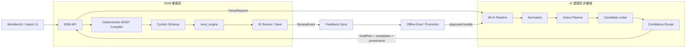
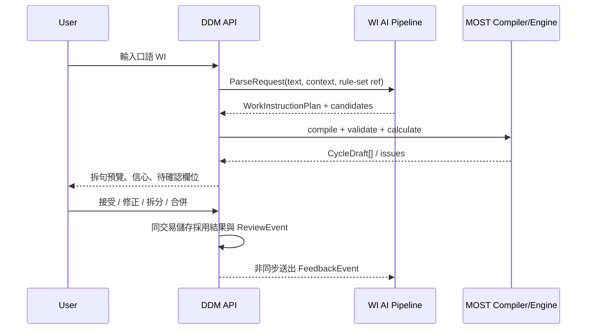
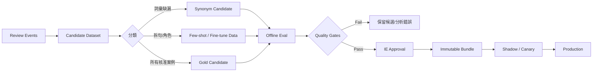

# WI AI Parser 系統規格（DDM v2 專屬）

**文件類型：** v2 系統架構與行為規格（canonical）
**版本：** 0.2 — 設計草案
**建立日期：** 2026-07-30（2026-07-31 補 domain evolution 契約）
**適用範圍：** `ddm-v2` 的互動式「AI 快速建模」與 CSV/Excel 批次建模
**決策依據：** [ADR-013](../decisions/ADR-013-excel-import-architecture.md)、[ADR-014](../decisions/ADR-014-v3-dictionary-as-value-authority.md)、[ADR-015](../decisions/ADR-015-nl-parsing-in-scope.md)、[ADR-016](../decisions/ADR-016-search-infrastructure.md)、[ADR-023](../decisions/ADR-023-dictionary-governance-unification.md)、[ADR-024](../decisions/ADR-024-master-data-vs-dictionary-boundary.md)、[ADR-025](../decisions/ADR-025-import-template-matching-p2.md)
**架構邊界提案：** [ADR-026](../decisions/ADR-026-wi-ai-parser-pipeline-boundary.md)、[ADR-027](../decisions/ADR-027-domain-evolution-versioning-and-ai-readiness.md)（均 proposed）
**核心邏輯依據：** [MiniMOST Sequence Model](../core-logic/minimost-sequence-model-core-logic-spec.md)
**資料與演進地基：** [Domain Evolution 與 AI Readiness](domain-evolution-and-ai-readiness-spec.md)
**設計研究來源：** 歷史 v3 WI parser 與 Romantic-Rush 評測研究已收斂進本文件；原始研究文件不再作實作依據。

> 本文件是 ddm-v2 的 WI AI Parser 實作與驗收依據。歷史研究若與本文件衝突，以本文件、
> accepted ADR、核心邏輯規格與現行 `most_engine` 契約為準。

---

## 1. 目的

使用者可以透過兩種入口提供自然語言作業描述：

1. 在工作台「AI 快速建模」輸入一段口語敘述，即時取得一筆或多筆 MiniMOST 草稿。
2. 上傳 CSV/Excel，一次處理數十至數百列作業敘述，預覽後批次採用。

兩種入口必須共用同一套解析核心，將自由文字轉成：

- 可稽核的作業計畫（要拆成幾個原子動作、動作順序與相依關係）；
- 每個原子動作的 GM/CM 候選與合法 option code 候選；
- 每個判斷的原文證據、來源、信心與待確認原因；
- 經 DDM 確定性編譯、`CycleIn` schema 與 `most_engine` 驗證後的 MOST 草稿。

系統的長期目標不是讓 LLM 自由產生 MOST，而是建立一條「能學習、可回退、受 MOST
規則約束」的建議管線，使自動採用區段維持高精度，並讓人工審核率隨經驗累積下降。

---

## 2. 名詞與責任

| 名詞 | 本文件定義 |
|------|------------|
| WI source | 使用者原始口語敘述或匯入列的 description |
| Action plan | 尚未轉成 MOST 前的原子動作、角色、數量與相依圖 |
| Role | hand、object、tool、from、to、distance、quantity、process、inspect 等語意角色 |
| Candidate | 對某個 action/slot 的合法候選，包含 option code、分數與證據 |
| Draft | AI 建議結果；尚未成為 worksheet 或標準工時 |
| Compile | 由確定性程式將 action plan 與候選組成合法 `CycleIn` |
| Review | IE 對拆句、角色、GM/CM、slot 或預設值的接受與修正 |
| Promotion | 將回饋轉為正式 synonym、few-shot、校準器或模型版本的治理流程 |
| Deployment bundle | 一次推論所使用的 parser、prompt、模型、索引、校準器與門檻版本集合 |

---

## 3. 不可違反的系統不變量

### 3.1 MOST 權威不變量

1. `most_engine` 是 GM/CM 結構驗證、TMU 與秒數計算的唯一權威。
2. AI pipeline 不得計算、覆寫或持久化權威 TMU。
3. AI pipeline 不得建立 active rule-set 中不存在的 option code。
4. AI pipeline 輸出永遠是 draft；寫入 worksheet 或發布 motion module 前必須重新經過：
   - DDM `CycleIn` schema；
   - GM/CM grammar 與跨模型欄位檢查；
   - active 或指定版本的 rule-set lookup；
   - `most_engine.compute_cycle()`。
5. 正式 METHOD 敘事由後端 narrative builder 依已驗證 cycle 產生；LLM 文字只能作為解釋，
   不得成為正式敘事權威。

### 3.2 建議層不變量

1. 缺少必要資訊時必須 `abstain` 或 `needs_review`，不得用高信心預設掩蓋缺漏。
2. 每個建議必須能追溯到原文 span、規則、檢索候選或明確的站點預設。
3. `explicit`、`inferred`、`default`、`missing` 四種來源必須分開呈現與記錄。
4. 格式合法不代表語意正確；constrained decoding 不得取代人工校準與評測。
5. 相同輸入、相同 context 與相同 deployment bundle 應得到可重現結果；外部模型不保證位元級
   重現時，必須以 response cache 保存原始結果。
6. 綁定 worksheet 的推論必須記錄 `source_revision`；採用時 revision 不一致即 fail closed，不得把
  舊結果靜默覆蓋到新內容。
7. Modeling policy、Level policy 與 AI deployment bundle 是三個不同版本軸，不得互相代替。

### 3.3 回饋治理不變量

1. 人工修正採 append-only event 留存 before/after，不覆蓋原始 prediction。
2. 單次修正不得直接改 production threshold、active synonym 或 production prompt。
3. 回饋只能先成為 candidate data，經離線評測與 IE 核准後 promotion。
4. production deployment bundle 必須不可變、可識別、可回退。

---

## 4. 範圍

### 4.1 本期範圍

- 繁體、簡體、英文與中英混合 WI。
- 口語、語序顛倒、常見錯字、全半形與單位正規化。
- 一段文字拆成一筆或多筆原子動作。
- 工具取得、工具使用、檢查與可選歸位之間的相依關係。
- 數量抽取，以及「展開多列 / row frequency / slot repeat」的受治理決策。
- Rule、LLM/NER、hybrid retrieval、reranker 的混合候選。
- 互動式同步預填。
- CSV/Excel staging、背景解析、預覽、部分重跑與提交。
- Slot/action 級信心、審核分流與 provenance。
- 人工修正事件、gold set、校準與 promotion 流程。

### 4.2 非目標

- 不由 AI 定義或修改 MOST TMU 規則。
- 不由 LLM 直接建立正式 worksheet、發布 motion module 或核准標準工時。
- 不承諾從沒有圖片內容的「依圖示」推得圖中位置；沒有 VLM 輸入時應標 missing。
- 不在本規格中實作影片動作辨識或 VLM；未來可輸出相同 `WorkInstructionPlan` 契約。
- 不以線上自我訓練取代版本化、可回退的發布程序。
- 不把 Romantic-Rush 的 RAGAS 指標當作 MOST 正確性的最終判準。

---

## 5. 架構決策：獨立 pipeline、共享契約、DDM 最終裁決

### 5.1 邏輯邊界

WI AI Parser 應建立為獨立 bounded context。它可以與 DDM 同 repository 開發，但必須具備
可獨立部署的 API contract，且不得直接 import DDM ORM 或 `most_engine`。



### 5.2 部署演進

| 階段 | 形態 | 適用時機 |
|------|------|----------|
| A | 同 monorepo、獨立 Python package、in-process adapter | 契約與 gold set 建立期；降低初期維運成本 |
| B | 獨立 `wi-ai-api` 容器，DDM 以 HTTP adapter 呼叫 | LLM/embedding dependencies 或資料落地策略需隔離時 |
| C | `wi-ai-api` + `wi-ai-worker` + job queue | CSV/Excel 數十至數百列、GPU 排程、retry/cancel 上線時 |

從階段 A 起就必須遵守：

- request/response schema 有獨立版本；
- DDM 只依賴 `ParserPort`，in-process 與 HTTP adapter 可互換；
- timeout、circuit breaker 與 rule-based fallback 是 contract 的一部分；
- AI 服務不可取得 worksheet 寫入權限；
- rule-set 只以 read-only projection 提供，DDM 仍是資料 owner。
- DDM 對 AI 提供版本化 context/policy reference，不讓 AI runtime 直接讀 mutable domain tables。

### 5.3 建議專案結構

```text
ddm-v2/
├── src/ddm_v2/
│   ├── nlp/                         # DDM-side port、fallback adapter、contract mapping
│   ├── most_compiler/               # action plan → CycleIn，確定性、無模型
│   └── most_engine/                 # 唯一 TMU 權威，維持現有邊界
├── services/wi_ai/
│   ├── api/                         # parse / jobs / health
│   ├── pipeline/                    # normalize / plan / link / route
│   ├── adapters/                    # LLM / GLiNER / embedding / reranker
│   ├── evaluation/                  # gold set runner、calibration、risk-coverage
│   └── worker/                      # 批次處理；階段 C 啟用
└── packages/wi_ai_contract/
    └── schemas/                     # 唯一跨程序 contract
```

`services/wi_ai/` 是目標形，不要求在第一個實作階段立即搬檔。現有
[`src/ddm_v2/nlp/`](../../src/ddm_v2/nlp/) 應先透過 port 與 contract 收斂，再抽離部署。
階段 A 仍放在 `src/ddm_v2/nlp/`，直到 `services/wi_ai/` 擁有自己的 packaging、entrypoint
與部署驗證；不得把未被 `pyproject.toml` 納入的目錄當成可部署 Python package。

---

## 6. 權威資料與 read-only projection

### 6.1 DDM 擁有的資料

- active/published rule-set 與 A/B/G/P/M/X/I 選項；
- work vocab、motion modules、worksheet 與 cycle；
- import staging 與使用者採用結果；
- IE review 決策；
- 被核准的 synonym 及其治理狀態。
- worksheet revision、正式 method context、modeling policy 與 Level policy；
- 正式採用事件與 transactional outbox。

### 6.2 AI pipeline 可持有的資料

- 指定 rule-set/version 的 read-only option projection；
- option text、synonym、embedding 與 reranker index；
- inference run、候選分數、latency 與模型 provenance；
- candidate training/evaluation dataset；
- immutable deployment bundle 與 response cache。

AI 可保存 DDM context/policy 的 immutable snapshot 或 reference 供推論重現，但不得把副本變成
新的業務權威。正式表、版本軸與 proposed schema 見
[Domain Evolution 與 AI Readiness](domain-evolution-and-ai-readiness-spec.md)。

### 6.3 Rule-set projection

DDM 必須以版本化 snapshot 提供 AI linking 所需資料：

```json
{
  "projection_version": "rsproj-v1",
  "rule_set_code": "MINIMOST_FACTORY_V2",
  "rule_set_id": "uuid",
  "content_hash": "sha256:...",
  "slots": {
    "G": [{
      "option_code": "g_grasp",
      "label_zh": "抓握",
      "sentence_zh": "抓握",
      "synonyms": ["握取", "拿住"]
    }]
  }
}
```

AI index 必須以 `rule_set_id + content_hash + embedding_model_revision` 識別。projection 變更時
建立新 index，不就地修改既有版本。

---

## 7. 核心中間表示：WorkInstructionPlan

### 7.1 為何不能讓 LLM 直接輸出 MOST

口語 WI 的第一個問題是「人在做哪些事」，第二個問題才是「這些事如何表達為 MiniMOST」。
若把兩者合成單一 prompt，拆句、數量、工具狀態與 slot mapping 的錯誤會混在一起，難以評測、
修正與學習。

因此 LLM/NER 的主要輸出必須是 MOST-neutral 的 `WorkInstructionPlan`。MOST option linking 可以提供
候選，但最終 cycle 組裝留在 DDM deterministic compiler。

### 7.2 Plan 契約

```json
{
  "schema_version": "wi-plan-v1",
  "source": {
    "text": "拿取電動起子，依圖示鎖附兩顆螺絲",
    "normalized_text": "拿取電動起子,依圖示鎖附兩顆螺絲",
    "language": "zh",
    "source_ref": {"kind": "interactive", "id": null, "row": null}
  },
  "actions": [
    {
      "action_id": "a1",
      "action_type": "acquire",
      "sequence_order": 1,
      "roles": {
        "tool": {"text": "電動起子", "status": "explicit"},
        "quantity": {"value": 1, "status": "explicit"},
        "hand": {"value": null, "status": "missing"},
        "from_location": {"text": null, "status": "missing"}
      },
      "evidence": [{"start": 0, "end": 6, "text": "拿取電動起子"}],
      "confidence_raw": 0.0
    },
    {
      "action_id": "a2",
      "action_type": "fasten",
      "sequence_order": 2,
      "roles": {
        "tool_ref": {"action_id": "a1", "status": "inferred"},
        "object": {"text": "螺絲", "status": "explicit"},
        "quantity": {"value": 2, "status": "explicit"},
        "destination": {"text": "圖示位置", "status": "explicit_unresolved"}
      },
      "evidence": [{"start": 7, "end": 16, "text": "依圖示鎖附兩顆螺絲"}],
      "confidence_raw": 0.0
    }
  ],
  "dependencies": [
    {"from": "a1", "to": "a2", "type": "tool_held_for"}
  ],
  "unresolved": ["hand_assignment", "distance", "visual_destination"],
  "provenance": {}
}
```

### 7.3 Action type 封閉集合

第一版 action type 使用下列封閉集合；新增類型須更新 contract 與 compiler 測試：

| Action type | 語意 | 常見 MOST 編譯方向 |
|-------------|------|--------------------|
| `acquire` | 取得工件或工具 | GM |
| `move_place` | 搬運、放置、插入、卡合 | GM |
| `controlled_move` | 推、拉、旋轉、刷、移動工具 | CM |
| `process` | 鎖附、點膠、熱熔、壓合、掃碼等製程 | CM 的 X，必要時連 M |
| `inspect` | 查看、確認、檢查、對點 | CM 的 I 或獨立 CM |
| `release_return` | 放開、工具歸位、返回 | GM；是否生成由 policy 決定 |
| `composite_unknown` | 確認含多動作但無法可靠拆解 | 不編譯，自動送審 |

### 7.4 Role status

| Status | 含義 | 可否自動採用 |
|--------|------|--------------|
| `explicit` | 原文直接提供，有 span 證據 | 可，仍需 linking/engine gate |
| `inferred` | 由上下文、站點規則或工具狀態推得 | 依校準門檻與規則治理 |
| `default` | 使用已版本化的 site/process default | 必須顯示來源；關鍵 slot 預設通常需審 |
| `explicit_unresolved` | 原文明講，但缺外部內容，例如「依圖示」 | 不可自動採用該欄位 |
| `missing` | 原文與 context 均無法提供 | 不可假裝高信心；依必要性送審 |

---

## 8. 解析與編譯管線

### 8.1 Stage 0：Ingest 與正規化

- 驗證字數、檔案列數、編碼與支援語言。
- NFKC、OpenCC、英文小寫、空白與標點正規化。
- 單位正規化但保留原單位；`20mm` 不得直接當成 `20cm`。
- 保留 raw ↔ normalized offset map，供 evidence 與 UI highlight。
- 產生 `input_hash`；hash 必須包含 normalized text、context hash 與 deployment bundle id。

### 8.2 Stage 1：文件與工序 context grounding

解析請求可附：

- site、product、SKU、process/station；
- 可用工具與物料清單；
- from/to 常用位置；
- 站點預設手別、距離與歸位 policy；
- CSV 同批次的表頭、前後列摘要與文件 metadata；
- 圖片/VLM reference 是否實際可讀。

context 必須版本化並寫入 hash。未提供的 context 不得由模型假設存在。

Context 分為兩層：

- **正式 method context**：品質、安全、圖示、SOP、工具/機台設定等被使用者採用的工序事實，
  由 DDM 擁有並依 `wi-context-*` schema 儲存。
- **parse context snapshot**：站點預設、候選工具/物料、前後列提示等推論輸入，隨 inference run
  保存，不等於正式工序事實。

AI metadata（prompt、top-K、score、latency）不屬於上述任一正式 context，不得寫入 `slot_inputs`
或 method context。

### 8.3 Stage 2：Action planning

主解析器以 LLM structured output 或經微調的 GLiNER/專用模型產生 `WorkInstructionPlan`：

- 判斷 action 數與順序；
- 抽取 hand/object/tool/from/to/distance/quantity/process/inspect；
- 建立 `uses_tool`、`tool_held_for`、`same_object`、`precedes` 等 dependency；
- 標記每個 role status 與原文 evidence；
- 不輸出 TMU；
- 不把未知資訊補成 `explicit`。

LLM 必須使用 constrained structured output、`temperature=0`、鎖定 model revision 與 prompt version。
同一 deployment bundle 的 response 應快取。

### 8.4 Stage 3：確定性展開 policy

Action planning 後先套用 DDM 所有、版本化的 domain policy，不讓 LLM 自由裁決：

#### 數量 policy

| 情境 | 建議表達 |
|------|----------|
| 完整方法循環相同，且每次重新取得/放置 | row `frequency=N` |
| 一次取得 N 件，後續逐件操作 | 取得 action 與操作 action 分開，分別決定 frequency |
| 同一 slot 內動詞分量重複且引擎允許 | slot `repeat_count=N` |
| 每件位置、距離、姿勢或方法不同 | 展開成 N 個 action/cycle |
| 無法判定是否同方法 | 保留 quantity，標 `quantity_policy_review` |

#### 工具狀態 policy

- `acquire(tool)` 建立 held-tool state；後續 action 可用 `tool_ref`。
- LLM 不得因看到工具名稱就假設已持有。
- 是否自動生成工具歸位 action 由 site/process policy 決定；沒有 policy 時不生成並標提示。
- 換手、雙手與 SIMO 不由文字相似度決定，必須走明確規則或審核。

#### 檢查 policy

- 「鎖附」不必然等於「並確認」。只有明示、版本化 process policy 或已核准標準模組可加入 I。
- 若原文只有「依圖示」，沒有圖像資料時不得推得實際位置或檢查結果。

### 8.5 Stage 4：Slot candidate linking

每個 role/span 只在對應 slot 的合法候選池檢索：

數值型 A `reach_cm/twist_deg/foot_cm` 與 M `distance_cm/angle_deg/revolutions/diameter_cm`
不進 option candidate pool；只做單位正規化並保留原始量值，band/ladder selection 依
[ADR-026 §2](../decisions/ADR-026-wi-ai-parser-pipeline-boundary.md) 留在 `most_engine`。

1. L1：DB synonym exact/longest match。
2. L2：pg_trgm/BM25/字面與拼音容錯。
3. L3：多語 embedding hybrid retrieval。
4. L4：cross-encoder reranker 或 LLM 在 top-K 內選擇。

要求：

- G query 只能搜尋 G pool，X query 只能搜尋 X pool。
- 回傳 top-K、raw scores、rank、margin、source engine 與 option projection version。
- Retrieval 永遠有最近鄰，因此低於門檻時必須回空或 abstain，不得強選 top-1。
- Rule 與 retrieval/LLM 不一致是送審訊號，不以固定優先順序靜默覆蓋。

現行 `motion_templates` 關鍵字匹配（ADR-025）是本階段的 **L0 完整 cycle candidate**：

- `map` 預覽與逐列 IE 採用的既有流程維持不變；
- template 命中可與 rule/retrieval/LLM 候選並列，但不能因分數較高而繞過 IE 採用；
- 被採用的 template 仍由 DDM 以 active rule-set 重新建立 `CycleIn` 並呼叫 engine；
- 新 pipeline 不另寫一套 template scoring，也不把 template 內的快取 TMU 當權威；
- 導入 parse job 是對 `upload → map → submit` 的加法 enrich，不是靜默取代 ADR-025。

### 8.6 Stage 5：Deterministic MOST Compiler（DDM 端）

Compiler 輸入 `WorkInstructionPlan + SlotCandidates + RuleSetProjectionRef + ModelingPolicyVersion`，輸出
一筆或多筆 `CycleDraft`：

1. 依 action type、角色與 policy 判定 GM/CM 候選。
2. GM 只允許 `A-B-G-A-B-P-A`；CM 只允許 `A-B-G-M-X-I-A`。
3. 數值只做單位正規化，將原始 `cm/deg/revolutions/diameter_cm` 寫入 cycle；A/M band 與
  ladder selection 仍由 `most_engine` 依指定 rule-set 計算，compiler 不複製 band table。
4. option code 必須存在於指定 rule-set projection。
5. 缺少關鍵欄位時可產生 partial draft，但不可假裝完整。
6. 先通過 compiler-owned 的 strict GM/CM intermediate schema（未知欄位 `forbid`），再以加法
  adapter 映射到現有單一 `CycleIn`；本規格不要求把 public `CycleIn` 改成 discriminated union。
7. 呼叫 `most_engine.compute_cycle()`；失敗即 draft invalid，不得落庫。
8. 由 narrative builder 產生正式 METHOD 預覽。

現有 `CycleIn` 以 `seq` + optional GM/CM fields 表示，`cycle_in_to_engine()` 依 `seq` 選取相關
slot；compiler 的 strict intermediate schema 是新增的內部防線，不得破壞 ADR-011 的既有 API
相容性。若未來要將 public `CycleIn` 改成 discriminated union 或 `extra="forbid"`，必須另走契約
演進決策與 OpenAPI 相容測試。

### 8.7 Stage 6：Confidence 與 routing

信心分三層計算，不以單一 `overall_confidence` 掩蓋結構錯誤：

- `c_plan`：action count、boundary、dependency 的校準信心。
- `c_role`：各語意角色抽取信心。
- `c_slot`：各 option linking 的校準信心。

Slot 信心可由校準後分數、top1-top2 margin 與多引擎一致性融合：

$$c_{slot} = w_p p_{calibrated} + w_m margin + w_a agreement$$

整筆 routing 不取簡單平均；關鍵欄位採最弱環節：

$$c_{critical} = \min(c_{plan}, c_G, c_P \text{ or } c_M, c_X, c_I)$$

只有同時滿足下列條件才可標 `auto`：

- action plan 通過結構檢查；
- 沒有 unresolved required role；
- 所有 critical slot 高於其校準門檻；
- 多引擎無重大不一致；
- compiler、schema 與 `most_engine` 全數通過；
- deployment bundle 未被停用。

Routing 狀態：

| 狀態 | 行為 |
|------|------|
| `auto` | 可自動填入草稿表單，但仍不是正式標準 |
| `review` | 顯示可疑 action/role/slot 與 top-K，IE 一鍵修正 |
| `abstain` | 不產生完整 cycle；要求補資料或由 IE 建模 |
| `invalid` | schema/engine/版本不一致，禁止採用 |

---

## 9. 互動式流程



UI 必須先呈現「拆成幾個動作」，再呈現每個 action 的 MOST slot。使用者可：

- 拆分、合併、調序、刪除或新增 action；
- 修改 role 與 quantity policy；
- 在 top-K 中替換 option；
- 補填 missing context；
- 選擇「覆蓋全部」或「只填空白」；
- 看見 explicit/inferred/default/missing 與 evidence highlight。

未按採用前，worksheet 與 motion module 不得有副作用。

---

## 10. CSV/Excel 批次流程

### 10.1 共用核心

批次不可另寫簡化 parser。每個 source row 呼叫與互動入口相同的 parse/compile contract；差別只在
orchestration、context 與持久化。

「共用核心」不排除 ADR-025 的標準 template 候選；template matching 是候選來源，完整 action
planning 是未命中或需重建時的解析來源，兩者最後共用 DDM validation/engine gate。

### 10.2 Job 模型

```text
upload → map columns/template preview → staging → create parse job → process rows
       → review summary → retry selected rows → approve selected drafts → submit
```

Job 至少支援：

- `queued/running/partial/completed/failed/cancelled` 狀態；
- row 級狀態與錯誤，不因單列失敗回滾全部推論；
- bounded concurrency、rate limit、timeout 與 retry；
- 取消、續跑、只重跑失敗或指定列；
- deployment bundle pinning，整批使用同一版本；
- idempotency key，避免重複產生結果；
- `source_row → generated_actions[] → cycle_drafts[]` 可追蹤關係；
- 預覽確認後才進 DDM 提交交易。

Job 建立時必須 pin `deployment_bundle_id + rule_set_projection_hash + modeling_policy_version_id`；
同一 job 不可在處理到一半切換版本。Row-level durable schema、lease/retry 與 `staged_rows` 加法遷移見
[Domain Evolution 與 AI Readiness §12](domain-evolution-and-ai-readiness-spec.md)。

### 10.3 文件 context 與列隔離

可先從整份文件抽出 product/station/tool/location 等共享 context，再逐列獨立解析。不得把數百列
放進單一 prompt；否則容易截斷、列錯位且無法單列重跑。

前後列 context 只能作候選提示，不可無證據地把上一列物件寫入下一列。任何 carry-over 必須以
`context_ref` 和 `inferred` provenance 記錄。

### 10.4 提交語義

- 一個 source row 可展開為多個 worksheet rows。
- 使用者可只採用部分 source rows。
- AI 產生的 TMU 不被信任；提交時 DDM 重新 compile/compute。
- 失敗與 abstain 列維持 staging，不建立 0 TMU 假標準。
- imported observed seconds 與 MOST calculated seconds 保持不同欄位與語意。

上述「abstain 留在 staging」是新 parse-job 提交模式的目標行為。現行 `/imports/{id}/submit`
仍依 ADR-025 對未採用 template 的列建立 stub；在 ADR-026 尚未 accepted、且未另行修訂
ADR-025 前，不得移除或偷偷改變既有 submit 語義。P5 實作時應採新增 submit mode/endpoint，
或先以後續 accepted ADR 明確取代 stub 政策。

---

## 11. API Contract（目標）

### 11.1 DDM 對外 API

既有 public API 可維持相容，逐步加法演進：

| API | 用途 |
|-----|------|
| `POST /api/v2/worksheets/nl-draft` | 互動式解析；回傳一或多筆 action/cycle draft |
| `POST /api/v2/imports/upload` | CSV/Excel ingest 到 staging |
| `POST /api/v2/imports/{id}/map` | 現行欄位對應、template preview 與 staging |
| `POST /api/v2/imports/{id}/parse-jobs` | 建立批次 AI 解析 job |
| `GET /api/v2/imports/{id}/parse-jobs/{job_id}` | 查進度與 row summary |
| `POST /api/v2/imports/{id}/parse-jobs/{job_id}/retry` | 重跑指定列 |
| `POST /api/v2/imports/{id}/submit` | 現行 ADR-025 提交；新模式須加法擴充或另開 endpoint |
| `POST /api/v2/nl-drafts/{run_id}/reviews` | 儲存人工審核事件與採用結果 |

舊版 `NLDraftResult` 欄位只增不改；遷移期可透過 adapter 將第一筆 cycle 轉為 legacy shape，但當
結果含多 action 時，舊前端必須收到明確 warning，不得靜默只取第一筆。

### 11.2 DDM 對 AI 內部 API

#### ParseRequest

```json
{
  "contract_version": "wi-ai-v1",
  "request_id": "uuid",
  "text": "...",
  "source_ref": {
    "kind": "interactive",
    "worksheet_id": "uuid-or-null",
    "worksheet_revision": 12,
    "import_id": null,
    "import_row_id": null
  },
  "context_snapshot": {},
  "context_hash": "sha256:...",
  "rule_set_projection_ref": {
    "rule_set_id": "uuid",
    "content_hash": "sha256:..."
  },
  "modeling_policy_ref": {
    "version_id": "uuid",
    "content_hash": "sha256:..."
  },
  "level_policy_ref": null,
  "deployment_bundle_id": "wi-ai-2026-07-001"
}
```

#### ParseResponse

```json
{
  "contract_version": "wi-ai-v1",
  "run_id": "uuid",
  "plan": {},
  "slot_candidates": [],
  "routing": {
    "status": "review",
    "reasons": ["missing_distance", "quantity_policy_review"]
  },
  "provenance": {
    "source_worksheet_revision": 12,
    "rule_set_projection_hash": "sha256:...",
    "modeling_policy_version_id": "uuid",
    "level_policy_version_id": null,
    "deployment_bundle_id": "wi-ai-2026-07-001",
    "model": "provider/model@revision",
    "prompt_version": "plan-v3",
    "index_version": "sha256:...",
    "calibrator_version": "cal-v2",
    "threshold_version": "threshold-v4",
    "latency_ms": {}
  }
}
```

### 11.3 錯誤與降級

| 情境 | DDM 行為 |
|------|----------|
| AI timeout/unavailable | 退回現有 rule-based adapter，整筆標 `review` 與 fallback provenance |
| embedding unavailable | 保留 exact/trgm 候選，semantic=false |
| reranker unavailable | 使用 retrieval ranking，降低 confidence 並標 review |
| rule-set projection mismatch | fail closed，重新同步 projection，不採用舊候選 |
| worksheet revision mismatch | `409 WORKSHEET_REVISION_CONFLICT`；重新解析或人工 merge |
| modeling policy mismatch | fail closed，不以今天的 policy 解讀舊結果 |
| LLM schema invalid | bounded retry 一次；仍失敗則 fallback/abstain |
| compiler/engine reject | `invalid`，回傳結構化 issue，不寫 worksheet |

---

## 12. 推論、審核與回饋資料模型

### 12.1 InferenceRun

至少包含：

- `run_id`、request id、source kind/ref/row；
- raw/normalized text 與 context hash；
- complete WorkInstructionPlan；
- deployment bundle 與 rule-set projection；
- 所有 candidates/raw scores/calibrated scores；
- routing status/reasons；
- latency、fallback 與錯誤；
- retention class 與建立時間。

### 12.2 ReviewEvent

Review event 使用封閉類型：

| Event | 說明 |
|-------|------|
| `accept_plan` | 接受 action count、boundary 與順序 |
| `split_action` / `merge_actions` | 修正拆句 |
| `reorder_action` / `add_action` / `delete_action` | 修正作業計畫 |
| `replace_role` | 修正 object/tool/hand/from/to/distance/quantity |
| `replace_candidate` | 更換 G/P/M/X/I 等 option code |
| `change_sequence_model` | GM/CM 修正 |
| `change_quantity_policy` | 展開列、frequency、repeat 的修正 |
| `mark_missing` | 確認輸入本身資訊不足 |
| `accept_all` | 接受完整 draft；仍保存各層 prediction |

每個事件包含 `before`、`after`、reason、reviewer、timestamp、site、source run 與 UI 版本。

### 12.3 儲存責任與一致性

- DDM 在採用/儲存的同一 DB transaction 中寫入 review event 或 outbox event。
- AI feedback ingestion 採 at-least-once；以 event id 去重。
- AI service 不參與 worksheet distributed transaction。
- inference log 與 feedback 可在 AI storage 建 projection，但 DDM 採用結果仍是業務事實來源。

Inference/review/bundle/outbox 的欄位級 proposed schema 不在本文件重複定義，以
[Domain Evolution 與 AI Readiness §10–12](domain-evolution-and-ai-readiness-spec.md) 為準。本文件只定義
解析行為、事件語意與學習流程。

---

## 13. 長期學習與 Promotion Pipeline



### 13.1 回饋分類

- 同義詞缺漏：產生 synonym candidate，不直接寫 active synonym。
- action boundary 錯誤：加入 segmentation/few-shot dataset。
- role 錯誤：加入 extraction dataset。
- top-K 有正解但 top-1 錯：改善 reranker/calibrator。
- top-K 無正解：改善 index、option text 或 synonym recall。
- quantity/tool-state 錯：先修 deterministic policy 或規格，不優先以模型掩蓋。
- reviewer 意見不一致：標 adjudication，不進 gold test。

### 13.2 Romantic-Rush 可借用部分

採用：

- contextual gate 的「分段 → embedding → 門檻」骨架；
- 多閘門/多引擎不一致作為不確定訊號；
- IQR 不確定區間與 active-learning 取樣；
- 高信心結果少量抽查，避免只審低分造成 selection bias；
- EMA/rolling median 作為離線 threshold 建議；
- 合成中英與口語測試案例，人工核准後再進 gold。

不採用：

- 直接以 RAGAS 或 LLM-as-a-judge 判定 MOST 正確；
- 線上逐筆回饋即時改 production threshold；
- Romantic-Rush 的整套 service topology；
- 未經 IE 核准的自動 synonym 回灌。

### 13.3 Threshold 治理

Phase 1–3 使用從固定 gold/calibration split 得出的固定門檻。Phase 4 可利用 EMA/IQR 建議新門檻，
但只能產生新的 `threshold_version`，經離線 risk-coverage 評測與核准後發布。

任何歷史 inference 必須保存當時 threshold version，不能用今天門檻改寫昨天 routing 結果。

---

## 14. 評測規格

### 14.1 Gold set 四層標註

Gold sample 不只標 slot，必須包含：

1. **Plan**：action count、boundary、順序、dependency。
2. **Role**：hand/object/tool/from/to/distance/quantity/process/inspect 與 evidence span。
3. **Compilation**：每個 action 的 GM/CM、quantity policy、frequency/repeat、option code。
4. **End-to-end**：完整 CycleIn[] 與由權威引擎算出的結果。

### 14.2 Dataset 切分

- `train`：模型或 reranker 訓練。
- `calibration`：校準分數與選 threshold，不可與 train 混用。
- `test`：IE 人工核准、不可用於調參。
- `temporal_holdout`：較晚時間的真實資料，檢查資料漂移。
- 同一句的改寫、同一 motion module 衍生樣本必須放在同一 split，避免 leakage。

### 14.3 挑戰維度

至少包含：繁簡、全形、錯字、同音、中英混合、英文、語序顛倒、口語、多 action、數量、
工具持有、SIMO、缺資訊、歧義、依圖示但無圖片、不同 site 用語與匯入髒資料。

### 14.4 指標與上線門檻

| 層級 | 指標 | 初始目標 |
|------|------|----------|
| Plan | action-count exact match | ≥ 0.95 |
| Plan | boundary/dependency F1 | ≥ 0.90 |
| Role | role/span F1 | ≥ 0.90 |
| Retrieval | recall@5，逐 slot | ≥ 0.95 |
| Linking | critical slot top-1 accuracy | ≥ 0.95 |
| End-to-end | sentence/cycle exact match | ≥ 0.85 |
| Routing | auto-accept precision | ≥ 0.98 |
| Routing | coverage at target precision | 初期 ≥ 0.50，穩定後目標 ≥ 0.70 |
| Safety | 非法 GM/CM 或不存在 option code 自動通過率 | 0 |
| Audit | median time-to-review | < 10 秒/action |

門檻須按 site、語言、action type 與 critical slot 分層觀察；不能只看整體平均。

### 14.5 CI 與發布 gates

每個 deployment bundle 必須通過：

1. contract/schema tests；
2. deterministic compiler unit tests；
3. `most_engine` golden tests；
4. gold test regression，不得低於 production bundle；
5. calibration 與 risk-coverage report；
6. adversarial/缺資訊/failover tests；
7. shadow traffic 比較與人工抽查；
8. IE sign-off。

---

## 15. 審核 UX

審核成本等於「送審數量 × 每筆時間」。UI 應：

- 先顯示 action 拆解，不把拆句錯誤藏在 slot 表單後面；
- 只高亮 `review/abstain` 的 action、role 或 slot；
- 顯示原文 evidence、推論來源與 review reason；
- 每個待審 slot 提供 top-K 一鍵替換；
- 支援鍵盤接受、替換與下一筆；
- 批次依相似錯誤、site、action type 分組；
- 可批量接受完全相同 input hash + bundle 的重複結果；
- 保留少量高信心抽查，不讓 UI 永遠只顯示低信心樣本。

不得把原始 cosine、logit 等無法解釋的 raw score 假裝成百分比正確率；UI 顯示的機率必須來自
有版本的 calibrator。

---

## 16. 可觀測性、SLO 與成本

### 16.1 指標

- request/job/row throughput、queue depth、p50/p95 latency；
- LLM token、embedding/reranker latency 與單列成本；
- fallback、timeout、schema invalid、engine reject rate；
- action count、slot confusion matrix、OOV 與 abstain rate；
- auto precision、coverage、audit rate、review duration；
- 依 site/language/action type 的 drift；
- bundle adoption、rollback 與 index mismatch。

### 16.2 初始 SLO

| 流程 | SLO |
|------|-----|
| 互動式單句 p95 | 地端 ≤ 4 秒；雲端依供應商另訂，但 UI 必須有 timeout |
| Rule fallback p95 | ≤ 500 ms |
| 批次 job | 以 row progress 回報，不以單一 HTTP timeout 當完成界線 |
| 核心可用性 | AI unavailable 時 DDM 手動建模與 `most_engine` 必須正常 |

### 16.3 快取

Cache key 至少包含：

```text
normalized_text_hash
+ context_hash
+ rule_set_projection_hash
+ deployment_bundle_id
+ modeling_policy_version_id
+ source_worksheet_revision（綁定 worksheet 時）
```

任何一項不同都不得誤用舊結果。

---

## 17. 安全、資料落地與權限

- 製造 WI、產品、站點與圖片可能是敏感資料；外部 LLM 使用前必須有資料落地決策。
- AI 服務使用最小權限，只讀必要 projection，不持有 DDM admin credential。
- Prompt/log 中的員工識別資訊應最小化或去識別。
- Inference 與 feedback retention 需可配置並有刪除流程，但已發布標準的 audit record 依治理保留。
- 防 prompt injection：匯入文字只當資料，不允許改變 system instruction、schema 或 tool policy。
- 外部模型回應仍需完整 schema、candidate allow-list 與 engine gate；供應商安全聲明不能取代驗證。
- API 需有 request size、row count、rate limit、timeout 與 idempotency 防護。

---

## 18. 現況與遷移

### 18.1 目前已具備

- [`DraftParserPort`](../../src/ddm_v2/nlp/ports.py) 與 rule-based adapter。
- NFKC/OpenCC 正規化與 DB synonym longest match。
- `POST /api/v2/worksheets/nl-draft` 唯讀建議端點。
- 前端覆蓋/只填空白流程與後端 calculate debounce。
- pg_trgm/pgvector 搜尋基礎設施與 `EmbeddingProvider` port。
- Excel staging、mapping、preview 與 template keyword matching。
- `CycleIn` 與 `most_engine.compute_cycle()` 的權威驗證路徑。

### 18.2 目前主要缺口

- parser 固定以單一 GM-shaped slots 表示，尚未依 action 產生 GM/CM-specific 建議；這不表示
  必須破壞性重構現有 public `CycleIn`。
- 沒有 action planning、一句多 action、dependency、quantity/tool-state policy。
- context 的 object/from/to 抽取與 A distance 套用不完整。
- 現有 confidence 不是校準機率，跨參數歧義 top-K 尚未實作。
- semantic search 尚未接入 WI option linking。
- import 未採用 template 時仍建立 stub，而非共用完整 parser/compiler。
- 沒有 inference/review event、gold pipeline、promotion 與 bundle registry。
- 沒有背景 job queue/worker、row retry/cancel/progress。
- worksheet 無 draft revision/optimistic lock，AI 結果沒有 stale apply 防線。
- Level validator/output contract 無 policy version 與 validation run，未來規則改版無法完整回放。
- 正式 method context、modeling policy 與 AI metadata 尚未分層儲存。

### 18.3 相容原則

- 現有 rule-based parser 保留為 baseline 與 fallback。
- `/nl-draft` 契約採加法演進；前端完成多 action UI 前不得自動丟棄額外 action。
- AI pipeline 抽離前先以 port + contract 隔離，避免一次搬遷造成行為回歸。
- import 與 interactive 最終共用 compiler，不維護兩套 MOST 建模邏輯。

---

## 19. 分階段交付

| Phase | 內容 | 退出條件 |
|-------|------|----------|
| P-1 Domain Readiness | worksheet revision、policy manifests、context/AI ownership 與資料契約 | stale write 409；現行 MOST/Level 行為有 V1 manifest 可追溯 |
| P0 規格與量測 | contract、action/quantity policy、四層 gold schema、現況 baseline | IE 核准至少 50 筆真實案例；eval 可重現 |
| P1 契約與紀錄 | v2 parser contract、inference/review event、deployment bundle、legacy adapter | 現有 rule parser 全部經新 contract；無 API 回歸 |
| P2 Action Planner Shadow | LLM/GLiNER structured plan、evidence、multi-action，不自動套用 | plan action-count ≥0.95、boundary F1 ≥0.90 |
| P3 Linking + Compiler | slot-scoped retrieval/reranker、quantity/tool policy、deterministic compiler | recall@5 ≥0.95；非法結構自動通過率 0 |
| P4 互動審核 | confidence calibration、top-K UI、auto/review/abstain、shadow/canary | auto precision ≥0.98；review UX <10 秒/action |
| P5 批次 Worker | CSV adapter、job queue、progress/retry/cancel、row→actions lineage | 1000 列有界處理；失敗列可獨立重跑 |
| P6 Learning Loop | feedback classification、candidate dataset、promotion、bundle registry | 跑通一輪修正→eval→IE 核准→canary→發布 |

不得為趕進度跳過 P-1 revision/policy foundation、P0 baseline，或直接讓 P2 LLM 結果寫入
worksheet。詳細依賴、migration batches 與暫緩條件見
[WI AI 與批次建模交付計畫](../roadmap/wi-ai-and-batch-modeling-delivery-plan.md)。

---

## 20. 待 IE/架構決策

下列問題未定前，以「保守送審、不自動推論」為預設：

1. 工具取得、使用、歸位在各 process 的拆句 policy。
2. quantity 何時用 row frequency、slot repeat 或展開多 action。
3. 「鎖附」是否在特定站點隱含確認 I；預設為不隱含。
4. 左右手、雙手與 SIMO 是否允許由 station policy 自動分配。
5. A/M distance 缺漏時可使用哪些 site/process default。
6. 雲端 LLM 是否允許、可傳哪些資料、保留多久。
7. 地端 GPU、模型服務與 batch queue 技術選型。
8. Review event 與 inference text 的 retention、匿名化與跨 site 可見性。
9. 初始 auto-accept precision/coverage 工作點與高信心抽查比例。
10. Synonym、few-shot、calibrator、model bundle 的 IE 核准角色與發布流程。
11. Worksheet revision、Level policy manifest、modeling policy 與 method context schema 的核可。

這些決策應在實作對應 Phase 前以 ADR 或本規格的 accepted revision 固化，不應由開發者或模型自行猜測。

---

## 21. 文件權威與閱讀順序

實作者依下列順序判定：

1. accepted ADR；
2. [MiniMOST Sequence Model 核心規格](../core-logic/minimost-sequence-model-core-logic-spec.md)；
3. 本文件；
4. 現行 OpenAPI/schema 與 `most_engine` tests；
5. 現行 `src/ddm_v2/nlp/`、integration/unit tests 與版本化 evaluation reports；
6. 已封存於版本歷史的研究材料。

若第 1–4 層互相衝突，必須先更新 ADR/規格並補 regression test，不可挑方便的一份實作。
