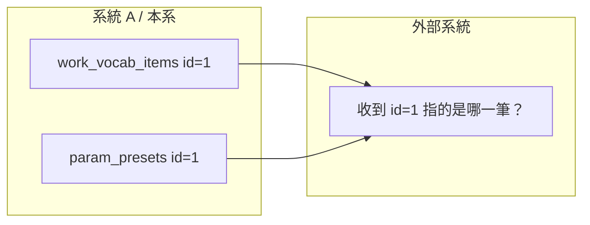
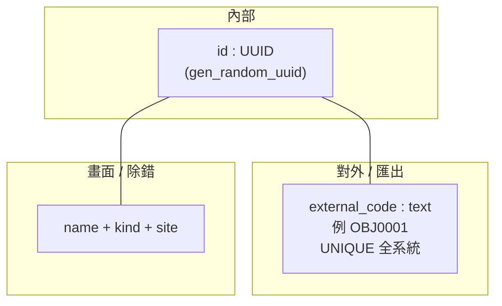
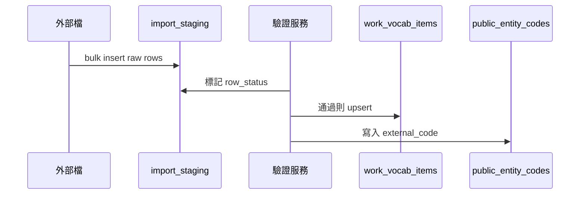

# Phase 2 — 跨系統數據對齊規格（對外編碼、資料表設計、匯入／匯出）

**狀態：** 🔄 草案（**實作以 §13.1／§13.2 與下方「本期實作優先」為準**；§13.3 暫緩）  
**建立日期：** 2026-04-19  
**最後更新：** 2026-04-19（§8 步驟 JSON／手勢識別碼 **已與 UI 規格 §5.8 對齊**；§13.3 仍暫緩）  
**關聯文件：** [phase2-ui-ia-rbac-masterdata-architecture.md](phase2-ui-ia-rbac-masterdata-architecture.md)（UI／RBAC／工序語意、**§1.1 實作對齊現況**；**本文件專責「數據如何對齊外部系統」** — 兩份需同步決策狀態）  
**程式現況參考：** `src/ddm_v2/models/most_reference.py`（`work_vocab_items` 等）

---

## 1. 文件目的

用 **可實作的結構**（表、索引、流程）說明：

1. **為什麼** 不能只依賴「各表自己的 `id: 1`」做跨系統對齊。  
2. **技術主鍵（UUID）** 與 **對外編碼（`external_code`）** 如何分工。  
3. **全系統 `external_code` 唯一** 在 PostgreSQL 裡 **三種落地方式** 與建議。  
4. **前綴分流**（如 `OBJ0001`）與 **前綴定義** 存放位置（含 **DDL 草案**）。  
5. **BOM／料號預留**、**手勢主數據**、**JSONB vs EAV** 的 **表設計草案**。  
6. **外部匯入 staging** 的建議表與流程（含 **mermaid**）。  
7. **匯出 JSON** 範例形狀（給介面與對方系統對齊用）。

---

## 2. 名詞

| 名詞 | 意義 |
|------|------|
| **技術主鍵** | 資料庫內部使用的 **`id`**（本專案多為 **UUID**），API 內部關聯、JOIN 用。 |
| **對外編碼 / `external_code`** | 人類或外部系統可讀、可約定規則的 **業務編碼**（如 `OBJ0001`）；**跨表、跨匯出檔仍應唯一**（本專案已決議方向）。 |
| **前綴分流** | 用 **前綴** 區分資源語意（`OBJ`＝物件類、`HND`＝手勢…），後接序號或流水號。 |
| **global id 精神** | 對方系統拿到一個字串，能 **唯一定位** 到「這一筆主數據」，不與別表、別環境的「1」混淆。 |
| **Staging** | 外部檔 **先落地**、驗證、再 **併入正式表**，避免髒資料直接進核心表。 |

---

## 3. 問題：為什麼整數主鍵無法直接當「跨系統鍵」



- 不同 **表** 各自從 1 遞增 → 「id=1」**語意不唯一**。  
- 不同 **環境**（dev/staging/prod）同一筆業務可能不同 id → 無法穩定對齊。  
- **解法（本專案採行之方向）：**  
  - 內部仍用 **UUID** 當技術主鍵（已存在於多表）。  
  - 對外再約定 **`external_code` 全系統唯一**（必要時加 **registry** 或 **唯一約束策略**，見 §5）。

---

## 4. 雙軌識別（建議一律這樣想）



| 用途 | 使用欄位 |
|------|----------|
| API 內部 FK、DB JOIN | `id` (UUID) |
| 匯出給 ERP / MES、人類溝通、掃碼 | `external_code`（**可讀、可約定規則**） |
| 說明與列表顯示 | `name`、`kind`、`site_id` 等 |

**注意：** 若對方系統 **只收 UUID 字串** 也可只匯出 `id::text`；你已表達希望有 **像 `OBJ0001`** 的語意層，故 **`external_code` 與 UUID 並存** 最彈性。

---

## 5. 全系統 `external_code` 唯一：三種資料庫落地方式

目標：**任意兩筆「需對外發碼」的資料**，不可出現相同 `external_code`（即使來自不同表）。

### 5.1 作法一：中央登錄表（**已決議採用** — 2026-04-19）

**概念：** 凡要對外的實體，都在 **一張表** 登記 `external_code`；正式業務表只存 **UUID**，與登錄表 **1:1** 或透過 `(resource_type, entity_id)` 關聯。

**使用者決議：** 採用 **中央登錄表**（本節 DDL 方向），以 DB 層保證 **`external_code` 全系統唯一**。

**優點：**  
- DB 層 **一個 UNIQUE(`external_code`)** 就保證全系統唯一。  
- 匯入驗證可先查登錄表是否已占用。

**缺點：**  
- 多一次 JOIN 或應用層組裝；需維護 `resource_type` 列舉。

**DDL 草案（示意，欄位名可再調）：**

```sql
-- 資源類型：與應用層 Enum 一致
CREATE TYPE public_id_resource AS ENUM (
  'work_vocab_item',
  'hand_gesture',       -- 若手勢獨立表
  'param_preset',
  'sequence_model'      -- 若日後獨立實體
  -- …可擴充
);

CREATE TABLE public_entity_codes (
  id              UUID PRIMARY KEY DEFAULT gen_random_uuid(),
  resource_type   public_id_resource NOT NULL,
  entity_id       UUID NOT NULL,          -- 對應各業務表主鍵
  external_code   TEXT NOT NULL,
  created_at      TIMESTAMPTZ NOT NULL DEFAULT NOW(),
  updated_at      TIMESTAMPTZ NOT NULL DEFAULT NOW(),
  CONSTRAINT uq_public_entity_codes_code UNIQUE (external_code),
  CONSTRAINT uq_public_entity_codes_entity UNIQUE (resource_type, entity_id)
);

CREATE INDEX ix_public_entity_codes_entity ON public_entity_codes (resource_type, entity_id);
```

> **寫入流程：** 先插入業務列取得 `entity_id`，再插入 `public_entity_codes`；或同一交易內完成。刪除業務列時需同步刪登錄（FK `ON DELETE CASCADE` 從業務表指向登錄表 **或** 反過來依你選的主表方向）。

### 5.2 作法二：各業務表各自 `external_code` + **觸發器／應用層** 做跨表唯一

每張表都有 `external_code TEXT UNIQUE`，但 **PostgreSQL 無法** 直接做「跨多表」的單一 UNIQUE，除非：

- 用 **可延遲約束** 的 **統一檢視**（不常見），或  
- **觸發器** 查詢「其他表是否已占用」，或  
- **僅在應用層** 先查全表（易漏、併發需鎖）。

**缺點：** 維護成本高，**不建議** 當首選。

### 5.3 作法三：單一「寬」主數據表 + `discriminator`

所有可對外實體 **同一張表**，用 `kind` / `resource_subtype` 區分。**一個 UNIQUE(`external_code`)** 即可。

**缺點：** 不同實體欄位差異大時，表會很寬或大量 NULL；與現有 `work_vocab_items` 已分表的方向 **衝突較大**。

### 5.4 建議小結

| 作法 | 建議 |
|------|------|
| **中央登錄表** | ✅ 與「多張業務表並存」相容，**唯一性最乾淨**。 |
| **觸發器跨表** | ⚠️ 可維護性差。 |
| **單一寬表** | ⚠️ 僅在全新綠地且實體極相似時考慮。 |

---

## 6. 前綴分流與「OBJ 從哪裡來」

已決議：**前綴分流**（如物件 → `OBJ`）。

**使用者決議（2026-04-19）：** 前綴 **以資料表登錄為準**（§6.2 `code_prefix_registry`），**非** 僅依賴 §6.1 之應用層常數（常數可作 **預設 seed** 寫入登錄表）。**手勢（hand）** 與 **object / action / target / destination** **同一套治理**（同一詞彙表／同一 `work_vocab` 脈絡下擴充 `kind`，見 §8）。

### 6.1 應用層常數（可選：預設值或 seed 來源）

```text
# 虛擬碼
PREFIX_BY_VOCAB_KIND = {
  "object": "OBJ",
  "action": "ACT",
  "target": "FRM",   # From — 與產品用語一致時再定
  "destination": "TO",
}
# 手勢若獨立 resource_type → "HND"
```

- **產生規則範例：** `external_code = PREFIX + zero_pad(seq, 4)` → `OBJ0001`。  
- **序號來源：** 每前綴一個 **序列**（`SERIAL` 綁定邏輯表，或 Redis／DB `sequence` 表）。

### 6.2 資料表登錄（營運可改、需 UI）— **已決議為權威來源**

**DDL 草案：**

```sql
CREATE TABLE code_prefix_registry (
  id              UUID PRIMARY KEY DEFAULT gen_random_uuid(),
  resource_key    TEXT NOT NULL,       -- 如 work_vocab:object 或 hand_gesture
  prefix          TEXT NOT NULL,       -- 如 OBJ
  display_name_zh TEXT,
  display_name_en TEXT,
  is_active       BOOLEAN NOT NULL DEFAULT TRUE,
  CONSTRAINT uq_code_prefix_resource UNIQUE (resource_key),
  CONSTRAINT uq_code_prefix_prefix UNIQUE (prefix)
);
```

### 6.3 與 §5 中央表的關係

- **前綴** 決定「字串長怎樣」。  
- **中央表 `public_entity_codes`** 決定「字串 **不能跟別張表撞**」。  
- 產生新碼時：**算前綴 + 流水 → 插入中央表**；若 UNIQUE 違反則重試流水。

---

## 7. 現有 `work_vocab_items` 與擴充方向

**現況（摘要）：** `id` UUID、`kind`、`site_id`、`name`、`external_code`（可空）、`extra` JSONB、`is_active`…

**建議演進（不一次定死）：**

| 項目 | 建議 |
|------|------|
| **全系統唯一** | 採 §5.1 時，**可** 將 `work_vocab_items.external_code` 改為 **NOT NULL**（匯入／正式環境），或 **以 `public_entity_codes` 為準**、業務表冗餘一份方便查詢。 |
| **BOM／料號預留** | 見 §9；**不要** 一開始塞進 EAV，先用 **可空欄位** 或 **獨立 1:1 附表**。 |
| **彈性屬性** | 延續 **`extra` JSONB**；見 §10。 |

---

## 8. 手勢（與詞彙同一套治理）

**已決議：** 手勢是 **一類數據**，未來可能不只左／右／雙手。

**使用者決議（2026-04-19）：** 手勢 **不** 另闢獨立表與 object／action 等 **分開治理**；採 **方案 A** —— 在 **`work_vocab_items`** 增加 **`kind = 'hand'`**（或 `gesture`，實作時與 Enum／CHECK 一致），與 `object`、`action`、`target`、`destination` **並列**，**共用**：

- §5 **中央登錄表** `public_entity_codes`（`resource_type` 仍為 `work_vocab_item` 或依實作採單一類型涵蓋所有 kind）；  
- §6.2 **前綴登錄表**（為 `hand` 設定前綴，例如 `HND`，與 `OBJ` 等 **同一套 `code_prefix_registry`**）。

**方案 B**（獨立表 `hand_gesture_items`）：**不採用**（與使用者「hand 也與其他一起」之決策一致）。

**與步驟 JSON（已決議 — 2026-04-19，見 [phase2-ui-ia-rbac-masterdata-architecture.md](phase2-ui-ia-rbac-masterdata-architecture.md) §5.8）：**  
- **權威：** `work_vocab_items`（含 `kind = hand`）與 **`external_code`／UUID** 策略（§5～§7）。  
- **儲存：** 步驟 JSON **僅存唯一識別**（**UUID 或 `external_code`**，全專案擇一為準寫入 API／schema）；**不** 存顯示字串。  
- **正式環境：** **不** 保留 legacy 字串預設作為生效路徑；既有資料以 **migration** 對應至主數據列。  
- **工序步驟 schema** 應另於 OpenAPI／JSON Schema 收斂（與 §12 匯出形狀一併維護）。

---

## 9. BOM／料號：預留與未來 ERP 匯入

**已決議：** 先預留，目標是 **未來外部匯入** 物料／工具。

**建議（最小預留）：** 在「會對應到實體物料／工具」的主數據列上：

```sql
-- 示意：加在 work_vocab_items 或僅加在 object/tool 類（若用 CHECK）
ALTER TABLE work_vocab_items
  ADD COLUMN IF NOT EXISTS bom_code TEXT,
  ADD COLUMN IF NOT EXISTS material_code TEXT;

-- 全系統唯一時（若與 external_code 分開約束）：
-- CREATE UNIQUE INDEX uq_work_vocab_bom ON work_vocab_items (bom_code) WHERE bom_code IS NOT NULL;
```

**是否與 `external_code` 共用唯一空間：**  
- **已決議（2026-04-19）：** **`bom_code` / `material_code` 與 `external_code` 分開約束**（各欄位可各自 `UNIQUE WHERE … IS NOT NULL`，**不** 與對外主碼共用同一 UNIQUE 規則）。

**匯入：** 見 §11。

---

## 10. 彈性屬性：JSONB vs EAV

### 10.1 JSONB（沿用 `extra`）

**適合：** 少用的備註、未定型參數、不需複雜 WHERE。

```sql
-- 已存在於模型時無需改；範例寫入
UPDATE work_vocab_items
SET extra = extra || '{"torque_nm": 12.5}'::jsonb
WHERE id = '...';
```

**索引（可選）：** `CREATE INDEX ... ON work_vocab_items USING GIN (extra jsonb_path_ops);`（僅當會依 key 查詢）

### 10.2 EAV（僅在屬性集無法列舉且需大量篩選時）

**DDL 草案：**

```sql
CREATE TABLE master_entity_attributes (
  id            UUID PRIMARY KEY DEFAULT gen_random_uuid(),
  entity_table  TEXT NOT NULL,         -- 'work_vocab_items'
  entity_id     UUID NOT NULL,
  attr_key      TEXT NOT NULL,
  attr_value    TEXT,
  attr_num      NUMERIC,
  created_at    TIMESTAMPTZ NOT NULL DEFAULT NOW(),
  CONSTRAINT uq_master_attr UNIQUE (entity_table, entity_id, attr_key)
);

CREATE INDEX ix_master_attr_key_value ON master_entity_attributes (entity_table, attr_key, attr_value);
```

**風險：** 報表與 JOIN 變複雜；**建議：** 能 **固定欄位** 的（如扭力常用）就 **拉欄位**，其餘 **JSONB**。

---

## 11. 外部匯入：Staging 表與流程

**目的：** 檔案先進 **staging**，驗證（唯一性、必填、參照）通過後再 **upsert 正式表 + public_entity_codes**。



**DDL 草案（示意）：**

```sql
CREATE TABLE import_staging_rows (
  id              UUID PRIMARY KEY DEFAULT gen_random_uuid(),
  batch_id        UUID NOT NULL,
  source_system   TEXT,
  raw_payload     JSONB NOT NULL,      -- 整包原始列
  mapped_external_code TEXT,
  row_status      TEXT NOT NULL DEFAULT 'pending', -- pending|ok|error
  error_message   TEXT,
  created_at      TIMESTAMPTZ NOT NULL DEFAULT NOW()
);

CREATE INDEX ix_import_staging_batch ON import_staging_rows (batch_id, row_status);
```

---

## 12. 匯出 JSON 形狀（範例）

**目的：** 讓外部系統與內部除錯 **同一套欄位語意**。

```json
{
  "schema_version": "2026-04-19",
  "resources": [
    {
      "resource_type": "work_vocab_item",
      "stable_id": "550e8400-e29b-41d4-a716-446655440000",
      "external_code": "OBJ0001",
      "kind": "object",
      "site_id": null,
      "name": "電鋸",
      "bom_code": null,
      "material_code": null,
      "is_active": true
    }
  ]
}
```

- **`stable_id`**：UUID 字串（= DB `id`）。  
- **`external_code`**：對外主碼（與登錄表一致）。  
- 實際 API 可 **分頁**、**批次**，錯誤格式另定。

**匯出／匯回（使用者要求）：** 至少需支援 **本系統匯出之格式，可再匯入本系統**（round-trip），以利備份、遷移與環境同步。

**匯出型態（使用者決議 — 第三輪）：** 本系統完成之匯出 **至少兩種**，後續皆需能 **對應匯回**（細部欄位與版本可迭代）：

1. **結構化 JSON 檔** —— 主數據、登錄表、或 §12 類型之封包（`schema_version` + `resources[]`）。  
2. **工序 CSV／Excel** —— **每一列（row）為一道工序**，並帶 **MOST sequence model**（GM／CM 等）所需欄位；供 IE／Excel 生態編修與對外交接。

**外部檔案匯入**（非本系產生之檔）：上傳方式、錯誤列舉、對應表 —— 可另階段定義；**本系產生之上述兩類** 為 round-trip **最低驗收**。

---

## 13. 決議與待決議

### 13.1 已決議（2026-04-19 使用者回覆）

| # | 議題 | 決議 |
|---|------|------|
| 1 | 是否採用 **§5.1 中央登錄表** | **採用** `public_entity_codes`（或同等）中央登錄，保證 `external_code` 全系統唯一。 |
| 2 | **前綴** 常數 vs **§6.2 登錄表**；手勢與其他詞彙關係 | **前綴以登錄表為權威**（`code_prefix_registry`）。**手勢（hand）** 與 **object / action / target / destination** **同一套**：`work_vocab_items` 新增 **`kind = hand`**，與其他 kind **一併**走中央登錄與前綴規則（見 §6、§8）。 |
| 3 | `bom_code` / `material_code` 與 `external_code` 是否同一 UNIQUE | **否** —— **分欄位** 各自約束（見 §9）。 |
| 4 | 手勢 **方案 A 或 B** | **方案 A**（§8）；**B 不採用**。 |
| 5a | 匯出／匯入 | **至少**：**本系統匯出格式必須可再匯入本系統**（round-trip）；作為匯入 API 與檔案格式的 **最低驗收線**。 |
| 5b | 本系統匯出 **型態** | **兩種**：（1）**結構化 JSON**；（2）**工序 CSV／Excel**，**每列一道工序** 並含 **MOST sequence model** 所需資訊（見 §12 末「匯出型態」）。 |

### 13.2 已確認之實作方向（第三輪 — 2026-04-19）

| # | 議題 | 確認 |
|---|------|------|
| 1 | **`work_vocab_items.kind` 擴充 `hand`**（及 `public_entity_codes`／API 驗證對齊） | **擴充**（Enum／CHECK、migration、Pydantic 一併更新）。 |
| 2 | **`code_prefix_registry` 初始 seed**（含 `HND` 等） | **採用** —— 由 **Alembic migration 或 seed script** 寫入（擇一或並用，依 repo 慣例）。 |

### 13.2.1 本期實作優先（不等待 §13.3）

以下與 **§13.1、§13.2** 及本文件 **§5～§9、§11** 之 DDL 方向一致，**可先開發／先 migration**，不必等 §13.3 拍板：

| 順序 | 項目 |
|------|------|
| 1 | **中央登錄表** `public_entity_codes`（§5.1）與寫入流程 |
| 2 | **前綴登錄表** `code_prefix_registry` + **初始 seed**（§6.2、§13.2） |
| 3 | **`work_vocab_items`**：擴充 **`kind` 含 `hand`**、`bom_code`／`material_code` 可空欄位（§7～§9） |
| 4 | **API／驗證**：對外編碼唯一性、與登錄表同步 |
| 5 | **匯出／匯回**：先支援 **結構化 JSON** 之 round-trip（§12）；**工序 CSV／Excel** 可在 **最小表頭** 上迭代，細部見 §13.3 暫緩項 |

**說明：** §13.3 所列為 **之後專題討論**；**不阻塞** 上述資料模型與主數據對齊之實作。

### 13.3 暫緩討論（保留議題 — 不納入本期必做）

以下 **先保留於文件**，待之後與業務／實作驗證再議；**本期不強制交付**。

| # | 議題 | 說明 |
|---|------|------|
| 1 | **非本系產生之檔案匯入** | 檔案上傳 vs API、錯誤列舉、欄位對應 —— **尚未定**；可與 §11 staging 併案。 |
| 2 | **工序 CSV／Excel 欄位清單** | 每列對應 GM／CM 之 **param 欄位名**、版本、與 `schema_version`；需與 `most/ui-definitions` 或步驟 JSON 對齊後凍結 **v1 表頭**。 |
| 3 | **JSON 封包範圍** | 是否單檔含 **主數據 + 版本 + 工序** 或 **分檔**（例如 `masterdata.json` + `steps.csv`）—— 可於實作時定 **最小可行** 再擴充。 |

---

## 14. 文件維護

- 與 [phase2-ui-ia-rbac-masterdata-architecture.md](phase2-ui-ia-rbac-masterdata-architecture.md) **同步**：RBAC／工序語意 **不** 在本文件重複，僅互相連結。  
- 定稿後可將 §5～§11 摘入 **database-architect** migration 說明或 ADR。
