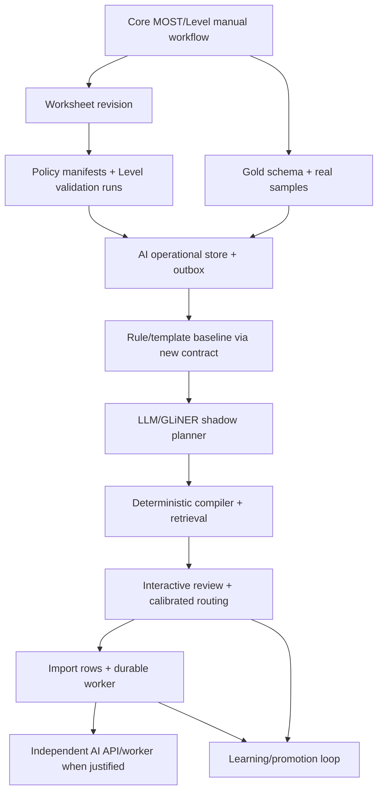

# WI AI 與批次建模交付計畫

**文件類型：** Roadmap / 執行分期（非核心規則權威）
**版本：** 0.1 — 計畫草案
**建立日期：** 2026-07-31
**架構規格：** [WI AI Parser 系統規格](../architecture/wi-ai-parser-system-spec.md)
**資料地基：** [Domain Evolution 與 AI Readiness](../architecture/domain-evolution-and-ai-readiness-spec.md)
**決策邊界：** [ADR-026](../decisions/ADR-026-wi-ai-parser-pipeline-boundary.md)（proposed）
**既有匯入行為：** [ADR-013](../decisions/ADR-013-excel-import-architecture.md)、[ADR-025](../decisions/ADR-025-import-template-matching-p2.md)

> 本文件回答「何時做、先後順序、每階段如何驗收」。資料欄位、權威與解析行為若與 architecture
> spec 衝突，以 architecture spec 與 accepted ADR 為準。本計畫不授權跳過 `/dev-team:checkpoint`、
> code review、資安檢查或核心 golden tests。
>
> **條件性：** 除 R0 的調查/核可工作外，R1 之後所有 schema、migration 與服務階段都以
> ADR-026/ADR-027 被 accepted（或由後續 accepted ADR 修訂）為前提。若提案被否決，對應 phase
> 必須停止並依新決策重排，不得因已寫入 roadmap 就視為核可。

---

## 1. 交付策略

採「核心產品完成優先、資料地基平行、AI shadow 後接、自動化最後」：

1. MOST 工作台與 Level System 先完成可人工正確操作的閉環。
2. 不等所有業務規則永遠不變；先補 revision、policy manifest 與契約版本。
3. AI 先在同 monorepo/in-process 以 shadow mode 累積真實資料。
4. 有可靠 gold set 與 deterministic compiler 後，才開放互動預填。
5. 有 row-level staging 與 durable worker 後，才開放數百列批次。
6. 出現 GPU、依賴、負載或資料落地需求後，才物理抽成服務。
7. 人工修正先進 candidate dataset，通過 promotion gates 才改 production bundle。

這不是「先做完 AI 再補治理」，也不是「等所有 domain 完全凍結才開始」。目標是先固定可演進的
接縫，使 domain、model 與部署可以分別改版。

---

## 2. 工作流分類

### Track A：Core Product（最高優先）

- MOST 工作台人工建模完整可用。
- `CycleIn → most_engine → narrative` 單一權威。
- Level 編輯、R1–R9 驗證、LB output 完整可用。
- Process version draft/publish/clone 與 RBAC 正確。
- Excel staging/template preview 既有流程不回歸。

### Track B：Domain Readiness（可與 A 平行）

- Worksheet revision/optimistic locking。
- Modeling/Level policy manifests。
- Level validation runs。
- Method context 與 AI metadata 分層。
- Contract/hash/version conventions。
- AI operational schema、review/outbox ownership。

### Track C：AI Quality（A 的人工流程可用後開始）

- 四層 gold set 與 baseline。
- Rule/template baseline 經新 contract。
- Action Planner shadow。
- Slot retrieval/reranker/compiler。
- Calibration、review UX、promotion。

### Track D：Batch & Deployment（C 穩定後）

- `import_rows` 正規化。
- Durable parse job/worker。
- Retry/cancel/partial submit。
- AI API/worker 抽離與獨立 scaling。

---

## 3. 依賴圖



硬依賴：

- 沒有 worksheet revision，不得自動套用非同步 AI 結果。
- 沒有 policy version，不得宣稱歷史 parse/compile 可重現。
- 沒有 gold baseline，不得設定 auto-accept threshold。
- 沒有 deterministic compiler/engine gate，不得寫正式 cycle。
- 沒有 row-level durable state，不得以 request/background task 跑數百列批次。

---

## 4. Phase R0：決策與規格凍結

### 目標

把影響 schema 與服務邊界的決策先核可，不先猜 DB。

### 工作

1. 核可或修訂 ADR-026。
2. 核可 worksheet revision 與 optimistic locking 原則。
3. 核可 modeling policy 與 Level policy 為獨立版本軸。
4. 核可 method context 與 AI metadata 的分界。
5. 決定初期 AI 資料同 DB cluster 的邏輯隔離方式。
6. 決定 inference/raw WI retention、去識別與外部 LLM 政策。
7. IE 裁定第一批 quantity/tool/inspect/SIMO/default policy。
8. 決定 modeling/Level policy resolver precedence：family、site/process override、default tag 與版本選擇；
  不得以「最高 version_no」或建立時間作未明說的 fallback。
9. 決定 AI deployment bundle 的 `draft → shadow → canary → production → retired` transition、
  核准角色、IE sign-off 與 rollback 權限。
10. 決定 outbox/job 的 max attempts、backoff、dead-letter escalation、audit retention 與清理政策。

### 產出

- Accepted ADR 或使用者核可的 architecture spec revision。
- Open questions owner 與 due date。
- 初始 `wi-plan-v1`、`wi-context-v1`、policy manifest schema。

### 退出條件

- 不存在會讓 migration 方向相反的未決項。
- 每個資料事實有明確 owner。
- 明確知道哪些 proposed tables 進 R1/R2，哪些延後。
- Policy resolver、bundle promotion 與 dead-letter operational policy 有可測的決策結果。

---

## 5. Phase R1：Worksheet Revision Foundation

> **前置：** ADR-027 接受 worksheet revision/optimistic locking 原則後才可實作本 phase。

### 目標

解決 draft last-write-wins，建立 AI stale-result 防線。

### Migration batch R1

加法新增 `most_worksheets`：

- `revision_no bigint NOT NULL DEFAULT 1`
- `content_hash text NULL`
- `last_edited_by text NULL`
- `last_edited_at timestamptz NULL`

### Backend

- Save DTO 加 `base_revision`，response 加 `revision_no/content_hash`。
- 原子 compare-and-increment；stale save 回 `409 WORKSHEET_REVISION_CONFLICT`。
- 確保 revision check 是任何 metadata/policy/context update 或 rows delete 前的第一個 mutation；所有
  worksheet 內容變更（含 allowance、Level/context）成功時 revision +1。
- Clone 建新 worksheet 時 revision 重設為 1。
- Publish 針對當前 revision 執行所有 gates。

### Frontend

- Store 保留 server revision。
- 409 顯示 reload/比較/另存，不靜默 retry。
- AI draft 綁 source revision；editor 改動後標 stale。

### Tests

- 兩 client 同 revision：一成功、一 409。
- 409 後舊 rows/cycles/levels 完整保留。
- 只改 Level/context 是否 increment revision，依 R0 決策鎖測試。
- Clone/reload/publish revision lifecycle。

### 退出條件

- Draft 無 silent overwrite。
- API 與前端都傳遞 revision。
- 可證明 stale AI result 無法自動套用。

---

## 6. Phase R2：Policy Manifest 與 Level Replay

> **前置：** ADR-027 接受 policy manifests/validation evidence；R0 完成 policy resolver/default 決策。

### 目標

不重寫現有 R1–R9 或 MOST engine，先讓當時使用的業務規則可識別、可追溯。

### Migration batch R2a

- `modeling_policy_versions`
- `level_policy_versions`
- `most_worksheets.modeling_policy_version_id` nullable FK
- `most_worksheets.level_policy_version_id` nullable FK

Nullable 僅限 migration 過渡；seed/backfill/consumer 切換後收緊，新 worksheet 建立時同 transaction
snapshot published policy，無可選 policy 即 fail closed。

### Seed/backfill

- `MODELING_FACTORY_V1`：描述目前無額外自動 policy 的保守行為。
- `LEVEL_FACTORY_V1`：指向目前 R1–R9 validator revision 與 LB output contract。
- 回填現有 worksheet；資料不確定時記 migration report，不猜 site override。

### Migration batch R2b

- `level_validation_runs`
- Latest validation query/index

### Backend

- Level validate/build-output 都解析 policy manifest。
- Save/publish 寫 validation run；run 失敗不覆寫舊證據。
- Publish 只接受目前 worksheet revision 的 valid run。
- Retired policy 可回放，不可供新建選擇。

### Tests

- 現有 7 教學例與 image5 反例使用 V1 manifest結果不變。
- 新 policy 重驗產生新 run，不改舊 run。
- Published worksheet 可指出當時 policy/validator/output contract。
- Missing/incomplete policy fail closed。

### 退出條件

- MOST rule-set、modeling policy、Level policy 三軸可分別追溯。
- Level 歷史驗證有 immutable evidence。
- Golden tests 全綠，數值/issue codes 無非預期改變。

---

## 7. Phase R3：Method Context 與 AI Operational Foundation

> **前置：** ADR-026/027 接受 bounded context、資料 ownership 與 review/outbox 原則。

### 目標

建立 AI 可觀測與人工回饋地基，但先以現有 rule/template parser 運行。

### Migration batch R3a

- `wi_row_contexts`
- Versioned context schema validation

### Migration batch R3b

- `ai_deployment_bundles`
- `ai_parse_runs`
- `ai_parse_items`
- `ai_review_events`
- `outbox_events`

### Backend

- 現有 rule-based parser 包成 `wi-plan-v1` adapter。
- 每次 run 保存 source revision、rule-set projection、policy、bundle。
- Review/正式 save 同 transaction 寫 outbox。
- Consumer at-least-once，event id 去重。
- `workflow_audit_log` 不承載 AI high-volume events。

### Security

- AI DB role 權限測試：正式 worksheet/rule-set 寫入必須被 DB 拒絕。
- Raw WI retention/PII 去識別。
- Prompt injection 測試與 request size limit。

### Tests

- 同 input/version key 可 idempotent reuse。
- 任一 version/hash 不同不能誤用 cache。
- DDM rollback 時不產生可消費 feedback。
- Consumer 重送不重複建立 review/training sample。

### 退出條件

- 沒有 LLM 也能走完整 inference/review/outbox contract。
- AI metadata 未污染 `slot_inputs`/method context/workflow audit。
- 可從正式採用反查原 prediction 與 bundle。

---

## 8. Phase Q0：Gold Set 與 Baseline

### 目標

先量測現有 rule/template 系統，再判斷 LLM 是否真的改善。

### Gold schema

- Plan：action count/boundary/order/dependency。
- Role：hand/object/tool/from/to/distance/quantity/evidence。
- Compilation：GM/CM、frequency/repeat、option code。
- End-to-end：CycleIn[] 與權威 engine result。

### 資料來源

- 現有真實 WI/METHOD。
- 匯入 staged description。
- Motion modules 與 IE 認證範例。
- 繁簡、中英、錯字、語序、缺資訊、多 action、工具/數量案例。

### 治理

- IE adjudication；reviewer 不一致不進 test gold。
- Train/calibration/test/temporal holdout 分離。
- 同源改寫放同 split，防 leakage。
- Synthetic data 主要進 dev/train；test 維持人工核准。

### Baseline report

- Rule parser action/slot 表現。
- Template hit precision/coverage。
- 每 challenge、site、language 的錯誤熱點。
- Review time baseline。

### 退出條件

- 至少 50 筆 IE 核准起始集；進入互動自動化前擴到 ≥150 筆。
- Eval CLI 可重現並輸出 versioned report。
- Production threshold 尚未設定為 auto-accept。

---

## 9. Phase Q1：Action Planner Shadow

### 目標

加入 LLM/GLiNER，但不改使用者正式結果。

### 實作

- Structured output `WorkInstructionPlan`。
- Offset/evidence、role status、unresolved。
- Multi-action segmentation 與 dependency。
- `temperature=0`、model/prompt revision、response cache。
- Timeout → rule fallback，整筆標 review。

### Shadow

- 與 rule/template baseline 並跑。
- 保存 disagreement，不顯示 auto accept。
- 每週 IE 抽查 uncertain + 少量 high-confidence。

### 指標

- Action-count exact match ≥0.95。
- Boundary/dependency F1 ≥0.90。
- Role/span F1 ≥0.90。
- Schema invalid rate 與 p95 latency 達標。

### 退出條件

- 連續兩個評測週期不低於 baseline。
- 沒有 evidence 的 inferred/default 不會被標 explicit。
- 難句可 abstain，失效可 fallback。

---

## 10. Phase Q2：Retrieval 與 Deterministic Compiler

### 目標

讓語意理解收斂到 active/specified rule-set 的合法 MOST 候選，仍由 DDM engine 裁決。

### 實作

- Slot-scoped L1 exact、L2 text、L3 embedding、L4 reranker。
- ADR-025 template 保留為 L0 完整 cycle candidate。
- Modeling policy 決定 quantity/tool/inspect/SIMO/default。
- Compiler strict intermediate schema → 現有 `CycleIn` adapter。
- 原始 cm/deg/revolutions 傳 engine；不在 compiler 選 band/ladder。
- `CycleIn → compute_cycle → narrative` 全部通過才產生 valid draft。

### 指標

- 每 slot recall@5 ≥0.95。
- Critical slot top-1 ≥0.95。
- 非法 GM/CM/不存在 option 自動通過率 0。
- 新 compiler 對已知人工 cycles round-trip 不漂移。

### 退出條件

- AI 無法越過 allow-list、schema 與 engine。
- 同一 plan 可用不同 modeling policy recompile 並產生可解釋 diff。
- 仍不直接 auto-save。

---

## 11. Phase Q3：互動審核與有限自動填入

### 目標

在工作台提供多 action 預覽、top-K 修正與可量測 routing。

### UI

- 先審 action split，再審 role/slot。
- explicit/inferred/default/missing badge。
- Evidence highlight、review reason、top-K keyboard selection。
- Editor 有內容時覆蓋/只填空白。
- Source revision stale warning。

### Confidence

- Calibration split 訓練 calibrator。
- Plan/role/slot 分層，不使用單一平均掩蓋 critical error。
- Fixed threshold 先上線；EMA/IQR 只產生候選 threshold version。
- 抽查少量 high-confidence 防 selection bias。

### Release stages

1. Preview-only。
2. Canary site/users。
3. 高信心自動填入 draft，永不自動發布。

### 退出條件

- Auto segment precision ≥0.98。
- 初期 coverage ≥0.50；不為追 coverage 降低 precision gate。
- Median review time <10 秒/action。
- 所有採用都寫 review/outbox 且 engine 重算。

---

## 12. Phase B1：Import Rows 與 Durable Worker

> **前置：** ADR-026/027 接受 batch ownership/row normalization；若要改 ADR-025 trust/stub boundary，
> 必須先有明確 accepted replacement。

### 目標

將既有整批 `staged_rows` 加法演進為可排程、可重跑的 row-level batch。

### Migration batch B1a

- `import_rows`
- Map path 雙寫 JSONB + child rows
- Historical backfill/report

### Migration batch B1b

- `ai_parse_jobs`
- `ai_parse_job_items`
- Job/item indexes、lease fields、dead letter

### Worker

- Dedicated process，不使用 Web request worker/`BackgroundTasks`。
- PostgreSQL `FOR UPDATE SKIP LOCKED` 起步。
- Lease timeout、bounded retry、cancel、idempotency。
- 整批 pin bundle/rule-set/modeling policy。

### UI

- Progress counts、filter failed/review/ready。
- Row-level retry/cancel/skip。
- One source row → many actions/cycles lineage。
- Partial adoption；stale target worksheet revision 時重新確認。

### Compatibility

- ADR-013 upload/map/profile 保留。
- ADR-025 template preview/adoption 保留。
- 未另行 accepted 決策前，不移除舊 stub submit 語義。

### 退出條件

- 1000 rows 有界執行，服務重啟後可續跑。
- 單列失敗不丟整批。
- Retry/cancel 不重複建立正式 rows。
- Partial submit 與 observed seconds/MOST seconds 語意不混淆。

---

## 13. Phase D1：AI Service / Worker 抽離

### 啟動條件

滿足任一項才啟動，不以「用了 AI」為理由提前拆：

- GPU/大型模型依賴污染 DDM image。
- AI timeout/CPU/RAM 影響 DDM SLO。
- 模型 release cadence 與 DDM 明顯不同。
- 需要獨立 autoscaling、retention 或資料落地政策。
- Batch throughput 需要獨立 worker pool/broker。

### 目標形

```text
ddm-api
wi-ai-api
wi-ai-worker
postgres (logical schemas/roles)
optional broker/model-server
```

### 抽離原則

- `ParserPort` 從 in-process adapter 換 HTTP adapter。
- Contract/schema/version 不變。
- AI 不分享 DDM ORM，不直接寫正式表。
- Projection/read API 最小權限。
- Feedback 走 outbox/API。

### 退出條件

- AI service unavailable 時 DDM 手動 MOST/Level 正常。
- Timeout/circuit breaker/fallback 驗證。
- Contract compatibility、auth、network/data residency 通過資安審查。
- 抽離前後同 bundle 對 gold set 結果一致。

---

## 14. Phase L1：Learning 與 Promotion

### 目標

讓人工修正降低未來審核率，但不做無治理線上自學。

### Feedback 分流

- Synonym missing → synonym candidate。
- Plan/role error → few-shot/fine-tune candidate。
- Top-K 有正解 → reranker/calibrator candidate。
- Top-K 無正解 → retrieval/index/option-text candidate。
- Policy error → 修改 modeling policy，不用模型掩蓋。
- Reviewer disagreement → adjudication queue。

### Promotion

```text
candidate data
  → offline eval
  → regression + calibration report
  → IE approval
  → immutable bundle/policy version
  → shadow
  → canary
  → production / rollback
```

### 退出條件

- 跑通至少一輪 feedback→candidate→eval→IE→canary→production。
- Production bundle/policy 可回退。
- Audit rate 在固定 precision 目標下呈下降趨勢。
- 今天的 threshold 不改寫歷史 routing/provenance。

---

## 15. Migration 分批原則

每個 migration batch 必須：

1. 同步修改 SQLAlchemy model 與 Alembic migration。
2. 提供 existing-data backfill 與不確定資料報告。
3. 先 nullable/additive，確認 consumer 切換後再收緊。
4. 不在同一 release 加欄又刪舊欄。
5. 提供 upgrade、部署驗證與 forward-fix 計畫。
6. Integration tests 真正連 PostgreSQL，不以 skip 當通過。
7. 觸及 MOST/Level 規則時執行 golden validation。

建議 batches：

| Batch | Schema |
|-------|--------|
| R1 | worksheet revision fields |
| R2a | modeling/Level policy manifests + worksheet FKs |
| R2b | Level validation runs |
| R3a | WI row contexts |
| R3b | AI bundles/runs/items/reviews/outbox |
| B1a | import rows normalization |
| B1b | parse jobs/items/leases |

實際 Alembic revision number 以開工時 migration head 為準，本 roadmap 不預留編號。

---

## 16. 品質關卡

### 每個功能段落

- 執行 repo 要求的 `/dev-team:checkpoint`。
- 主對話不得自行取代 code review/資安席位。
- DB 變更 model/migration 雙邊查核。

### Backend

- Unit 與 integration 分開執行。
- `ruff check src/`、`mypy src/`。
- MOST/Level 變更跑 `scripts/core_logic/run_all.py`。
- API contract/OpenAPI 加法相容測試。

### Frontend

- `npm run typecheck`、`npm run build`。
- Playwright 互動/批次/衝突/審核流程。
- 對照 v3 母版只限既有 UX；新 AI/批次 UX 依本規格與使用者驗收。

### AI Quality

- Versioned gold report。
- Risk-coverage curve。
- Challenge/site/language 分層指標。
- Shadow/canary diff 與 IE sign-off。
- Failover、schema-invalid、prompt-injection、stale-revision tests。

---

## 17. 風險登錄

| 風險 | 早期訊號 | 緩解 |
|------|----------|------|
| Domain policy 藏進 prompt | 同模型改 prompt 後 cycle 大幅變動 | Policy 版本化、compiler deterministic |
| Level 規則改版無法回放 | 歷史 worksheet 今日變 invalid | Policy manifest + validation runs |
| AI stale overwrite | 編輯後套用舊 run | Worksheet revision + 409 |
| JSONB 變垃圾桶 | 查詢/約束只能掃 JSON | Context 分類與升欄政策 |
| AI event 污染 workflow audit | audit log 成長快且 action 雜亂 | 獨立 review/outbox tables |
| Batch request timeout | 大檔卡住 Web workers | Durable job + dedicated worker |
| 過早微服務化 | 每次 contract 改動都跨 repo/部署 | 先邏輯隔離，達條件再抽離 |
| 無治理自學 | 單次修正立即改線上結果 | Candidate→eval→IE→canary promotion |
| 只審低分造成盲區 | 高信心錯誤長期未被發現 | High-confidence stratified sampling |
| Template 與 AI 兩套計算 | 同描述 TMU 不一致 | 全部走 DDM active/specified rule-set + engine |

---

## 18. 里程碑判定

| Milestone | 可以對使用者宣稱的能力 |
|-----------|--------------------------|
| M0 | 人工 MOST/Level 穩定，draft 不會 silent overwrite |
| M1 | 歷史資料可指出 MOST/Modeling/Level policy 與 validation evidence |
| M2 | AI shadow 可量測，但不影響正式資料 |
| M3 | 互動式 AI 可審核預填，auto segment precision 達標 |
| M4 | 數百列 durable batch 可 retry/cancel/partial submit |
| M5 | AI 獨立服務（若需要），核心 unavailable-safe |
| M6 | 人工回饋經治理後使 audit rate 下降 |

不得在 M2 前宣稱「AI 自動建模」；M2 只能稱「shadow evaluation」。不得在 M3 前以單一
overall confidence 作 auto-accept。

---

## 19. 現階段建議啟動範圍

在 MOST 工作台與 Level System 尚未完全收尾的前提下，建議現在只啟動：

1. R0 決策核可。
2. R1 worksheet revision 設計與實作。
3. Q0 gold schema、真實樣本蒐集與 rule/template baseline。
4. R2 policy manifest 的 schema/seed 設計；可延後 publish gate 切換。
5. R3 contract/schema 文件；AI tables 可等 R1/R2 穩定再 migration。

暫不啟動：大型模型安裝、獨立 repository/database、GPU service、數百列 worker、自動 synonym
回灌或 production dynamic threshold。

---

## 20. 待排程決策

1. R1 是否納入近期工作台收尾 sprint。
2. Level V1 manifest 的 validator revision 如何識別（package/git/build id）。
3. Modeling V1 policy 的 IE 核准內容。
4. Initial gold owner、sample 數量與 adjudication 角色。
5. AI raw data retention 與外部 LLM policy。
6. R3/B1 migrations 是否使用 `wi_ai` PostgreSQL schema。
7. 第一版 worker 是否採 PostgreSQL queue。
8. ADR-025 stub submit 何時進入替代設計。
9. Canary site/users 與 auto-accept precision 工作點。
10. 哪個 milestone 後評估獨立 AI service。
