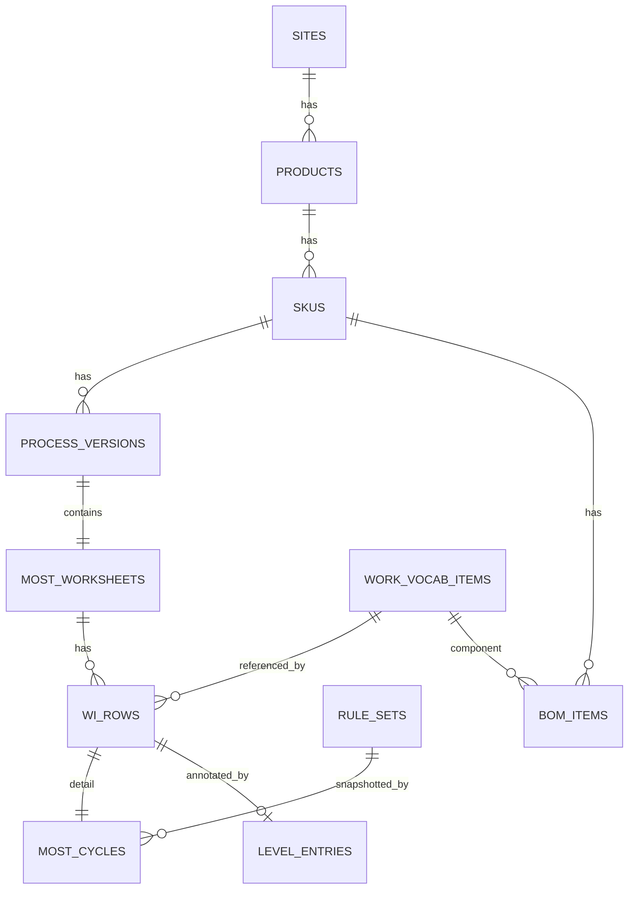

# 資料模型與儲存設計規格（Data Model & Storage）

**文件類型：** 資料模型 / 儲存設計規格
**版本：** 0.1 — 草案
**建立日期：** 2026-06-17
**關聯：** [system-architecture-v2-spec.md](./system-architecture-v2-spec.md)（§3 單一引擎、§4 資料模型總綱）、[level-system-core-logic-spec.md](./level-system-core-logic-spec.md)、[minimost-sequence-model-core-logic-spec.md](./minimost-sequence-model-core-logic-spec.md)
**範圍：** 本地 PostgreSQL 儲存模型；設計時即預留「日後改由外部系統界接」與「BOM 自動產生草稿」「匯出真實 WI/Level」。

---

## 0. 名詞：「本地儲存模型」

指**資料在自家 PostgreSQL 裡的表/欄位設計**（相對於即時向 ERP/MES/PLM 界接取得）。現階段全部存本地；但**對外的讀取一律經 Provider 介面**（見 §6），日後換成外部來源＝換 adapter，領域邏輯不動。

---

## 1. 階層總覽（你的理解）

```
site 廠區
 └─ product 產品
     └─ sku  (機種/料號，如 HDL5X_AVERY05)
         └─ process_version  版本（draft/published，輕量 SOP 版本化）
             └─ most_worksheet  MOST 工序單 (WI)
                 ├─ wi_row (方法步, 穩定 id) ── most_cycle (GM/CM 七格填值)
                 └─ level_entry (層級系統標註, FK→wi_row)
```

旁掛（跨多處共用）：
```
work_vocab_item  詞彙庫主數據（object/component/tool/from/to/hand）—— 內部 UUID + external_code
rule_set (+ A/B/G/P/M/X/I 子表)  版本化 MOST 規則（計算引擎讀這個）
code_prefix_registry / external_code  對外編碼治理
bom_import / bom_item  BOM 暫存與料表（Q3 預留）
audit_log  稽核
```



> **三個設計支柱貫穿全表**：(1) 內部 `id` UUID + 對外 `external_code`（§5）；(2) `most_cycle` 快照 `rule_set_version_id`，可回放；(3) `wi_row` 穩定 id，讓改 MOST 不清空 Level。

---

## 1.5 ★ 儲存策略決策：JSONB vs 結構化（混合，單一真相源）

**決策（2026-06-17）：採「關聯式骨幹 + JSONB 葉子」混合，單一真相源，DB 自動投影 + 可重生快取。不採對稱雙軌。**

### 框定
問題不是「JSONB 或正規化二選一」，而是「**哪些事實需要關聯式的力量（FK／跨列查詢／聚合／約束），哪些只是被『擷取存檔』**」。`most_cycle.slot_inputs`（七格輸入）特性：小、有界、強型別、**變體**（GM≠CM、M 為可變陣列）。

### 取捨摘要
| | JSONB | 完全正規化 |
|---|---|---|
| 變體結構/整筆存取(=DTO=前端=LLM) | ✅ | ❌ 多表 join、變體難表 |
| schema 演進 | ✅ 免 migration | ❌ 每次 migration |
| FK 完整性 / 跨筆查詢聚合 | ❌ JSONB 內 id 不受 FK 約束、查詢較鈍 | ✅ |

### 判斷準則（逐欄套用）
> 欄位若被 **引用(FK)／跨列查詢／聚合／DB 約束** → **升成 column**；只是被 **擷取存檔** → **留 JSONB**。

依此：
- **升成 column**：`seq_kind`（要篩）、`rule_set_version_id`（FK，回放）、`total_tmu`/`total_seconds`（要聚合）。
- **vocab 引用走 `wi_rows` FK 欄**（object/from/to/tool）——不放 slot_inputs，確保引用完整性與「哪些列用了 DIMM」這類查詢。
- **留 JSONB**：純方法細節（距離、選項 id、修飾、M 分量陣列、精度旗標）= `slot_inputs`；入口由 Pydantic 驗證形狀。

### 「雙軌與同步」——不要真雙軌
真雙軌（同一資料兩份可寫副本）＝同步地獄、會漂移（資料層版的「三套定義」病）。改用：

1. **同一事實只存一處**：升上來的 column 是獨立事實(FK)或衍生值，不是 JSONB 的副本。
2. **要查 JSONB 內欄位又不重複存 → 用 DB 自維投影**（DB 負責同步、零同步程式）：
   - **GENERATED 欄位**：`seq_kind text GENERATED ALWAYS AS (slot_inputs->>'seq_kind') STORED`（值只活在 JSONB，欄位是 DB 自動投影）。
   - **表達式 GIN 索引**：直接索引 `slot_inputs` 路徑。
   - **物化視圖**：跨筆分析用，DB 刷新。
3. **衍生值（`computed`/`narrative_zh`/total）＝可重生快取**，真相＝`slot_inputs + rule_set_version`；**對帳＝重算覆寫**，無雙向同步。

> 一句話：**寫入只有一個真相源（slot_inputs）；其餘要嘛是 DB 自動投影、要嘛是可重生快取，都不需手寫同步邏輯。**

### LLM/Agent 未來（加分而非衝突）
- Agent 吐 cycle DTO(JSON) → **走與 UI 相同的 validate+compute 路徑**（SequenceError / R1–R9 即 agent 輸出護欄，不開後門）。
- 查詢/推理用第 2 點的關聯式投影；語意搜尋未來加 embedding 存放（靠 external_code/穩定 id 指涉，不靠中文名）。
- 分工：**JSONB 擷取讀寫 ｜ 關聯式投影查詢聚合 ｜ embedding(未來) 語意**，三者單一真相、非雙軌。

### 何時才正規化某格
**可延後**——等真的開始頻繁查它再做（加 GENERATED 欄或 trigger/物化視圖維護的投影表），仍不必把寫入改雙軌。

---

## 2. 階層表（廠區 → … → level）

### 2.1 `sites`（廠區）
| 欄位 | 型別 | 說明 |
|---|---|---|
| `id` | UUID PK | 內部主鍵 |
| `external_code` | text UNIQUE | 對外碼，如 `SITE001`（§5） |
| `name_zh` / `name_en` | text | 中/英名（i18n，見 §8） |
| `is_active` | bool | 軟停用 |
| `created_at`/`updated_at` | timestamptz | 稽核時戳 |

### 2.2 `products`（產品）
| 欄位 | 型別 | 說明 |
|---|---|---|
| `id` | UUID PK | |
| `site_id` | UUID FK→sites | 所屬廠區 |
| `external_code` | text UNIQUE | 如 `PRD0001` |
| `name_zh`/`name_en` | text | 產品名 |
| `description` | text | 說明 |
| `is_active` | bool | |

### 2.3 `skus`（SKU / 機種）
| 欄位 | 型別 | 說明 |
|---|---|---|
| `id` | UUID PK | |
| `product_id` | UUID FK→products | |
| `sku_code` | text | SKU 本身的對外碼（常即外部碼，如 `HDL5X_AVERY05`）；建議同時當 `external_code` |
| `name_zh`/`name_en` | text | |
| `attributes` | JSONB | 外部屬性預留（規格、料號群） |
| `is_active` | bool | |

### 2.4 `process_versions`（版本 / 輕量 SOP）
| 欄位 | 型別 | 說明 |
|---|---|---|
| `id` | UUID PK | |
| `sku_id` | UUID FK→skus | |
| `version_no` | text | 版本號（v1、v2…） |
| `status` | text | `draft` / `published` / `retired`（決策：輕量版本快照） |
| `effective_from`/`effective_to` | timestamptz | 生效期間 |
| `created_by` | UUID FK→users | 建立者（IE） |
| `published_by` | UUID FK→users | 發布者（manager+，呼應 rule-set 治理） |
| `published_at` | timestamptz | |
| `notes` | text | |

> **嚴格 1:1**（2026-06-17 決議）：一個 version ＝一份 WI 工序單。詳見 §2.9 生命週期/另存新檔。**發布即凍結**：published 後不可改，要改→另存新檔開新 version。

### 2.5 `most_worksheets`（MOST 工序單 / WI 表頭）
| 欄位 | 型別 | 說明 |
|---|---|---|
| `id` | UUID PK | |
| `process_version_id` | UUID FK→process_versions **UNIQUE** | 嚴格 1:1（§2.9） |
| `model_label` | text | WI 表頭 MODEL 欄 |
| `analyst` | text | ANALYST 欄 |
| `study_date` | date | DATE 欄 |
| `default_rule_set_version_id` | UUID FK→rule_sets | 此單預設採用的規則版本 |
| `status` | text | 與 version 同步或獨立（草稿/完成） |

### 2.6 `wi_rows`（方法步 / 工序列）— **穩定 id 是關鍵**
| 欄位 | 型別 | 說明 |
|---|---|---|
| `id` | UUID PK | **跨編輯穩定**；Level 與 cycle 都 FK 它，改 MOST 內容不換 id → Level 標註不流失 |
| `worksheet_id` | UUID FK→most_worksheets | |
| `seq_no` | int | 列序（顯示順序，可調不影響 id） |
| `sub_activity` | text | SUB_activities（子活動描述） |
| `key_parts` | text | Key Parts |
| `hand` | text | `LH`/`RH`/`BH` |
| `object_vocab_id` | UUID FK→work_vocab_items | 作業物件/元件（必填） |
| `from_vocab_id` | UUID FK→work_vocab_items | 從哪裡（選填） |
| `to_vocab_id` | UUID FK→work_vocab_items | 到哪裡（選填） |
| `tool_vocab_id` | UUID FK→work_vocab_items | 器具/治具（選填） |
| `frequency` | numeric | 次數（≥1，允許分數） |
| `simo_group_id` | text | 同組＝雙手同時（SIMO；指派 UX 待 C5） |
| `provenance` | text | `manual` / `bom_draft`（Q3：BOM 產生的草稿標記） |
| `created_at`/`updated_at` | timestamptz | |

### 2.7 `most_cycles`（GM/CM 七格填值）— **快照 + 可回放**
| 欄位 | 型別 | 說明 |
|---|---|---|
| `id` | UUID PK | |
| `wi_row_id` | UUID FK→wi_rows (1:1) | |
| `seq_kind` | text | `GM` / `CM` |
| `rule_set_version_id` | UUID FK→rule_sets | **快照**：算這筆時用的規則版本 → 可回放 |
| `slot_inputs` | JSONB | **權威原始輸入**（使用者選擇：距離 cm、選項 id、修飾、M 分量…），形狀由 Pydantic 驗證 |
| `computed` | JSONB | **快取**（每格 TMU、合計、tech_line）；可由 slot_inputs+rule_set 重算 |
| `narrative_zh` | text | 快取的中文 METHOD 敘述（後端唯一產生，見架構 §D13） |
| `computed_at` | timestamptz | 最後重算時間 |

> 設計取捨：`slot_inputs` 存**原始輸入**（非算好的 index），配 `rule_set_version_id` → 規則改版仍可回放歷史數值。`computed`/`narrative_zh` 是快取，可重生。**前提：同一 rule-set 版本內，選項 id 不可變**（§5、架構 §B6）。

### 2.8 `level_entries`（層級系統標註）
| 欄位 | 型別 | 說明 |
|---|---|---|
| `id` | UUID PK | |
| `wi_row_id` | UUID FK→wi_rows | 連回方法步（穩定 id）→ MOST 改不清空 |
| `worksheet_id` | UUID FK | 冗餘便查 |
| `raw_seconds` | numeric | 原始秒數（＝對應 cycle 的秒數） |
| `coefficient` | numeric | 系數（難度/寬放，>0） |
| `second` | numeric (generated) | `= raw_seconds × coefficient`（動作時長） |
| `number` | text | 分割限制名稱（`nb1`…） |
| `number_count` | int | 分割限制數量（≥1） |
| `ascription` | text | 歸屬名稱（`main` 或空） |
| `level` | text | 歸屬層級；支援 `1` / `1~2` / `1/3`（變動層級） |
| `countersignature` | text | 從屬名稱（`sub*`/`cub*`） |
| `order_in_group` | int | 群組內順序（1=頭列） |
| `machine_count` | int | 機台數（≥1） |
| `manpower` | int | 人力（≥1） |

> 驗證規則 R1–R9 見 level 規格 §8.1，由後端引擎執行。

### 2.9 版本生命週期 · 存檔 · 另存新檔（clone）

**1:1 確定（2026-06-17）**：`process_version ↔ most_worksheet` 嚴格 1:1（`worksheet.process_version_id` UNIQUE）。一個版本＝一份 WI；clone 時把「version + worksheet + 所有 wi_rows/cycles/level_entries」當**一個聚合（aggregate）**整體處理。

**狀態機**：`draft → published → retired`。draft 可改；published 凍結唯讀；retired 封存。

**三種「存」**（實現 level 需求「區分上傳/暫存」）：

| 動作 | 意義 | 影響 | 權限 |
|---|---|---|---|
| **暫存/存檔 (save)** | draft 工作副本就地更新（自動 debounce + 手動） | 現行 draft 的 rows/cycles/level | IE |
| **發布 (publish / 上傳)** | draft → published，凍結快照 | 版本狀態 | manager+ |
| **另存新檔 (save-as / clone)** | 深拷貝整個聚合 → 新 draft 版本 | 新 process_version | IE |

**另存新檔（clone）規則**：

- **新 UUID**：version / worksheet / wi_rows / cycles / level_entries 全給新 id（與來源完全獨立）。
- **照抄不複製**：master data（vocab FK）與 `rule_set_version_id` 指向共用主數據，不拷貝。
- 設 `status=draft`、`version_no=下一號`、清空 `published_*`、`created_by=當前使用者`。
- 記 `source_version_id`（血緣），供日後 diff / 追溯；wi_row 可選記 `source_row_id`。
- **規則版本**：預設**沿用來源** `rule_set_version`（v2 開檔即與 v1 數值一致）；IE 可顯式「升級規則版本」→ 以新版重算 `computed`。

**穩定 id 範圍**：`wi_row.id` 在「同一版本的編輯生命週期內」穩定（改 MOST 內容不丟 Level 標註）；**跨版本＝不同 id**（clone 是新文件），以 `source_row_id` 連血緣（選配）。

**並發**：draft 就地編輯採樂觀鎖（`updated_at` / 版本欄）防多 IE 互蓋（E4）。

> 實作備註：1:1 下亦可將 worksheet 表頭欄位併入 process_version 以省一個 join；本規格保持分表 + UNIQUE FK（lifecycle 與 WI content 概念分離），clone 仍以聚合為單位。此為 #2 migration 時的細節選擇。

---

## 3. 主數據（詞彙庫）與外部界接

### 3.1 `work_vocab_items`（器具/從/到/物件/元件/手勢）
| 欄位 | 型別 | 說明 |
|---|---|---|
| `id` | UUID PK | 內部主鍵 |
| `external_code` | text UNIQUE (nullable) | 對外碼（§5）；發碼前可空 |
| `kind` | text | `object`/`component`/`tool`/`from`/`to`/`hand` |
| `name_zh`/`name_en` | text | 中/英名（i18n；外部對接常需英文/碼） |
| `site_id` | UUID FK (nullable) | 廠區專屬；空＝全域共用 |
| `source_system` | text | **誰是權威來源**：`local`/`mes`/`erp`/`plm`（守門，外部擁有者唯讀） |
| `attributes` | JSONB | 外部欄位預留（料號、規格…） |
| `is_active` | bool | 軟停用 |
| `deleted_at` | timestamptz (nullable) | 軟刪（被歷史 WI 參照者不可硬刪，見 §8） |

> 既有 `work_vocab_items` 已有 `kind`，**擴充 `tool`/`component` 與 `source_system`/`name_en`**。

---

## 4. BOM 自動產生 sequence model（Q3：可行性與預留）

### 4.1 可行到什麼程度？
**坦白說：BOM 不能直接產出「正確」的 sequence model，但可以產出「草稿骨架」讓 IE 修。**
- BOM 告訴你**有哪些元件、結構/數量**；但 **MOST 需要的是「動作方法」**（伸手幾公分、怎麼抓、怎麼放）——這 BOM **沒有**。
- 所以可行的是 **草稿產生器**：BOM 每個元件 → 自動產生一列 WI（如「取得元件 X → 放置到父件」的預設 GM cycle，距離/抓放給預設值），標 `provenance='bom_draft'`，**IE 再逐列補方法與距離**。
- 全自動、零人工的「BOM→精確工時」**不可行**（缺方法資訊）。這與既有 [ADR-010 自然語言→MOST backlog](../decisions/ADR-010-nl-to-most-backlog.md) 同類，屬輔助、非取代。

### 4.2 現在要預留什麼（讓日後接得上）
| 預留 | 作法 |
|---|---|
| 元件為一等主數據 | `work_vocab_items.kind='component'` + `external_code` 對應 BOM 料號 |
| WI 列可溯源元件 | `wi_rows.object_vocab_id` 指向 component；`provenance` 標草稿/人工 |
| BOM 暫存與料表 | `bom_imports`（staging）→ `bom_items`(sku_id, parent_item_id, component_vocab_id, qty, level) |
| 產生器輸出對齊引擎 | 草稿產生器輸出**同一個 cycle DTO**（slot_inputs），與手填走同路徑 |
| 信心/狀態 | `provenance` + 未來可加 `confidence`，UI 標示「待 IE 確認」 |

> 結論：**現在不必為 BOM 做複雜結構，只需 (a) 元件主數據化+external_code、(b) wi_row 可指元件+provenance、(c) BOM staging 表**。日後產生器是「讀 BOM → 吐 cycle DTO 草稿」的一個 service，不動核心。

---

## 5. external_code 設計（Q5：確認你的理解 + 細節）

**你的理解正確**：external_code 讓**外部/其他系統方便對接與理解**，且是**非中文、語言中立**的對照鍵。補充其完整定位：

| 性質 | 說明 |
|---|---|
| 人＋機可讀 | 如 `OBJ0001`、`TOL0003`——人看得懂、程式好解析、可掃碼 |
| **跨系統穩定鍵** | 對方系統拿 `OBJ0001` 就能唯一定位這筆主數據，不與別表/別環境的「id=1」混淆 |
| **語言中立** | 不依賴中文；對接英文/他國系統或非中文環境的對照基準（你說的「非中文字對照」） |
| 全系統唯一 | 跨表、跨匯出檔皆唯一（用 `code_prefix_registry` 發碼） |
| 內外分工 | 內部 JOIN 用 UUID；對外/匯出/掃碼用 external_code（雙軌並存最彈性） |

**前綴治理 `code_prefix_registry`**（既有，沿用）：
| prefix | kind | 範例 |
|---|---|---|
| `SITE` | 廠區 | SITE001 |
| `PRD` | 產品 | PRD0001 |
| `OBJ` | 物件 | OBJ0001 |
| `CMP` | 元件 | CMP0001 |
| `TOL` | 器具 | TOL0001 |
| `LOC` | 場景(從/到) | LOC0001 |

- 欄位：`prefix`, `kind`, `description`, `next_seq`, `issuer_role`。發碼權責建議 manager+。
- **重要約束**：external_code 一旦發出且被歷史 WI/匯出引用，**不可重用、不可改語意**（穩定性是它的全部價值）。

---

## 6. Clean Architecture：資料來源可抽換（回顧）

```
Domain（純）   VocabItem/Tool/Location/Component/Bom；MostEngine
Port          MasterDataProvider（get_objects/get_tools/get_locations/get_components）
Adapter       今: LocalDbProvider(PG)   ｜ 日後: MesProvider/ErpBomProvider/PlmProvider
```
- service 只依賴 Port；換外部來源＝換 adapter（DI 設定），領域與 service 不動。
- 外部資料流：外部系統 → `staging` → 驗證/對映 external_code → 正式表；本地 read-through cache 保表單即時。
- `source_system` 守門：外部擁有者唯讀，避免本地覆蓋。

---

## 7. 匯出真實 WI 與對應 Level System（Q4）

`export_service` 由同一份權威資料渲染（單一來源，不另算）：

| 匯出物 | 格式 | 內容/對齊 |
|---|---|---|
| **WI 工序單** | **xlsx**（對齊 1128 欄位：SUB/Key Parts/HAND/METHOD/SEQUENCE A B G…/Freq/SIMO/TMU）、PDF（現場張貼） | 直接套你們現有 Excel 工作流 |
| **Level System 表** | xlsx / JSON | 內容/原始秒數/系數/Second/Number/Number_Count/Ascription/Level/Countersignature/order |
| **對 LB 輸出** | JSON（合約：nodes/precedence/cub/number） | 給線平衡 project |

- 匯出**內嵌 external_code**，讓對方系統可對照。
- 匯出快照當時 rule-set 版本與計算結果（可重現）。

---

## 8. 我認為很重要、你還沒提到的補充

| # | 主題 | 為何重要 / 設計 |
|---|------|----------------|
| E1 | **參照完整性 + 軟刪** | 詞彙/元件被「已發布 WI」引用後**不可硬刪**，只能 `is_active=false`+`deleted_at`；否則歷史工時單會斷鏈、無法回放 |
| E2 | **多語名稱 (i18n)** | 各命名實體用 `name_zh`/`name_en`（呼應你「非中文對照」）；external_code 語言中立、name 多語並存 |
| E3 | **稽核與版本歷史** | `audit_log`（誰、何時、改了什麼）+ process_version 版本鏈；IE 治理與追溯必備 |
| E4 | **並發編輯** | 多 IE 同編一份 WI 需樂觀鎖（`updated_at`/version 欄）或編輯鎖；避免互蓋（呼應舊 OQ-004） |
| E5 | **rule-set 完整性 gating** | 發布 rule-set 版本前檢查各表齊備；引擎遇缺表**報錯不可回 0** |
| E6 | **單位一致性** | TMU↔秒（×0.036）只在一處換算；難度係數只在 Level 乘一次，勿在 WI 與 Level 重複乘 |

---

## 9. 待確認（含先前 IE 清單）
- 各分類**權威系統**：元件→PLM/ERP？器具→工具主檔？從/到→MES 線體佈局？（決定哪個 adapter 先做）
- external_code **前綴規則與發碼權責**最終版。
- process_version 與 worksheet 是否永遠 1:1（或一版本多線體工序單）。
- 既有 IE 待確認：C1 機台/人力分攤、C2 Level 巢狀>2、C4 B 選用、C5 SIMO 指派（[level §14](./level-system-core-logic-spec.md#14--需找人ie確認清單user-尚未回答須對外確認)）。

---

*本規格與架構 v2 同步維護；確認後納入 P0/P1 的 migration 設計。*
