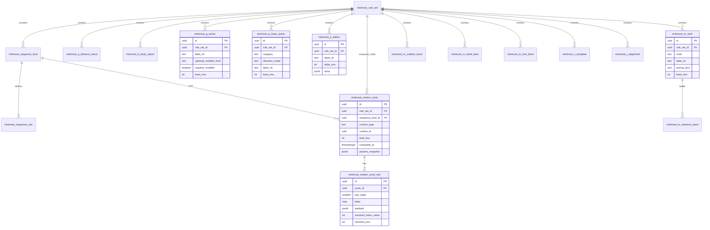

# MiniMOST 資料庫架構設計（草案）

> **地位**：使用者規格／設計討論稿，用於與現有 `phase1-postgresql-schema-spec.md`、`most_ui_*` 主數據對照後再決定 migration 切分。  
> **最高指導原則**（本文件嚴格對齊）：  
> - 僅兩種 **sequence model**：**一般移動 (General Move)** `A B G A B P A`、**控制移動 (Controlled Move)** `A B G M X I A`。  
> - **介面以文字選項為主**；僅在需要 **距離**、**時間**、**圈數／角度**、**M 複合取 max** 等情境才額外輸入數值。  
> - **G / P / M / X / I** 的選項、加總規則、M 的「動詞＋手度＋腳步取最大值」與使用者提供的對照表一致。  
> - **A、B**：你提供的範例僅示範索引結果（如 A6、B0）；實務上仍須對齊 **MiniMOST 官方距離／身體動作階梯**。本文件以 **可版本化的主數據表** 保留擴充點，不硬編死數值。

---

## 1. 設計目標

| 目標 | 說明 |
|------|------|
| **可稽核** | 每個 slot 能還原「使用者選了什麼」與「算出幾 TMU」；支援版本與事後追溯。 |
| **主數據與實例分離** | IE 維護 **目錄／規則**；PE 產出 **一次動作循環 (cycle)** 的選擇與計算結果。 |
| **與 UI 對齊** | 欄位設計對應「單選／複選（P 附加最多 2）／數值輸入」三類互動。 |
| **計算在服務層** | DB 存 **規則與輸入**；`TMU = f(選項, 距離, 秒, …)` 由 **Domain Service** 依版本化規則計算（避免 DB trigger 藏業務）。 |

---

## 2. Sequence model（硬約束）

以 **slot 序** 描述模型（字母順序不可變，由 `sequence_kind` 決定可用字母）。

| `sequence_code` | 人類可讀名稱 | Slot 序列（由 `minimost_sequence_slot` 表展開） |
|-----------------|--------------|-----------------------------------------------|
| `GM` | General Move | `A → B → G → A → B → P → A` |
| `CM` | Controlled Move | `A → B → G → M → X → I → A` |

**實作備註**：`sequence_code` 建議為 DB `CHECK` 或 enum 擴充點；未來若加 Tool 或其他子集，可新增列而非改既有列語意。

---

## 3. 字母與 UI／輸入型態對照

| Letter | 使用者互動（依你方原則） | 持久化重點 |
|--------|---------------------------|------------|
| **A** | 多為 **距離** 對應之索引（例：A6、A10） | `distance_cm` 或 `distance_in` + **規則版本** → 解析為 `index_value` |
| **B** | 文字選項（身體動作） | `choice_id` → `index_value` |
| **G** | 文字為主；部分列需勾選「接觸／選取／…」類修飾 | `g_action_id` + `modifier_flags`（jsonb 或正規化子表） |
| **P** | 基底放置／組裝 **單選** + 下方 **複選附加**（**最多 2 個**） | `p_base_id` + `p_addon_ids`（陣列，app 驗證 length≤2） |
| **M** | 動詞文字 + 依動詞類型輸入 **距離／圈數／角度／腳步**；**手度／腳步與主動詞並列取 TMU 最大** | `m_verb_id` + 多組輸入 + `resolved_tmu`（快取） |
| **X** | 多為 **使用者填秒**；少數為 **固定 0.216 s** | `x_template_id` + `duration_seconds`（可 NULL 若固定） |
| **I** | 文字選項 | `i_alignment_id` |

---

## 4. 資料表設計（Markdown schema）

以下欄位型別以 **PostgreSQL** 為預設；主鍵一律 **UUID**（`gen_random_uuid()`）便於 API 與匯出對齊。

### 4.1 版本與治理（建議全主數據表共用）

| 表名 | 用途 |
|------|------|
| `minimost_rule_set` | 一次「IE 發布」的規則快照：`code`、`effective_from`、`effective_to`、`status`（draft/published/retired）。所有目錄表可掛 `rule_set_id` 或透過 **單一 published rule_set** 視圖查詢。 |

**欄位範例：`minimost_rule_set`**

| 欄位 | 型別 | 說明 |
|------|------|------|
| id | uuid PK | |
| code | text UNIQUE | 例 `2026-Q1-factoryA` |
| name_zh | text | |
| status | text | `draft` / `published` / `retired` |
| effective_from | timestamptz | |
| effective_to | timestamptz NULL | |
| system_tmu_multiplier | numeric(10,4) NOT NULL DEFAULT 1 | 對應範例「×1」 |
| notes | text NULL | |

---

### 4.2 Sequence 定義

**`minimost_sequence_kind`**

| 欄位 | 型別 | 說明 |
|------|------|------|
| id | uuid PK | |
| rule_set_id | uuid FK → minimost_rule_set | |
| sequence_code | text | `GM` / `CM` |
| display_name_zh | text | 一般移動／控制移動 |
| is_active | boolean DEFAULT true | |

**`minimost_sequence_slot`**

| 欄位 | 型別 | 說明 |
|------|------|------|
| id | uuid PK | |
| sequence_kind_id | uuid FK | |
| slot_index | smallint | 0-based 或 1-based（團隊統一即可） |
| letter | char(1) | `A`/`B`/`G`/`P`/`M`/`X`/`I` |
| ui_step_group | text NULL | 前端分組：`取得`/`放置`/`返回`/`移動啟動` 等 |

**唯一約束**：`(sequence_kind_id, slot_index)` UNIQUE。

---

### 4.3 A／B（距離與身體動作 — 階梯主數據）

**`minimost_a_distance_band`**（依官方 MiniMOST 距離階梯維護；下表為 **結構示意**，數值由 IE 匯入）

| 欄位 | 型別 | 說明 |
|------|------|------|
| id | uuid PK | |
| rule_set_id | uuid FK | |
| max_distance_cm | numeric | **上界**（與業務定義一致：≤ 該值則落入此列） |
| index_value | integer | 出現在 sequence model 的數字，如 6、10、16 |
| sort_order | integer | |

**`minimost_b_body_option`**

| 欄位 | 型別 | 說明 |
|------|------|------|
| id | uuid PK | |
| rule_set_id | uuid FK | |
| label_zh | text | 顯示給使用者 |
| index_value | integer | 如 B0 |
| is_default | boolean | 常用「無身體動作」可標預設 |

---

### 4.4 G（取得控制）

**`minimost_g_action`**

| 欄位 | 型別 | 說明 |
|------|------|------|
| id | uuid PK | |
| rule_set_id | uuid FK | |
| label_zh | text | 例：輕按、抓握、拿取 |
| optional_modifier_kind | text NULL | 無 / `contact` / `select` / `select_small` / `separate` / `collect` / `transfer` …（與 UI 勾選框對齊） |
| requires_modifier | boolean | 若 true，前端必須勾對應修飾才能存檔 |
| base_tmu | integer | 與你表一致：3、6、10、16、24 |
| sort_order | integer | |

*索引呈現*：仍為 **G 的單一數字索引**（如 G6）；`base_tmu` 應等於該索引值（若你方 MiniMOST 定義如此）。若書本以「索引」表徵而非直接等於 TMU，可改存 `index_value` 並令 `base_tmu = index_value`。

---

### 4.5 P（放置／組裝 + 複選附加）

**`minimost_p_base_action`**

| 欄位 | 型別 | 說明 |
|------|------|------|
| id | uuid PK | |
| rule_set_id | uuid FK | |
| category | text | `place` / `assemble` / `toss` / `hold` … |
| direction_mode | text NULL | `none` / `multi` / `single`（對應「無方向／多種方向／一種方向」） |
| label_zh | text | |
| base_tmu | integer | 3、6、10、16 |
| sort_order | integer | |

**`minimost_p_addon`**

| 欄位 | 型別 | 說明 |
|------|------|------|
| id | uuid PK | |
| rule_set_id | uuid FK | |
| label_zh | text | 對準、插入、較難處理、卡合、施加壓力 |
| delta_tmu | integer | +8 或 +16 |
| max_select_global | integer | **固定 2**（可存表內或只寫在 app 常數；DB 可 CHECK `max_select_global = 2` 作文件化） |
| extra | jsonb NULL | 例：`对准` 需 **精度(<4mm)** 才 +8 → `{"requires_precision_lt_4mm": true}` |

**執行約束（應用層 + DB check）**：同一 P slot 上，`cardinality(selected_addons) ≤ 2`；若有互斥（未來擴充）可用 **`minimost_p_addon_exclusion`**（addon_id_a, addon_id_b）。

**P 總 TMU**：`base_tmu + sum(selected_addon.delta_tmu)`（若「對準」需精度條件，未滿足則不計入該 +8）。

---

### 4.6 M（控制移動 — 動詞階梯 + 手度 + 腳步取 MAX）

**`minimost_m_verb`**

| 欄位 | 型別 | 說明 |
|------|------|------|
| id | uuid PK | |
| rule_set_id | uuid FK | |
| code | text UNIQUE (within rule_set) | 內部鍵，如 `push`, `twist_hand`, `foot` |
| label_zh | text | 推、拉、理、… |
| pricing_kind | text | `distance_ladder` / `button` / `screw_slide_fixed` / `rotation_by_diameter` / `hand_twist` / `foot` |
| fixed_tmu | integer NULL | 僅 `screw_slide_fixed` → 3 |
| input_hint | text NULL | 給 UI：要距離／圈數／角度 |

**`minimost_m_ladder_profile` + `minimost_m_ladder_bands`（實作 v1）**  
多個距離動詞共用同一套 cm→TMU 階梯時，以 **`minimost_m_ladder_profiles`** 承載階梯，**`minimost_m_verbs.ladder_profile_id`** 指向該 profile，避免每動詞重複建 band 列。（原草案之 `minimost_m_distance_band` 語意由 `minimost_m_ladder_bands` 取代。）

**`minimost_m_ladder_bands`**

| 欄位 | 型別 | 說明 |
|------|------|------|
| id | uuid PK | |
| ladder_profile_id | uuid FK → minimost_m_ladder_profiles | |
| max_cm | numeric | 上界：≤1、≤4、≤10、≤18、≤30（與你表一致） |
| tmu | integer | 3、6、10、16、24 |

**`minimost_m_rotation_band`**

| 欄位 | 型別 | 說明 |
|------|------|------|
| id | uuid PK | |
| rule_set_id | uuid FK | |
| max_diameter_cm | numeric | ≤12.5 與 ≤50 兩套 |
| revolutions | smallint | 1、2、3（≤12.5 才有 3 圈） |
| tmu | integer | 16、32、42、24、42… |

**`minimost_m_hand_twist`**

| 欄位 | 型別 | 說明 |
|------|------|------|
| id | uuid PK | |
| rule_set_id | uuid FK | |
| max_angle_deg | smallint | 90、180 |
| tmu | integer | 6、10 |

**`minimost_m_foot_band`**

| 欄位 | 型別 | 說明 |
|------|------|------|
| id | uuid PK | |
| rule_set_id | uuid FK | |
| max_cm | numeric | 含 >30 → 42 TMU 一列（建議存 `max_cm = NULL` 表示「無上限列」+ `tmu=42`） |

**一次 CM 的 M slot 建議存法（實例層）**：  
- `m_components[]`：每列 `{ "verb_id", "inputs": {...}, "partial_tmu" }`  
- `resolved_tmu = max(partial_tmu)`  

例：**理 ≤4cm → 6**、**手度 ≤180° → 10**、無腳步 → **max = 10**。

---

### 4.7 X（處理時間）

**`minimost_x_template`**

| 欄位 | 型別 | 說明 |
|------|------|------|
| id | uuid PK | |
| rule_set_id | uuid FK | |
| label_zh | text | 并压合机台、刷条形码… |
| entry_mode | text | `user_seconds` / `fixed_seconds` |
| fixed_seconds | numeric NULL | 0.216 類固定列使用 |
| sort_order | integer | |

**換算**：服務層依 `OQ-002`（performance rating／TMU↔秒）將秒數轉 TMU；**固定列**可選在寫入時就 materialize 成 `x_tmu` 以便稽核不隨全域係數改變而漂移（產品決策）。

---

### 4.8 I（對齊）

**`minimost_i_alignment`**

| 欄位 | 型別 | 說明 |
|------|------|------|
| id | uuid PK | |
| rule_set_id | uuid FK | |
| label_zh | text | 并检查、并对准… |
| vision_scope | text | `normal` / `outside` |
| alignment_points | text NULL | `none` / `one` / `two`（到點／到兩點） |
| tmu | integer | 6、10、16、24、32… |

---

### 4.9 使用者一次「循環」實例（PE／IE 建工時）

**`minimost_motion_cycle`**

| 欄位 | 型別 | 說明 |
|------|------|------|
| id | uuid PK | |
| rule_set_id | uuid FK | 計算當下使用哪套規則 |
| sequence_kind_id | uuid FK | GM 或 CM |
| context_type | text | 未來可掛 `sku_version_step` / `library_template` |
| context_id | uuid NULL | 外鍵多型或拆關聯表 |
| narrative_zh | text NULL | 選填：人類可讀情境句 |
| work_object_vocab_id | uuid NULL FK `work_vocab_items` | 作業物件（`kind=object`）；**建立循環時 API 必填** |
| work_from_vocab_id | uuid NULL FK `work_vocab_items` | 自／來源目標（`kind=target`） |
| work_to_vocab_id | uuid NULL FK `work_vocab_items` | 至／目的地（`kind=destination`；GM「放置前」與 CM「移動啟動前」同一欄） |
| work_hand_vocab_id | uuid NULL FK `work_vocab_items` | 手勢（`kind=hand`） |
| total_tmu | integer | 快取：各 slot 加總後 × `system_tmu_multiplier` |
| computed_at | timestamptz | |
| params_snapshot | jsonb | **可選**：寫入時整包選擇快照，避免事後改規則影響歷史解讀 |

**`minimost_motion_cycle_slot`**

| 欄位 | 型別 | 說明 |
|------|------|------|
| id | uuid PK | |
| cycle_id | uuid FK | |
| slot_index | smallint | |
| letter | char(1) | 冗餘方便查詢 |
| payload | jsonb | **結構化選擇**（見下節 JSON 契約草案） |
| resolved_index_value | integer NULL | 若該 slot 對外要顯示「字母+數字」 |
| resolved_tmu | integer NULL | 該 slot 貢獻 TMU（M、P 已內含加總後結果） |

**`payload` 契約草案（jsonb）**

```json
// A
{"kind":"A","distance_cm":20,"band_id":"uuid"}

// B
{"kind":"B","choice_id":"uuid"}

// G
{"kind":"G","g_action_id":"uuid","modifiers":{"contact":true}}

// P (GM)
{"kind":"P","base_id":"uuid","addon_ids":["uuid","uuid"]}

// M (CM) — 複合取 max
{"kind":"M","components":[
  {"verb_id":"uuid","distance_cm":10},
  {"verb_id":"uuid_hand_twist","angle_deg":180},
  {"verb_id":"uuid_foot","distance_cm":0}
],"partial_tmus":[6,10,0],"resolved_tmu":10}

// X
{"kind":"X","template_id":"uuid","duration_seconds":1.2}

// I
{"kind":"I","alignment_id":"uuid"}
```

---

## 5. 與你提供之對照表一致性檢核（摘要）

| 區塊 | 設計要點 |
|------|----------|
| **Sequence** | 僅 `GM`=`ABGABPA`、`CM`=`ABGMXIA`，由 slot 表保證順序。 |
| **G** | 一列一動作；修飾勾選用 `optional_modifier_kind` + `requires_modifier`；`base_tmu` 與表一致。 |
| **P** | 基底與附加分表；**附加最多 2** 由 app +（可選）constraint 保證；**對準 +8** 可掛 `extra.requires_precision_lt_4mm`。 |
| **M** | 距離階梯用 `minimost_m_distance_band`；**旋轉／手度／腳步**分表；循環實例用 `components[]` + **max**。 |
| **X** | `user_seconds` vs `fixed_seconds=0.216`。 |
| **I** | 視野範圍內外 + 到點／兩點 + 動詞語義（检查／确认／对准／对齐）映射到 `tmu`。 |

---

## 6. Mermaid ER Diagram



---

## 7. 與現有 ddm-v2 的銜接建議（非本文件範圍內實作）

- **`most_ui_options` / `most_ui_fields`**：適合 **「已固定 seq_type + param_key」** 的顯示字串；MiniMOST 若 slot 化且規則多，**新建 `minimost_*` 前綴表**較不會污染既有 `seq_type` 枚舉。  
- **工步本體**：現有 `sku_version_steps.params`（JSONB）可嵌入 `minimost_motion_cycle.id` 或直接把 `minimost_motion_cycle_slot` 的摘要內嵌，二擇一需決策 **「循環是否可多工步共用」**。  
- **`WorkVocabItem`**：物件／地點敘事與 MOST 索引解耦時，可只存 narrative，**計算鍵**仍指向本文件的 `minimost_*` id。

---

## 8. 待你方確認的開放議題

1. **A／B 官方階梯**：請以 MiniMOST 手冊為準匯入 `minimost_a_distance_band` / `minimost_b_body_option`；本文件不臆測未提供的數值。  
2. **G 的「索引」vs TMU**：若 MiniMOST 中 G 的數字**不是**直接等於 TMU，則 `minimost_g_action` 應拆 `most_index` 與 `tmu_contribution` 兩欄。  
3. **X 固定 0.216 s**：與全域 **rating**（0.036 s/TMU 等）並存時，歷史工時是否 **凍結當下換算結果**（建議凍結在 `resolved_tmu` 或 snapshot）。  
4. **P「最多 2 個」附加**：是否包含「對準 + 插入」等任意組合，或需 IE 設定 **互斥組**（未來 `minimost_p_addon_exclusion`）。

---

*文件版本：草案 v0.1 | 建立日：2026-04-19*
