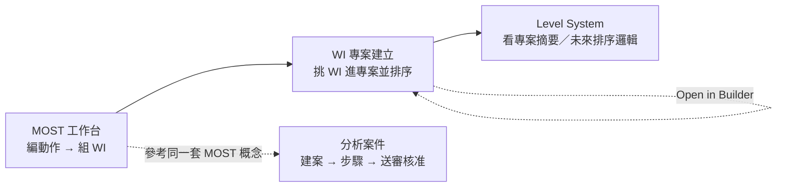

# 四 Tab 使用邏輯：MOST 工作台 → WI 專案建立 → Level System → 分析案件

> 對象：要在其他專案重現「同一條分析資產流」的產品／前端。  
> 側欄來源：`AppLayout.vue` menuItems（儀表板之後的四個核心業務 tab）。

---

## 0. 名詞對照（先對齊語意）

| 使用者說法 | 系統概念 | 主要資料 |
|------------|----------|----------|
| 動作 / 序列列 | Sequence item | 單一手別 × 單一模組（GM/CM）的槽位選擇 + TMU |
| WI | MI Statement / WI Template（視頁面） | 多個動作組成的工作指示語＋合計時間 |
| WI 專案 / WI Set | WI Set Project | Site/BU/製程維度下的 WI 集合（含 snapshot） |
| Level | Level System（規劃中） | 專案內 WI 的前後置／平行關係 |
| 分析案件 | Analysis Case | 正式送審對象：產品×站別×工序 + 步驟 + 簽核 |

**重要分流**：  
「MOST 工作台」產出的**動作／WI** 與「分析案件」裡的**步驟**目前是**兩套平行模型**——前者走 `/api/most/*` 即時工作台字典；後者走 `/api/analysis/*` + 字典版本 lexical options。移植時可選擇「打通」或「保持雙軌」；本專案現況是雙軌、以工作台做快速建模／組 WI，以案件做正式流程簽核。

---

## 1. 總流程（建議使用者心智模型）



實際側欄是**平級導覽**（沒有強制 wizard），但物件依賴大致是：

1. **MOST 工作台**：製造「可重用動作」與「WI」
2. **WI 專案建立**：從 WI Library 挑 WI 組成專案（後續給 level / 產線規劃）
3. **Level System**：目前以檢視專案為主，依賴／層級排序「Coming Soon」
4. **分析案件**：正式分析與簽核報告（產品/站別/工序粒度）

---

## 2. Tab 一：MOST 工作台

| 項目 | 內容 |
|------|------|
| Path | `/most-workbench` |
| 元件 | `MostWorkbenchPage.vue` |
| 權限 | 讀：全角色；寫：`admin` / `analyst` |

### 2.1 使用邏輯（一步步）

1. 載入 workbench options + 我的 sequences + 我的 MI statements  
2. （可選）用 NL 草稿帶出槽位建議  
3. 選動作類型（一般移動 / 控制移動）與使用手  
4. 填 context（從哪裡／目標物／元件／到哪裡…）並點各槽位選參數  
5. 看 SummaryBar 的 TMU / CT / 語句；可覆寫語句  
6. **新增動作** → 寫入動作列表  
7. 在列表調整頻率、SIMO、順序；可搜尋／編輯回填／刪除  
8. 勾選多筆 →（選填 WI 名稱）→ **加入 WI**  
9. 在 **WI 大綱** 展開子動作，用 Inspector 微調（copy-on-write，不改來源列）

### 2.2 核心業務規則

- TMU 合計：slot index/tmu 加總；CT(秒) = TMU × **0.036**
- SIMO：同列標記後，對「組合合計」以 max 思維貢獻（納入總時間可能降為 0／不疊加，依後端規則）
- GM ↔ CM 切換：共用 A1/B1/G/A3；清掉對方獨有槽
- WI 子項：`source_sequence_id` 僅追溯；真正計算吃 snapshot

### 2.3 與其他 Tab 的銜接

- 產出的 WI／動作會進入系統的 MOST 資源池（WI Library 來源之一，供 WI 專案建立搜尋）
- 側欄另有 `/most-workbench-v3`（動作子模組 → WI Pool → 作業流程），屬更高層模板化；預設「MOST 工作台」仍是 v2.1 單欄頁

詳 UI/參數請見 [`most-workbench-ui-ux.md`](./most-workbench-ui-ux.md)。

---

## 3. Tab 二：WI 專案建立（WI Set Builder）

| 項目 | 內容 |
|------|------|
| Path | `/wi-set-builder`（可帶 `?id=`） |
| 元件 | `WISetBuilderPage.vue` + `components/wi-set/*` |
| 權限 | 目前頁面未再細分；沿用登入使用者操作專案 API |

### 3.1 頁面五段（邏輯邊界）

| Section | 名稱 | 做什麼 |
|---------|------|--------|
| Header | 專案選擇器 | 選既有專案 / New Project |
| A | Project Metadata | 專案碼、名稱、Site、BU、Process、Family、Model、說明、status；Site 預設選項 `TAO/IPT/SQT/ITE/IMX/ICZ`（可自填）；名稱可 **Auto** = `site-bu-process-family-model` |
| B | WI Pool Search | 搜尋 WI Library、多選、Add to project |
| C | Selected WI Set | 已納入項目：上移/下移/刪除/排序 |
| D | Summary | 合計 WI 數、Actions、TMU、CT |
| E | Save / Export Actions | Create/Save、Duplicate、Delete |

### 3.2 使用邏輯

1. **New** 或從下拉選既有專案（`GET /most/wi-set-projects`）  
2. 填寫必填 metadata：`project_name` + `site/bu/process/family/model`  
3. 在 WI Pool 搜尋關鍵字 → 勾選 → **Add**  
   - 若尚無 `projectId`：先 **自動 create** 再加 items  
   - 成功後**只清勾選**、保留搜尋結果，方便連續加下一批  
4. 在 Selected 表調整順序（會呼叫 reorder API，並寫 snapshot 順序）  
5. Save / Duplicate / Delete  
6. URL `?id=` 與當前專案同步，方便書籤與從 Level System 跳回

### 3.3 Snapshot 語意

加入專案時，項目保存的是 WI 當下的：

- `wi_code_snapshot` / `wi_name_snapshot`
- `action_count_snapshot` / `total_tmu_snapshot` / `total_seconds_snapshot`

之後就算來源 WI 再改，**專案列仍吃快照**（適合凍結產線標準）。

### 3.4 與其他 Tab

- **輸入**：MOST 工作台（及 WI Library）產出的 WI  
- **輸出**：給 Level System 選專案；可反向「Open in WI Set Builder」

---

## 4. Tab 三：Level System

| 項目 | 內容 |
|------|------|
| Path | `/level-system` |
| 元件 | `LevelSystemPage.vue` |
| 成熟度 | **檢視層已做；依賴／層級演算未做** |

### 4.1 目前可用邏輯

1. 列出所有 WI Set Projects  
2. 選一個 → `GET` 詳情  
3. 顯示 Project Summary（Site/BU/Process/Family/Model、狀態、WI 數、Total Actions/TMU/CT）  
4. 顯示專案內 WI 表格（用 snapshot 欄位）  
5. **Open in WI Set Builder** → `/wi-set-builder?id=...`

### 4.2 Coming Soon（產品承諾、尚未實作）

- Independent / Dependent 分類  
- Parallel / Serial  
- Precedence（前後置）  
- Level 計算與 cycle time balancing  

移植時：可先重做「專案選擇 + 摘要表 + 回 Builder」這段；層級圖先當 placeholder。

---

## 5. Tab 四：分析案件

| 項目 | 內容 |
|------|------|
| Path | `/cases`、`/cases/new`、`/cases/:id`、`/cases/:id/report` |
| 元件 | `CaseListPage` / `CaseEditorPage` / `CaseReportPage` |
| API | `analysisApi`（`/api/analysis/...`）+ `dictionaryApi` |

### 5.1 列表邏輯

- 可依狀態篩選：`draft | submitted | reviewed | changes_requested | approved | archived`
- 欄位：案件編號、產品、站別、工序、分析人員、狀態、更新時間  
- 列點擊進詳情；Analyst 可「新增案件」

### 5.2 建案／編輯邏輯

1. 填案件頭：產品、站別、工序、寬放率(%)、字典版本（新建後鎖定）、備註  
2. **建立案件**後才能加步驟  
3. 「新增步驟」對話框：選序列模型 + 語彙（手別／目標物／從哪裡／到哪裡）+ 各 slot option + 頻次  
4. 先「預覽計算」再「儲存步驟」；列表顯示產生句、頻次、總 TMU、標準時間(含寬放)  
5. 頁尾合計所有步驟

### 5.3 編輯權限

| 狀態 | 誰可改內容 |
|------|------------|
| `draft` / `changes_requested` | admin **或** 該案 analyst |
| 其他 | 僅 admin（一般簽核流程中鎖定） |

### 5.4 簽核狀態機

```
draft ──送審──► submitted ──審核通過──► reviewed ──核准──► approved
   ▲                 │                     │
   └──── 退回修改 ←──┴─────────────────────┘
                      (request changes)
```

| 動作 | 可見條件（前端） |
|------|------------------|
| 送審 | status ∈ {draft, changes_requested} 且 canEdit |
| 審核通過 | `submitted` 且 `isReviewer` |
| 退回修改 | status ∈ {submitted, reviewed} 且 `isReviewer`（需填原因） |
| 核准 | `reviewed` 且 `isApprover` |
| 匯出 Excel / 檢視報表 | 有案件即可 |

簽核紀錄以 timeline 顯示 actor / action / from→to / comment。

### 5.5 與 MOST 工作台關係（務實說明）

- **概念同屬 MiniMOST**（GM/CM、slot、TMU、句子）  
- **資料未強制綁定**：案件步驟不會自動從工作台 WI 匯入  
- 若他專案要「同一套 UI + 同一條資產流」，建議新增：`從 WI / Sequence 匯入步驟` 或共用同一計算服務；本倉目前未接這條捷徑

---

## 6. 四 Tab 責任矩陣

| 能力 | MOST 工作台 | WI 專案建立 | Level System | 分析案件 |
|------|-------------|-------------|--------------|----------|
| 編輯單動作槽位 | ✅ 主力 | ❌ | ❌ | ✅（對話框舊式） |
| 組成 WI | ✅ | 消費 WI | 檢視 WI 集合 | ❌ |
| 專案／Site 維度 | ❌ | ✅ | ✅ 讀取 | 案件是產品/站別維度 |
| 順序／快照凍結 | WI 內子項 | 專案 items snapshot | （規劃中） | 案件步驟列表 |
| 正式簽核 | ❌ | status 欄位而已 | ❌ | ✅ 完整 |
| 報表 Excel | ❌ | ❌ | ❌ | ✅ |

---

## 7. 建議的使用者故事（給移植驗證）

1. Analyst 在 **MOST 工作台** 建 3 個動作 → 勾選組成「上蓋組裝 WI」  
2. 到 **WI 專案建立** 新建 Project（填 Site/BU/…）→ 搜尋並加入該 WI → 再加其他 WI → 調整順序並 Save  
3. 到 **Level System** 選該專案，確認合計 TMU/CT，必要時 Open in Builder 微調  
4. （並行或後續）在 **分析案件** 建 draft 案 → 加步驟/送審 → Reviewer/Approver 走完 → 匯出

---

## 8. API 地圖（跨 Tab）

| Tab | 主要 Endpoint 前綴 |
|-----|--------------------|
| MOST 工作台 | `/api/most/dictionary/*`, `/sequences`, `/mi-statements`, `/calculate-row`, `/nl-draft` |
| WI 專案建立 | `/api/most/wi-library`, `/api/most/wi-set-projects` (+ items/reorder/duplicate) |
| Level System | `/api/most/wi-set-projects`（讀為主） |
| 分析案件 | `/api/analysis-cases`（+ `/:id/steps`、`/analysis-steps/preview`、簽核 `submit\|review\|request-changes\|approve\|archive`、`approval-events`、`export.xlsx`）；字典走 `dictionaryApi` |

客戶端：`apps/web/src/api/most.ts`、`apps/web/src/api/index.ts`（analysis/dictionary）。

---

## 9. 移植優先級建議

1. **先做 MOST 工作台 UI + 計算契約**（另見 UI/UX 文）— 使用者感知最重  
2. **再做 WI Set Builder 五段式**（metadata → pool → selected → summary → save）  
3. Level System 先做「專案選擇+摘要+回跳」即可對齊現況  
4. 分析案件視產品是否要正式簽核再移植；若只要工時建模，可暫緩或日後把案件步驟接到 WI snapshot
