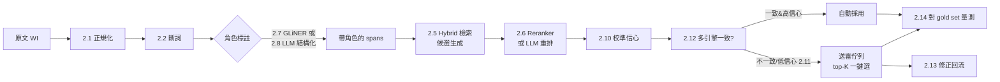

# 02 · 概念入門（把每個技術積木講成白話）

> 讀完這篇，你看 [03 方法比較](03-methods-survey.md) 和 [04 架構設計](04-architecture-design.md) 時不會有任何黑盒子。
> 每個積木都用三段式：**它是什麼 → 為什麼對我們重要 → 一個小例子**。

---

## 2.1 正規化 Normalization

**它是什麼**：把「看起來不同但意義相同」的字串統一成一種標準形。三招最關鍵：

- **NFKC（Unicode 正規化）**：全形→半形、相容字統一。`２０ＣＭ` → `20CM`。
- **繁簡統一（OpenCC）**：`检查` ↔ `檢查`。把輸入與詞典都轉成同一邊（建議統一成繁體，因為詞典是繁體）。
- **大小寫／空白**：`Snap-Fit ` → `snap-fit`。

**為什麼重要**：現況 100% 沒做這層，導致簡體、全形、英文大小寫全部 miss。這是**投資報酬率最高、風險最低**的一步。

**小例子**

$$\text{normalize}(\text{“伸手２０ＣＭ检查”}) = \text{“伸手20cm檢查”}$$

之後所有比對都在 normalized 字串上做。**務必保留「原文↔正規化」的字元位移對照（offset map）**，這樣最後才能在 UI 把命中片段 highlight 回原文給人審核。

---

## 2.2 斷詞 Tokenization / Segmentation

**它是什麼**：把中文連續字切成詞。`從料架上拿DIMM` → `從 / 料架 / 上 / 拿 / DIMM`。常用 jieba（可加自訂詞典）、pkuseg、HanLP。

**為什麼重要**：
1. 純「子字串包含」會誤命中——例如關鍵字 `握` 出現在不相關的詞裡也算中。在**詞邊界**上比對能大幅減少假命中。
2. 斷詞是後面「逐詞模糊比對」與「逐詞檢索」的前置。
3. **自訂詞典**：把 MiniMOST 詞典的 `display_text_zh` + 同義詞灌進 jieba userdict，確保「壓合機台」不被切成「壓合 / 機台」。

**小例子**：沒有自訂詞典時 `壓合機台` 可能被切成 `壓合`＋`機台`，導致對到 `X_PRESS_MACHINE`(壓合) 還是別的混淆；加 userdict 後它是一個 token，乾淨對應。

---

## 2.3 模糊比對 Fuzzy Matching（容錯）

**它是什麼**：允許「不完全一樣」也能配對。幾種層次：

- **編輯距離 Levenshtein**：要幾次增刪改才能從 A 變 B。`對淮`→`對準` 距離 1。
- **rapidfuzz**：C++ 實作、超快，提供 `ratio` / `token_set_ratio` 等相似度（0–100）。
- **字元 n-gram Jaccard**：中文詞短，單字錯一個 ratio 掉很多，改用 bigram 集合的交集比例更穩。
- **拼音 pinyin（pypinyin）**：把詞轉拼音再比，專治**同音錯字**。`壓合`/`押合` 拼音都接近 `ya he`。

**為什麼重要**：直接解掉「錯字、形近、同音」這一大類奇怪輸入，且**完全確定性、可離線、毫秒級**。

**中文專屬陷阱（很重要）**：別無腦套英文式 `fuzzywuzzy` 字元比對。中文詞 2–4 字，錯一字相似度驟降。**正解 = 斷詞後做 token 級比對 + bigram Jaccard + pinyin 雙保險**。

**小例子**

| 輸入 | 表內標準詞 | 字元 ratio | pinyin ratio | 判定 |
|------|-----------|-----------|--------------|------|
| 對淮 | 對準 | 50 | 95 | 命中（靠 pinyin） |
| 鎖咐 | 鎖附 | 50 | 92 | 命中（靠 pinyin） |

---

## 2.4 向量 Embedding 與語意相似度

**它是什麼**：用一個神經網路把任意文字映射成一個固定長度的向量（如 BGE-M3 是 1024 維）。**語意相近的文字，向量也相近**。相似度常用 cosine：

$$\text{sim}(u, v) = \frac{u \cdot v}{\lVert u\rVert\,\lVert v\rVert}$$

這種「一段文字 → 一個向量」的模型叫 **bi-encoder**（查詢與文件各自獨立編碼，可預先算好、超快）。

**為什麼重要**：模糊比對只能處理「字面接近」；embedding 能處理「**意思接近但字面不同**」——`扣上` 與 `卡合` 字面無關，但語意向量相近。而且現代多語模型（BGE-M3、Qwen3-Embedding）**天生跨語言**：中文 `卡合` 和英文 `snap fit` 會落在相近位置，直接解掉「中英混雜／純英文」。

**小例子**：把詞典每個選項的 `sentence_text_zh` 預先編碼成向量存起來；查詢時把使用者片段編碼，取 cosine 最高的當候選。`扣上` → 最近鄰是 `P_SNAP_FIT(卡合)`。

> **注意**：bi-encoder 永遠會回一個「最近的」，即使是亂輸入。所以**一定要配門檻與 reranker**（見 2.6、2.10），否則就是「自信地猜錯」。

---

## 2.5 檢索 Retrieval：Dense / Sparse / Hybrid

當「候選池」就是 MiniMOST 詞典的所有 option（每個 slot 幾到十幾個），我們要從中**檢索**最可能的幾個候選：

- **Dense（稠密）**：用 embedding cosine 找最近鄰。擅長**語意**、跨語言；但對**罕見專名／精確字串**（如型號 `DIMM`、`PPID`）可能不敏感。
- **Sparse（稀疏 / 詞彙）**：BM25 之類，靠**字詞重疊**打分。擅長精確詞、專名；不懂同義。
- **Hybrid（混合）**：兩者分數加權合併，**截長補短**。BGE-M3 一個模型就同時輸出 dense + sparse（lexical weights），官方建議「**hybrid retrieval + re-ranking**」。

**為什麼重要**：我們的輸入同時有「語意同義」（卡合/扣上/snap fit）和「精確專名」（DIMM、PPID、二維碼）。**只有 hybrid 兩邊都顧**。

**小例子（分數合併）**

$$\text{score} = \alpha \cdot \text{dense} + (1-\alpha)\cdot \text{sparse}, \quad \alpha \approx 0.5\text{–}0.7$$

---

## 2.6 重排序 Reranker（Cross-encoder）

**它是什麼**：把「查詢 + 單一候選」**一起**丟進模型算一個相關分數（不是各自編碼），叫 **cross-encoder**。比 bi-encoder 準很多，但慢，所以只用在「**先檢索出 top-K，再對這 K 個重排**」。代表：bge-reranker-v2-m3、Qwen3-Reranker。

**為什麼重要**：bi-encoder 檢索負責「**召回**」（別漏掉正解），reranker 負責「**精確**」（把正解排到第 1）。兩段式是現代檢索的標準配方，也是我們提高 slot 準確率的關鍵。

**小例子**：dense 檢索 `對準` 給出候選 `[P_ALIGN_LT_4MM, I_ALIGN_POINT_NORMAL, …]`，reranker 看上下文（句中有沒有「檢查」語氣）把正確的那個排到第 1。

---

## 2.7 NER / 角色標註 與 GLiNER

**它是什麼**：NER（命名實體辨識）= 在句子裡圈出片段並標上類型。我們要的是「**角色標註**」：把句子切出 `hand / from_location / grasp_verb / target_object / move_verb / place_verb / process / inspect / body / distance / destination / component` 等 span。

**GLiNER**：一個**輕量、可零樣本（zero-shot）、多語（100+ 語言）、CPU 可跑** 的 NER 模型。你只要給它一串 label 名稱，它就能抽——**不需要訓練資料就能起步**，之後可用少量標註**幾分鐘微調**。後續版本 **GLiNER2** 還支援 schema 驅動的多任務抽取。

**為什麼重要**：這正是解「**語序顛倒 + 中英混雜**」的鑰匙。一旦能把句子拆成**帶角色的 span**，後面只要把每個 span 對到 option_code 即可，**位置不再重要**（不像現況靠 regex 的位置假設）。

**小例子**

```text
輸入: 放到流水線，從料架拿DIMM
GLiNER labels: [hand, from_location, grasp_verb, target_object, destination, ...]
輸出: from_location="料架"  grasp_verb="拿"  target_object="DIMM"  destination="流水線"
       （即使語序顛倒，角色也對）
```

---

## 2.8 LLM 結構化輸出 與 Constrained Decoding

**它是什麼**：讓 LLM 直接輸出**符合 schema** 的 JSON。兩種強度：

- **Schema 提示**：在 prompt 裡描述要的欄位，LLM 盡量照做（可能出錯）。
- **Constrained decoding（受限解碼）**：在**生成的每一步**就限制 token，**保證**輸出 100% 合法（欄位齊全、`option_code` 只能是 enum 內合法值）。工具：**Outlines**（「Guaranteed valid structure」，支援 vLLM/Ollama/transformers/llama.cpp）、**OpenAI Structured Outputs**（`response_format` json_schema, strict）、vLLM guided decoding、xgrammar。

**為什麼重要**：LLM 是處理「**任何奇怪句子 + 任何語言 + 任何語序**」泛化能力最強的；但它會亂編。**把 `option_code` 設成 enum 並用 constrained decoding**，就能讓 LLM 的彈性**被綁在我們的封閉本體裡**——既泛化又不越界。這是「精度天花板最高」路線的核心。

**小例子（schema 片段）**

```jsonc
{
  "sequence_model": { "enum": ["GENERAL_MOVE", "CONTROLLED_MOVE"] },
  "G":   { "enum": ["G_GRASP","G_PICK","G_SELECT","G_SELECT_SMALL", "..."] },
  "from_location": { "type": "string" },
  "distance_cm":   { "type": ["number","null"] }
}
```

> LLM 仍可能「選錯合法值」，所以**還是要信心與審核**；constrained decoding 只保證「**格式合法**」，不保證「**語意正確**」。兩者別混淆。

---

## 2.9 實體連結 Entity Linking（把抽出的片段對到本體）

**它是什麼**：抽出 `target_object="DIMM"`、`grasp_verb="扣上"` 之後，要把**動作類片段**對到 MiniMOST 的 `option_code`。標準三步：

1. **Mention detection**（2.7 已做）：圈出片段。
2. **Candidate generation**：用 hybrid retrieval（2.5）取每個 slot 的 top-K 候選。
3. **Disambiguation / ranking**：用 reranker 或 LLM 從候選選最佳（2.6）。

**為什麼重要**：這是把「自由文字」收斂到「封閉 option_code」的正式框架。我們的整個 Stage 2 就是 entity linking。

---

## 2.10 信心校準 Calibration（讓分數可信）

**它是什麼**：模型吐的原始分數（cosine、reranker logit、LLM 自報信心）**不是真機率**——可能 0.9 卻常錯，或 0.6 卻常對。**校準**就是用一份標好答案的資料，學一個映射把「原始分數 → 真實正確機率」。常用 **Platt scaling（邏輯回歸）** 或 **isotonic regression（保序回歸）**。

**為什麼重要**：審核分流的門檻**必須**架在「可信的機率」上。沒有校準，你設 0.8 門檻其實不知道對應多少精度，分流就是空談。

**小例子**：校準後得到「reranker 分數 ≥ 0.92 ⇒ 實測精度 0.98」，於是把 auto-accept 門檻設在 0.92，就**保證**自動通過那段約 98% 對。

---

## 2.11 選擇性預測 / 棄權 Selective Prediction & Abstention

**它是什麼**：模型可以選擇「**這題我不答**」（abstain），把它丟給人。你用門檻控制「答多少」（coverage）與「答對多少」（precision）。畫出來就是 **risk–coverage 曲線**。

**為什麼重要**：**這就是「精度最高」與「審核最省」可調的旋鈕**。

- 想要**極高精度** → 門檻調高 → 只自動答最有把握的 → coverage 低、人工多。
- 想要**極省人力** → 門檻調低 → 自動答更多 → 靠校準保證精度不崩。

**小例子**

| 門檻 | Coverage（自動通過%） | 自動段 Precision | 人工負擔 |
|------|----------------------|------------------|----------|
| 0.97 | 55% | 0.995 | 高 |
| 0.92 | 72% | 0.98 | 中 |
| 0.85 | 88% | 0.95 | 低 |

挑哪一列，是商業決策，不是技術限制——系統要讓門檻**可設定**。

---

## 2.12 集成不一致 = 不確定訊號 Ensemble Disagreement

**它是什麼**：同時跑多個引擎（規則 / 檢索 / LLM）。**它們一致 → 很可能對（自動通過）；不一致 → 很可能難（送審）**。這是最便宜又有效的不確定性估計。

**為什麼重要**：不用訓練額外模型，就能得到一個強力的「該不該送審」訊號，直接服務「低審核成本」目標。

**小例子**：`對準` 這個詞，規則判 `P_ALIGN_LT_4MM`、LLM 判 `I_ALIGN_POINT_NORMAL` → 不一致 → 標記送審，並把兩個候選都列給人一鍵選。

---

## 2.13 主動學習回流 Active Learning

**它是什麼**：把**人工審核的修正**變成系統的養分：

1. 修正 `扣上→P_SNAP_FIT` → 自動**新增同義詞**到 DB `synonyms_json`。
2. 難句 + 正解 → 加入 **few-shot 範例庫** 給 LLM。
3. 加入 **gold set**，下次量測就涵蓋它。
4. 累積足夠後**微調** GLiNER / reranker。

**為什麼重要**：讓「審核率」**隨時間下降**——今天人工修過的，明天系統自己會。這是長期把人力成本壓低的引擎。

---

## 2.14 評測基礎 Evaluation（沒有量測就沒有優化）

**它是什麼**：
- **Precision（精確率）**：我說中的裡面，對的比例。
- **Recall（召回率）**：所有該中的裡面，我抓到的比例。
- **F1**：兩者調和平均。
- **Gold set（黃金測試集）**：人工標好答案的句子集合，當作「考卷」。

$$F_1 = 2\cdot\frac{P\cdot R}{P+R}$$

**為什麼重要**：模糊比對／embedding／LLM **都會用召回換精確**，稍不慎就讓精度悄悄退步。**每個 phase 都要對 gold set 跑分**，沒過門檻不准上線。這是 [06](06-evaluation-and-audit.md) 的核心紀律。

---

## 2.15 一張圖看懂積木如何串起來



---

下一篇 [03-methods-survey.md](03-methods-survey.md)：用這些積木，逐一比較 6 大類做法的優劣，並給出決策矩陣與我的推薦理由。
