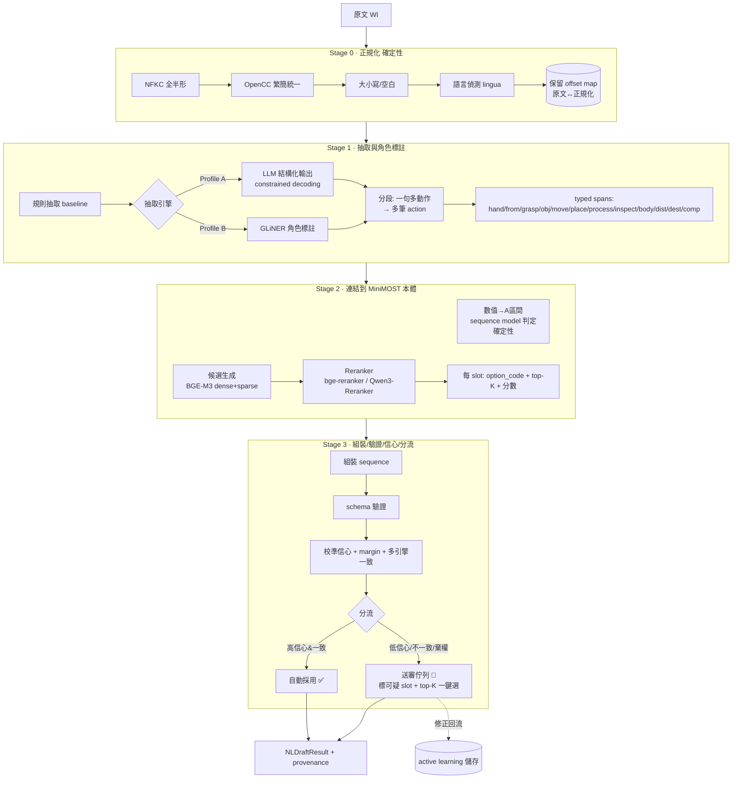
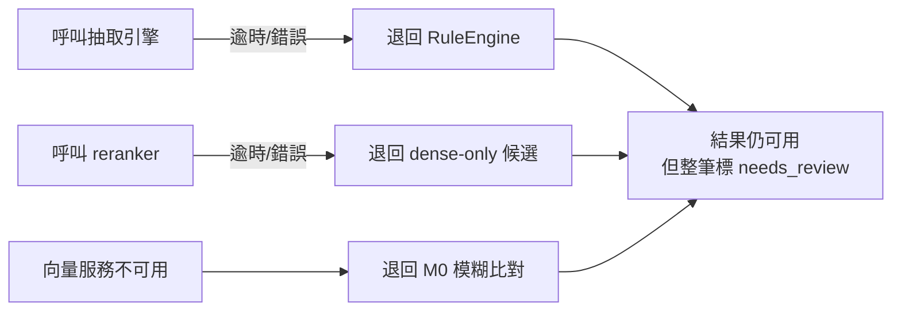

# 04 · 推薦架構與設計

> 把 [03 的混合管線](03-methods-survey.md) 變成**可實作的元件、資料契約、信心模型、分流邏輯**，並說明如何接進現有
> [nl_draft_parser.py](../../apps/api/app/services/nl_draft_parser.py) 與 [most.py 路由](../../apps/api/app/api/routes/most.py)。

---

## 4.1 全景圖



**設計骨幹三原則**（呼應 [README §6](README.md)）：確定性優先、每 slot 有 provenance、fail loud。

---

## 4.2 共用介面：`DraftParser` Protocol

程式註解早就預留了「未來 `LLMDraftParser` 可實作同介面」。我們把它正式化成一個 protocol，讓**每個引擎可插拔、可並跑、可比對**：

```python
# apps/api/app/services/nl_parser/base.py
from typing import Protocol
from .types import NLDraftResultV2

class DraftEngine(Protocol):
    name: str               # "rule" | "gliner" | "llm" | "retrieval"
    version: str            # 模型/prompt 版本（進 provenance）
    def parse(self, text: str, *, db_session=None) -> NLDraftResultV2: ...
```

- 既有 `RuleBasedDraftParser` 包成 `RuleEngine`（**不刪**，當 baseline 與 fallback）。
- 新增 `GLiNEREngine` / `LLMEngine` / `RetrievalLinker`。
- 一個 **`Orchestrator`** 負責：跑 Stage 0 → 選引擎 → Stage 2 linking → Stage 3 分流，並做多引擎一致性比對。

> 好處：**漸進遷移、可回退**（feature flag 切引擎）、**可量測**（同一句餵不同引擎比分數），完全符合 NFR5。

---

## 4.3 資料契約（stage 之間傳什麼）

用 Pydantic 明確定型，方便 LLM constrained decoding 直接套，也方便序列化進 provenance。

```python
# apps/api/app/services/nl_parser/types.py
class Span(BaseModel):
    role: str                  # "grasp_verb" | "from_location" | ...
    text: str                  # 命中片段（正規化後）
    raw_start: int; raw_end: int   # 對回原文的 offset（UI highlight 用）
    confidence: float

class SlotCandidate(BaseModel):
    option_code: str
    score: float               # 校準後機率
    raw_scores: dict           # {dense, sparse, rerank, llm} 原始分
    source_engine: str

class SlotResolution(BaseModel):
    slot_key: str              # "G" | "A1" | "P" | ...
    chosen: SlotCandidate | None
    top_k: list[SlotCandidate] # 供一鍵審核
    status: str                # "auto" | "review" | "abstain" | "default"
    badge: str                 # 顯示用（沿用現況 badge 風格）

class NLDraftResultV2(BaseModel):
    raw_text: str
    normalized_text: str
    language: str
    suggested_sequence_model: str
    context_fields: dict
    slots: dict[str, SlotResolution]
    overall_confidence: float
    needs_review: bool
    review_reasons: list[str]
    provenance: dict           # 引擎、版本、候選、分數、耗時
```

> **向後相容**：Orchestrator 末端提供 `to_legacy()` 把 `NLDraftResultV2` 轉成現有 [route 序列化格式](../../apps/api/app/api/routes/most.py) 期望的 `slot_suggestions` dict，前端先**不必改**即可上線；UI 增強（top-K 一鍵）再分批做。

---

## 4.4 Stage 0 — 正規化（確定性）

```python
def normalize(text: str) -> NormalizedText:
    nfkc = unicodedata.normalize("NFKC", text)          # 全半形/相容字
    zh   = opencc_s2t(nfkc)                              # 簡→繁（統一到詞典側）
    low  = lower_latin_only(zh)                          # 英文小寫，中文不動
    return NormalizedText(text=low, offset_map=build_offsets(text, low),
                          language=lingua_detect(low))
```

- **務必保留 `offset_map`**：審核 UI 要把命中片段標回**原文**。
- 語言偵測只當 metadata / 路由提示，**下游引擎本身要語言無關**。

---

## 4.5 Stage 1 — 抽取與角色標註（解語序/語言）

**角色標籤集（label set）**（與 [01 的輸出結構](01-problem-and-requirements.md)對齊）：

```
hand, from_location, grasp_verb, target_object, component,
move_verb, place_verb, process, inspect, body_action,
distance, destination, where_location, vision_scope(normal|outside)
```

### Profile A：LLM 結構化輸出
- 一次輸出「**動作清單**」，每個動作含上述角色 + 建議 sequence model。
- **constrained decoding**：`sequence_model` 與各 slot 是 **enum（合法 option_code）**；`distance_cm`、locations 是字串/數值。
- few-shot 帶 3–8 個涵蓋「亂序/中英/口語/一句多動作」的範例。
- `temperature=0`、鎖模型版本、**對 normalized_text 做快取**（NFR1 可重現）。

### Profile B：GLiNER
- `model.predict_entities(text, labels, threshold)` 取得帶角色 span。
- **分段**：以 grasp/move/place/process 動詞為錨點切出多筆動作。
- 領域動詞零樣本不穩處，靠 active learning 收集的標註**微調**（幾分鐘）。

**兩者都輸出 `list[Span]`**，下游一致。`RuleEngine` 也輸出同型，當第三方投票者。

---

## 4.6 Stage 2 — 連結到本體（解同義/跨語言/錯字）

### 4.6.1 確定性部分（先做、不丟模型）
- **距離**：regex 抽 `distance` span 的數值 → `_cm_to_interval`（沿用現有對照表）。
- **sequence model 判定**：有 `process|inspect|move_verb` 類角色 → `CONTROLLED_MOVE`，否則 `GENERAL_MOVE`（把現況 `_parse_actions` 的啟發式規則化、集中化）。
- **vision_scope**：偵測「視線範圍外/範圍外」→ outside。

### 4.6.2 候選生成（M1）
- 離線：把每個 slot 的所有 option 之 `sentence_text_zh + display_text_zh + synonyms_json` 編碼成 **BGE-M3 dense + sparse** 向量，存 **pgvector**（你已用 Postgres）。**按 slot 分庫**（G 的查詢只在 G 的候選裡找）。
- 線上：對 Stage 1 的動作 span 做 hybrid 檢索，取**每 slot top-K（K≈5）**。

### 4.6.3 精排（M2）
- 對 top-K 用 **bge-reranker-v2-m3 / Qwen3-Reranker** 重排，輸出每 slot 的 `chosen + top_k + raw_scores`。

> **詞典即索引**：新增/修改 option 只要重建該 slot 的向量（提供 `reindex` 指令 + 在 dictionary publish 後觸發，沿用現有 `invalidate_synonym_cache` 的鉤子位置）。**免改程式碼**滿足 NFR6。

---

## 4.7 Stage 3 — 信心模型與分流（同時達成「最準」與「最省審核」）

### 4.7.1 每 slot 的信心 = 三訊號融合
1. **校準分數**（[02.10](02-concepts-primer.md)）：reranker/LLM 原始分 → 經 isotonic/Platt 映射成機率 $p$。
2. **margin**：top1 與 top2 分數差，差太小 = 歧義。
3. **多引擎一致性**（[02.12](02-concepts-primer.md)）：rule / retrieval / LLM 的選擇是否一致。

融合成單一 slot 信心（權重在 gold set 上調）：

$$c_{\text{slot}} = w_1 p + w_2\,\text{margin} + w_3\,\text{agreement}$$

> **借鏡 Romantic-Rush**：內部評測框架（[domain-specific-llm-eval](../../../domain-specific-llm-eval)）的 **Dynamic Metrics Gates** 已用「多閘門對齊（align）＋human-feedback 以 EMA 微調門檻＋IQR 動態畫定不確定帶」驗證過這個信心模型。可直接沿用其「動態門檻」與可重用程式，見 [09 §9.3](09-prior-art-romantic-rush-eval.md)。

### 4.7.2 分流規則（每個 slot 各自判定）

```python
if c_slot >= TAU_AUTO and engines_agree:      status = "auto"      # 自動採用
elif c_slot <  TAU_ABSTAIN:                   status = "abstain"   # 完全沒把握→預設值+標待確認
else:                                         status = "review"    # 進審核佇列，top_k 一鍵選
```

- `TAU_AUTO` 由**目標 precision** 反推（如要自動段 ≥0.98 精度 → 查 risk–coverage 曲線得門檻）。
- **整筆 `needs_review`** = 任一**關鍵 slot**為 `review/abstain`（關鍵 slot：G/P/M/X/I；A/B 有合理預設可較寬）。
- **fail loud**：`abstain` 一律給安全預設（如 A=35cm、B=站，沿用現況）並明確標「待確認」，不靜默猜。

### 4.7.3 這如何同時服務兩個目標
- **要最準** → 調高 `TAU_AUTO`：自動段精度逼近 100%，其餘全送審。
- **要最省人力** → 調低 `TAU_AUTO`：自動段變多，靠校準保證精度不崩；審核只剩真正歧義的少數。
- 門檻是**設定值**（存 config / 詞典版本），不是寫死——這就是 [01 §1.5](01-problem-and-requirements.md) 說的「同一條曲線兩個取捨點」。

> **分級門檻的現成範本**：Romantic-Rush 簡報的 Multi-Agent Dynamic Routing給了「漸進式自動化，而非懸崖」的起手門檻（`>0.9` 自動、`0.7–0.9` 人審、`<0.7` 轉專家），可當 `TAU_AUTO/TAU_ABSTAIN` 起始值，見 [09 §9.6](09-prior-art-romantic-rush-eval.md)。

---

## 4.8 Provenance（可稽核的關鍵）

每筆結果都附，存進 DB（可考慮擴充 most workbench 既有資料表或新增 `nl_draft_log`）：

```jsonc
{
  "engine_profile": "B",
  "stage1_engine": "gliner@v2.5-ft-2026.07",
  "linker": "bge-m3@1024 + bge-reranker-v2-m3",
  "llm": null,
  "dictionary_version_id": "…",
  "normalized_text": "…",
  "slots": { "G": { "chosen": "G_SELECT", "top_k": [...], "raw": {"dense":..,"sparse":..,"rerank":..}, "status": "auto" } },
  "thresholds": { "TAU_AUTO": 0.92, "TAU_ABSTAIN": 0.45 },
  "latency_ms": { "stage0": 2, "stage1": 180, "stage2": 90, "stage3": 5 }
}
```

→ 滿足 NFR1（可重現：鎖版本+門檻+快取）、FR4（provenance）、稽核需求。

---

## 4.9 兩個 Profile 的元件對照（地端 vs 雲端）

| 元件 | Profile A（最高精度） | Profile B（地端/省人力） |
|------|----------------------|--------------------------|
| Stage 1 抽取 | LLM（OpenAI Structured Outputs **或** 地端 Qwen2.5/3-Instruct + Outlines/vLLM） | GLiNER（`gliner-multi` 或微調版） + RuleEngine 投票 |
| Stage 2 候選 | BGE-M3 hybrid（grounding 給 LLM 當合法候選） | BGE-M3 hybrid |
| Stage 2 精排 | LLM 直接選 **或** reranker | bge-reranker-v2-m3 / Qwen3-Reranker |
| 殘差難句 | （本就 LLM） | 低信心才呼叫 LLM（少量） |
| 部署 | 雲端 API 或 1×GPU | CPU 可跑（GLiNER+小 reranker）；BGE-M3 GPU 更快 |
| 落地性 | 視供應商；地端版可離線 | **全離線** |

> 兩 Profile **共用 Stage 0/2/3 與介面**，差別只在 Stage 1 抽取引擎與是否動用 LLM。所以可以**先做 B，再加 A 當選項**，程式碼共用度高。

---

## 4.10 接進現有系統的位置

| 現有檔案 | 改動 |
|----------|------|
| [services/nl_draft_parser.py](../../apps/api/app/services/nl_draft_parser.py) | **保留**，包成 `RuleEngine`；邏輯不動，當 baseline/fallback/投票者 |
| `services/nl_parser/`（新資料夾） | `base.py`(介面)、`types.py`(契約)、`normalize.py`、`engines/{rule,gliner,llm,retrieval}.py`、`orchestrator.py`、`confidence.py`、`index.py`(向量) |
| [api/routes/most.py `/nl-draft`](../../apps/api/app/api/routes/most.py) | 改呼叫 `Orchestrator.parse()`；用 `to_legacy()` 維持回傳相容；新增 `provenance`、`top_k`、`needs_review` 欄位 |
| [web NlDraftInput.vue](../../apps/web/src/pages/most-workbench/NlDraftInput.vue) | 第二批：低信心 slot 顯示 top-K chip 一鍵選；標出 `needs_review` |
| DB | 新增 `nl_draft_log`（provenance + 修正）、`option` 向量欄或獨立向量表；沿用 dictionary publish 鉤子觸發 reindex |
| config | `NL_PARSER_PROFILE`、`TAU_AUTO`、`TAU_ABSTAIN`、模型版本、feature flags |

---

## 4.11 失效與回退（必須設計）



- 任何 ML 元件失效 → **退回確定性層**，並把整筆標 `needs_review`（寧可多審，不可錯放）。
- 這保證系統**永遠可用**，且不會因為 AI 掛掉就產出靜默錯誤。

---

## 4.12 可重現性與版本（NFR1）

- LLM：`temperature=0`、鎖 `model@version`、對 `normalized_text + prompt_version` 建快取。
- 向量/reranker：鎖 model revision；reindex 記錄 `dictionary_version_id`。
- 門檻與權重：存設定並隨結果寫入 provenance。
- **相同輸入 + 相同版本 → 相同輸出**；歷史結果可回溯（與既有「歷史分析可重現」要求一致）。

---

下一篇 [05-implementation-plan.md](05-implementation-plan.md)：把以上拆成 Phase 0→4 的逐步施工單，含檔案、指令、驗收條件，讓下一個 agent 可以照著做。
