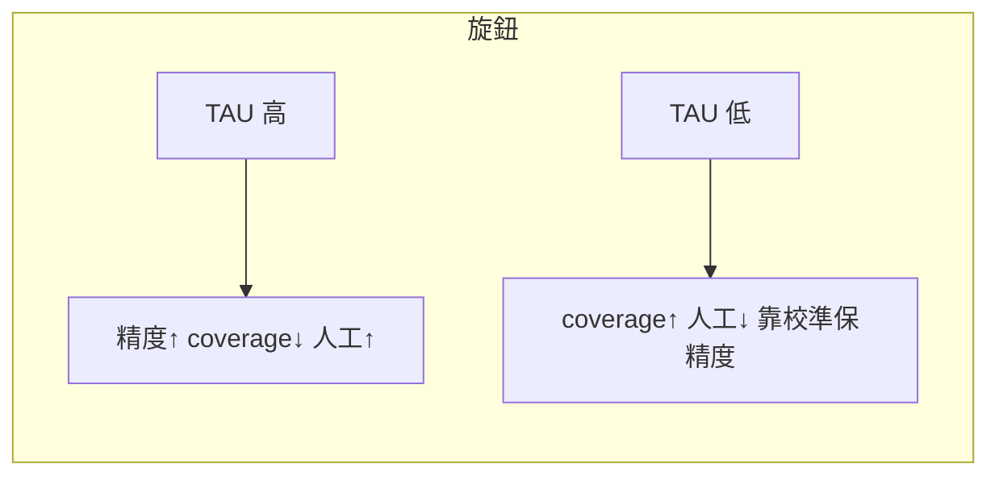
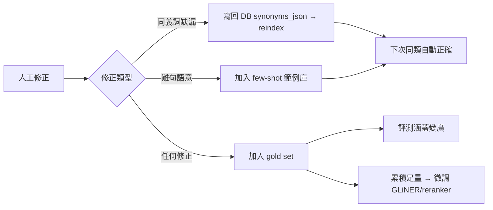

# 06 · 評測、信心校準與審核 Playbook

> 「**沒有量測就沒有優化**」。這篇定義 gold set、指標、校準與門檻、審核 UX、active learning。
> 它是 [05 每個 Phase 的驗收依據](05-implementation-plan.md)，也是「**最準 vs 最省人力**」旋鈕的操作手冊。

---

## 6.1 為什麼評測要「先」建

模糊比對、embedding、LLM **都用召回換精確**，稍不慎精度就悄悄退步。所以 **Phase 0 的第一件事就是建 gold set + 評測腳本**，先量出「現況 baseline 數字」，之後每個 Phase 都對同一份考卷跑分，**沒過門檻不准上線**。

---

## 6.2 Gold set 規格

**檔案**：`apps/api/tests/nl_gold/gold.jsonl`（一行一筆 JSON）。

```jsonc
{
  "id": "g001",
  "text": "從料架上拿DIMM放至流水線",            // 原始輸入（保留奇怪寫法）
  "lang": "zh",                                  // zh | en | mixed
  "challenge": ["baseline"],                     // 標註挑戰維度（見下）
  "expected": {
    "sequence_model": "GENERAL_MOVE",
    "context": { "hand_type": "right", "from_location": "料架",
                 "target_object": "DIMM", "to_location": "流水線" },
    "slots": { "G": "G_SELECT", "P": "P_PLACE_NO_DIRECTION",
               "A1": "A_REACH_LE_14_35CM", "B1": "B_STAND" }
  },
  "notes": "預設距離/身體可接受"
}
```

**challenge 維度（每類至少數筆，對齊 [01 §1.3](01-problem-and-requirements.md)）**：
`baseline, traditional_simplified, fullwidth, typo, homophone, mixed_lang, english, reordered, colloquial, multi_action, oov_synonym, missing_info, ambiguous`。

**規模目標**：Phase 0 起步 30–50 筆；Phase 2 前擴到 ≥150 筆（每維度 ≥8）；之後靠 active learning 持續長大。
**切分**：`dev`（調參/校準）與 `test`（最終驗收）**分開**，避免過擬合門檻。
**標註來源**：用現有真實 WI 句 + 你（IE 專家）標準答案最有價值。

> **解 gold set 冷啟動/規模瀑頸**：內部 Romantic-Rush（[domain-specific-llm-eval](../../../domain-specific-llm-eval)）的 [eval-pipeline](../../../domain-specific-llm-eval/eval-pipeline) 提供「從知識圖譜自動生成測試集」的成熟管線（含中英混合、persona/scenario 變體），可用來自動擴增「奇怪句」與 `mixed_lang/english` 維度；但 `test` 切分仍須人工標註保權威。作法見 [09 §9.4](09-prior-art-romantic-rush-eval.md)。

---

## 6.3 指標定義

| 指標 | 公式／定義 | 服務的目標 |
|------|-----------|-----------|
| **Slot accuracy** | 各 slot：`對的數 / 應有數`（option_code 完全相符） | 整體準度 |
| **Sentence exact-match** | 整筆 sequence_model + 所有關鍵 slot + context 全對的比例 | 端到端準度 |
| **Span/Slot F1** | Stage 1 抽取：$F_1=2PR/(P+R)$，span 角色與邊界相符才算 TP | 抽取品質 |
| **recall@K** | 正解 option_code 落在候選 top-K 的比例 | Phase 1 候選生成 |
| **Coverage** | 自動採用（非送審）的比例 | 省人力 |
| **Auto-segment precision** | 自動採用段的正確率 | 準度保證 |
| **Audit rate** | `1 - Coverage`（需人工的比例） | 人力成本 |
| **Time-to-audit** | 每筆審核中位耗時 | 人力成本 |

> **核心關係**：Coverage 與 Auto-precision 是**互換**的（risk–coverage）。我們不追求單一數字，而是**畫出整條曲線**再選工作點（§6.5）。

---

## 6.4 評測腳本設計

`apps/api/scripts/eval_nl_parser.py`（CLI）：

```bash
PYTHONPATH=. python scripts/eval_nl_parser.py \
  --gold tests/nl_gold/gold.jsonl \
  --engine rule|gliner|llm|orchestrator \
  --report out/eval_report.json \
  --by-challenge          # 各 challenge 維度分項分數
```

**輸出**：總分 + 各 challenge 維度分項 + 混淆熱點（哪些 option_code 互相搞混）+ 失敗清單（供回灌 gold/同義詞）。**把每次數字記進 [README 狀態看板](README.md)**。

**CI 門檻（建議）**：在 `apps/api` 測試流程加一條——`orchestrator` 對 `test` 切分的 sentence exact-match **不得低於上一版**（防退步）。

---

## 6.5 信心校準與門檻選擇（旋鈕怎麼轉）

**步驟**
1. **收集分數**：在 dev 切分上跑 parser，記錄每個 slot 的 `raw_score` 與「是否正確」。
2. **校準**：用 `sklearn.isotonic.IsotonicRegression`（或 Platt/邏輯回歸）擬合 `raw_score → P(correct)`。存成校準器（版本進 provenance）。
3. **畫 risk–coverage 曲線**：掃描門檻 $\tau$，對每個 $\tau$ 算 `coverage(τ)` 與 `auto_precision(τ)`。
4. **選工作點**：
   - 要**最準** → 找滿足 `auto_precision ≥ 0.99` 的最大 $\tau$。
   - 要**最省人力** → 找滿足 `auto_precision ≥ 你能接受的下限（如 0.97）` 的**最小** $\tau$，coverage 最大化。
5. 把選定 `TAU_AUTO`（與 `TAU_ABSTAIN`）寫進 config，並記錄當時曲線。



> **這就是回答你最初的問題**：「精度最高」與「審核成本最低」不是兩套系統，而是**同一條曲線上轉門檻**。系統要讓它**可設定**，甚至可按 slot 類型分別設（關鍵 slot 嚴、次要 slot 寬）。

> **从「可設定」升級為「會自我調整」**：Romantic-Rush 的 [dynamic_ragas_gate_with_human_feedback.py](../../../domain-specific-llm-eval/dynamic_ragas_gate_with_human_feedback.py) 用 **EMA + 自適應視窗 + 滾動中位數 + IQR 不確定帶** 讓門檻隨人工回饋演進。建議 Phase 3 先用固定門檻上線、Phase 4 再切動態門檻（門檻變更必須進 provenance 才不破壞可重現性），可重用程式見 [09 §9.3](09-prior-art-romantic-rush-eval.md)。

---

## 6.6 審核 UX 規格（把 time-to-audit 壓到最低）

審核成本 = `審核筆數 × 每筆耗時`。Phase 3 的 UI 要兩頭都壓：

**只看該看的**
- 只在 `needs_review` 的**那幾個 slot**上標紅，其餘自動採用的安靜顯示。
- 整筆若全自動通過 → 不打擾。

**一鍵修正**
- 每個待審 slot 直接列 **top-K 候選 chip**（已含正解的機率最高在前），點一下即替換。
- **highlight 來源片段**：用 offset map 把命中文字標回原文，讓人秒懂「AI 為何這樣猜」。
- 顯示**為何送審**（低信心 / 引擎不一致 / 歧義）。

**鍵盤優先 + 批次**
- 數字鍵選候選、Enter 下一筆；把「相似待審項」分組批次處理。

**回流**
- 修正即寫 `nl_draft_log.correction`，餵 §6.7。

> 設計目標：**一筆審核 = 看一眼紅字 + 按一個數字鍵**，< 10 秒。

---

## 6.7 Active Learning 迴路



- **C** 是投報率最高的：一次修正 → 一條同義詞 → 永久受益、零模型訓練。
- **H** 等資料夠（如每 slot 數百筆）再做，避免過早訓練。

> **取樣策略借鏡**：Romantic-Rush 用 **不確定帶（IQR）＋多元抽樣（以小機率抽查高信心樣本）** 決定誰要人看，避免「只審低分」造成盲區。Phase 4 可採用，見 [09 §9.3](09-prior-art-romantic-rush-eval.md)。

---

## 6.8 長期追蹤的儀表板

把這些指標按時間記錄（可先簡單寫進 `nl_draft_log` 再查詢）：

| 指標 | 期望趨勢 |
|------|----------|
| Audit rate | ↓ 隨 active learning 下降 |
| Coverage@(precision≥目標) | ↑ |
| 各 slot 錯誤熱點 | 找出最常被改的 slot/option，優先補同義詞或範例 |
| OOV 命中率（靠檢索救回的比例） | ↑ 代表語意層發揮作用 |
| p95 latency | 在 SLA 內 |

---

## 6.9 驗收門檻彙整（對應 [05](05-implementation-plan.md) 各 Phase）

| Phase | 守門指標 | 門檻 |
|-------|----------|------|
| 0 | slot accuracy vs baseline；四類修復測試 | 不退步且轉綠 |
| 1 | recall@5（逐 slot） | ≥ 0.95 |
| 2 | Stage1 slot F1（跨語言/亂序集） | ≥ 0.90 |
| 3 | auto 段 precision / coverage | ≥ 0.98 / ≥ 0.70 |
| 4 | audit rate 趨勢 | 單調下降 |

---

下一篇 [07-agent-handoff.md](07-agent-handoff.md)：給下一個 LLM agent 的工作協定、長時間運行規則、checkpoint 與 Definition of Done。
