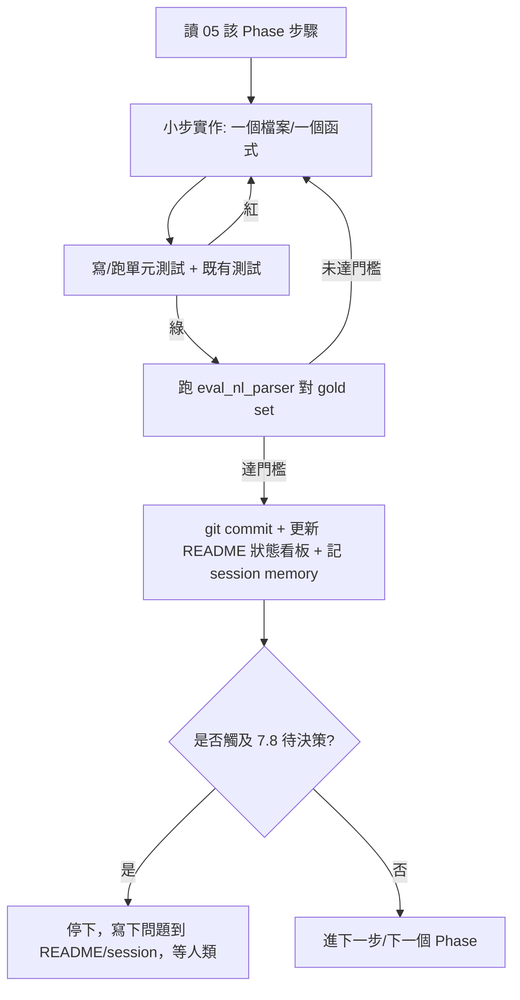

# 07 · 下一個 Agent 的接手協定（長時間自主運行）

> **你（接手的 LLM agent）就是要把這套升級實作到好的人。** 這篇是你的工作契約。
> 先把 [README](README.md) → [01](01-problem-and-requirements.md) → [04](04-architecture-design.md) → [05](05-implementation-plan.md) → [06](06-evaluation-and-audit.md) 讀完，再開工。
> 做 Stage 2 連結、信心分流、校準、主動學習時，務必先讀 [09-prior-art-romantic-rush-eval.md](09-prior-art-romantic-rush-eval.md)——那裡有內部既有框架已驗證的可重用程式與門檻設計，可大幅省手。

---

## 7.1 你的任務（Mission）

把 [nl_draft_parser.py](../../apps/api/app/services/nl_draft_parser.py) 從「規則式子字串比對」升級為 [04 的混合管線](04-architecture-design.md)，
依 [05 的 Phase 0→4](05-implementation-plan.md) **逐階段**實作，每階段以 [06 的 gold set](06-evaluation-and-audit.md) 驗收。
目標：**任何奇怪 WI（中英混雜/亂序/錯字/口語）都能準確產出 MOST**，且**人工審核成本最低**。

---

## 7.2 不可違反的護欄（Guardrails）

1. **不破壞既有 API 合約**：[`/nl-draft`](../../apps/api/app/api/routes/most.py) 既有回傳欄位**只增不改**；用 `to_legacy()` 保舊前端可用。
2. **計算引擎維持權威**：只動「建議預填」，**絕不**改 TMU 計算邏輯或讓 AI 蓋過計算結果。
3. **保留 `RuleBasedDraftParser`**：包成 `RuleEngine`，**不要刪**（baseline + fallback + 投票者）。
4. **每個新能力都要 feature flag**，預設 **off**，可單獨回退（見 [05 flag 表](05-implementation-plan.md)）。
5. **可重現**：LLM 一律 `temperature=0` + 鎖版本 + 快取；向量/reranker 鎖 revision；門檻寫進 provenance。
6. **fail loud**：任何引擎失效 → 退確定性層並標 `needs_review`，**不可**靜默產出可能錯的結果。
7. **不得跳過驗收門檻**：某 Phase 沒達 [06 §6.9](06-evaluation-and-audit.md) 門檻，**不准**進下一個 Phase。
8. **破壞性/外部動作要先問人**：安裝大型模型、改 DB schema（alembic migration 可做但要在分支上）、接雲端 LLM（資料落地）——這些先在 §7.8 的「待人類決策」確認。

---

## 7.3 環境與指令

```bash
# 後端
cd apps/api && PYTHONPATH=. pytest                 # 跑測試（必過才提交）
cd apps/api && python3 -m alembic upgrade head     # 套用 migration
PYTHONPATH=. python scripts/eval_nl_parser.py --gold tests/nl_gold/gold.jsonl --engine orchestrator --by-challenge
# 前端
cd apps/web && npx vitest run && npx vite build
```

**環境檢查清單（開工前跑一次）**
- [ ] 確認 Python 3.12 venv 可用、`pytest` 能跑（`tests/` 有 conftest）。
- [ ] 看 [db/session.py](../../apps/api/app/db/session.py) 確認 DB 是 Postgres（→ pgvector）還是 SQLite（→ faiss/numpy）。**此決定 Phase 1 做法。**
- [ ] 確認是否可離線下載模型（HF）；若不行，先問人要 proxy 或預載路徑。
- [ ] 新依賴加進 [pyproject.toml](../../apps/api/pyproject.toml)（後端）/ `package.json`（前端），不要只 ad-hoc 安裝。

---

## 7.4 長時間運行協定（Loop）

對**每一個 Phase**，嚴格照這個迴圈，做完一個才下一個：



**節奏建議**
- **小步提交**：每個可測的小單位就 commit（訊息含 Phase 與量測數字）。
- **每完成一步**更新 [README 狀態看板](README.md) 的對應列與「備註」（填 commit hash / gold 分數）。
- **checkpoint**：在 session memory 維護「目前 Phase / 已完成步驟 / 下一步 / 阻塞點」，這樣中斷後可無痛續做。
- **不要空轉**：若連續嘗試同一招失敗，改走 fallback（如 GLiNER 零樣本不穩 → 先用 LLM 標一批弱標註微調，或先降級到 Phase 0+1 出貨），並把決策寫進 README。

---

## 7.5 逐 Phase Definition of Done

| Phase | 完成定義（全部打勾才算完） |
|-------|----------------------------|
| **0** | ☐ gold.jsonl ≥30 筆且涵蓋各 challenge ☐ eval 腳本可跑並記錄 baseline ☐ normalize.py 上線 ☐ 最長匹配+評分重構 ☐ 遮蔽 bug 修復 ☐ rapidfuzz+pinyin fallback ☐ 四類修復測試轉綠 ☐ slot accuracy 不退步 |
| **1** | ☐ `nl_parser/` 介面+契約 ☐ 詞典向量化(按 slot) ☐ RetrievalLinker ☐ reindex 指令+publish 鉤子 ☐ recall@5 ≥0.95 ☐ flag 可關 |
| **2** | ☐ GLiNEREngine（或 LLMEngine）抽 span ☐ 一句多動作分段 ☐ Orchestrator 串起 ☐ RuleEngine 當投票者 ☐ 跨語言/亂序集 slot F1 ≥0.90 ☐ flag 可切引擎 |
| **3** | ☐ reranker 精排 ☐ 校準器(isotonic) ☐ 信心融合(校準+margin+一致性) ☐ 分流(auto/review/abstain) ☐ nl_draft_log + provenance ☐ to_legacy 相容 ☐ 前端 top-K 一鍵+highlight ☐ auto precision ≥0.98 & coverage ≥0.70 |
| **4** | ☐ 修正回灌 synonyms+reindex ☐ few-shot/gold 擴充 ☐ (足量後)微調流程 ☐ 儀表板 ☐ audit rate 下降趨勢 |

---

## 7.6 整體 Definition of Done（可宣告完成）

- [ ] Phase 0–3 全部達標（Phase 4 為持續運維，至少跑通一輪回流）。
- [ ] `orchestrator` 在 gold `test` 切分：sentence exact-match ≥ 0.85、auto 段 precision ≥ 0.98、coverage ≥ 0.70。
- [ ] 跨語言（en/mixed）與亂序樣本通過。
- [ ] 既有後端/前端測試全綠；`vite build` 成功。
- [ ] `/nl-draft` 舊欄位相容；新欄位（top_k/needs_review/provenance）就緒。
- [ ] 所有新能力有 feature flag 且預設安全（出問題可退回 Phase 0 確定性層）。
- [ ] [README 狀態看板](README.md) 全部 ✅ 並附最終 gold 分數。
- [ ] 寫一份簡短「驗收報告」放 `docs/wi-parser-upgrade/RESULTS.md`（每 Phase 數字 + 已知限制 + 後續建議），供人類回來檢驗。

---

## 7.7 常見陷阱（前車之鑑）

- **過早接 LLM**：先把 Phase 0+1 確定性層做穩，gold set 建好，否則無法判斷 LLM 是否真的更好。
- **沒做校準就設門檻**：原始分數不是機率，分流會失準（[06 §6.5](06-evaluation-and-audit.md)）。
- **中文用字元級 fuzzy**：要 token 級 + bigram + pinyin（[02 §2.3](02-concepts-primer.md)）。
- **向量索引沒按 slot 分庫**：G 的查詢跑去比到 X 的選項，污染候選。
- **忘了 offset map**：審核 UI 無法 highlight 原文，time-to-audit 上不去。
- **詞典改版沒 reindex**：候選與現行詞典不一致，靜默錯配。
- **把「格式合法」當「語意正確」**：constrained decoding 只保證 schema，仍需信心+審核。
- **重造已有輪子**：「語意比對門檻、human-feedback 動態門檻、active learning 取樣」內部 Romantic-Rush 已有可重用程式（[09](09-prior-art-romantic-rush-eval.md)），不要從零重寫。

---

## 7.8 待人類決策（不要自己猜，先問）

開工前把這幾項跟人類確認，並記到 [README](README.md) 頂部：

1. **Profile 選擇**：先做 **Profile B（地端）** 為骨幹？是否允許 **Profile A 雲端 LLM**（資料落地政策）？
2. **DB**：是否 Postgres（可用 pgvector）？否則用 faiss/numpy 本地索引。
3. **模型下載**：是否可離線從 HuggingFace 取 BGE-M3 / GLiNER / reranker？需要預載路徑或 proxy 嗎？
4. **GPU**：地端是否有 GPU？（影響 BGE-M3 / vLLM / 微調 的可行性與延遲）
5. **審核工作點**：初期 `TAU_AUTO` 要偏「保精度」還是「保覆蓋」？（[06 §6.5](06-evaluation-and-audit.md) 旋鈕）
6. **gold set 標註**：能否提供真實 WI 句 + 標準答案？由誰（IE 專家）驗收？

> 在這些未確認前，**安全的預設**是：Profile B、本地 faiss、保守門檻（偏精度）、先用既有 dictionary 自動產 gold 草稿再請人校。但**涉及裝大模型/接雲端/改 schema 前務必先問**。

---

## 7.9 你每次「上工」的起手式

1. 讀 session memory 的 checkpoint（目前 Phase / 下一步 / 阻塞）。
2. 讀 [README 狀態看板](README.md) 確認進度。
3. 跑一次 `pytest` + `eval_nl_parser.py` 確認綠燈與當前分數。
4. 接續 [05](05-implementation-plan.md) 的下一步，照 §7.4 迴圈做。
5. 收工前：commit、更新看板、更新 checkpoint。

開工吧。先從 [Phase 0](05-implementation-plan.md) 的「建立評測骨架」開始——**先能量測，再談優化**。
